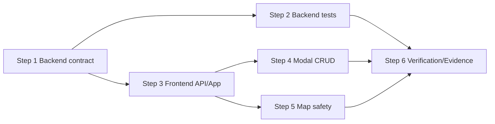

# Plan — Quản lý trạm đầu, trạm cuối và trạm dừng

## Thông tin tài liệu

| Thuộc tính | Giá trị |
|---|---|
| Feature ID | `001-station-management` |
| Spec/Test-Plan version | `2026-09-03` |
| Trạng thái | `READY` |
| Planner | `Codex` |
| Implementer | `Gemini` |
| Ngày cập nhật | `2026-09-03` |

## Mục tiêu implementation

Hoàn chỉnh CRUD station trên REST/UI bằng các layer hiện có; bảo vệ normalization, validation và route reference; trả lỗi Problem Details; chỉ đồng bộ list/map sau success; render marker đúng `stationType` và popup an toàn. Không thay đổi schema, dependency hoặc feature ngoài station management.

## Phạm vi implementation

### Sẽ thực hiện

- Backend invariant, status/error contract và safe delete theo `SPEC-002`–`SPEC-005`.
- Backend automated tests cho `TC-001`, `TC-003`–`TC-011`, `TC-015`.
- Frontend update API, create/edit/delete UX, error/loading/refresh theo `SPEC-001`, `SPEC-003`, `SPEC-006`.
- Marker theo type và output-safe popup theo `BR-003`, `BR-006`.
- Verification/Evidence theo `TC-012`–`TC-016`.

### Không thực hiện

- Route/ETA/check-in/simulator/traffic/notification/WebSocket changes.
- Schema migration, cascade delete, pagination, auth hoặc API base URL refactor.
- Frontend test framework/dependency mới.
- Refactor error handling của controller không liên quan station.

## Điều kiện tiên quyết

- [x] `requirement.md` ở trạng thái `READY`.
- [x] `spec.md` không còn câu hỏi chặn implementation.
- [x] `test-plan.md` liên kết mọi Acceptance Criteria.
- [x] Research/Survey cần thiết đã hoàn thành.
- [ ] Developer/User duyệt Requirement/Spec/Test-Plan/Plan và các `DEC-*`.
- [ ] Môi trường Gemini dùng JDK 26; `java -version` phải được ghi vào Evidence.
- [ ] Môi trường Gemini dùng Node `^20.19.0 || >=22.12.0`; `node --version` phải được ghi vào Evidence.

Không bắt đầu implementation khi chưa có duyệt của Developer/User.

## File sẽ tạo mới

### `vehiceltracking-backend/src/main/java/com/quangkhai/vehiceltracking_backend/exception/StationExceptionHandler.java`

- Trách nhiệm: scoped `@RestControllerAdvice` cho `StationController`, trả RFC 9457 Problem Details cho validation/not-found/conflict mà không đổi controller khác.
- Liên kết: `SPEC-002`–`SPEC-005`, `TC-001`, `TC-004`, `TC-005`, `TC-007`, `TC-008`, `TC-010`, `TC-011`.
- Lý do cần file mới: repository không có exception handler; nhét mapping lỗi vào controller/service sẽ trộn trách nhiệm.

### `vehiceltracking-backend/src/test/java/com/quangkhai/vehiceltracking_backend/service/StationServiceTest.java`

- Trách nhiệm: unit test normalization, duplicate, identity và safe delete/rollback behavior.
- Liên kết: `TC-004`, `TC-006`, `TC-007`, `TC-009`, `TC-010`.
- Lý do cần file mới: Survey xác nhận chưa có station service test.

### `vehiceltracking-backend/src/test/java/com/quangkhai/vehiceltracking_backend/controller/StationControllerTest.java`

- Trách nhiệm: MockMvc/integration assertions cho endpoint, validation, Problem Details và DB side effect.
- Liên kết: `TC-001`, `TC-003`–`TC-011`.
- Lý do cần file mới: Survey xác nhận chưa có station controller/API test.

## File sẽ chỉnh sửa

### `vehiceltracking-backend/src/main/java/com/quangkhai/vehiceltracking_backend/dto/StationDto.java`

- Trách nhiệm hiện tại: request/response station và validation boundary.
- Thay đổi: thêm size/range/finite constraints cho code/name/address/coordinates/radius; bắt buộc radius/type theo `BR-001`.
- Liên kết: `SPEC-002`, `SPEC-003`, `SPEC-005`, `TC-005`.
- Phần không được ảnh hưởng: field names/JSON success shape và output id/createdAt.

### `vehiceltracking-backend/src/main/java/com/quangkhai/vehiceltracking_backend/repository/StationRepository.java`

- Trách nhiệm hiện tại: JPA CRUD và lookup code.
- Thay đổi: thêm derived query cần thiết để kiểm tra normalized code của record khác khi update; không thêm custom query nếu derived method đủ.
- Liên kết: `BR-002`, `TC-004`, `TC-007`.
- Phần không được ảnh hưởng: `JpaRepository` behavior hiện có.

### `vehiceltracking-backend/src/main/java/com/quangkhai/vehiceltracking_backend/repository/RouteStationRepository.java`

- Trách nhiệm hiện tại: query/delete route station theo route id.
- Thay đổi: thêm `existsByStationId(Long stationId)` cho delete guard.
- Liên kết: `BR-004`, `TC-010`.
- Phần không được ảnh hưởng: query ordering/delete by route hiện tại.

### `vehiceltracking-backend/src/main/java/com/quangkhai/vehiceltracking_backend/service/StationService.java`

- Trách nhiệm hiện tại: transactional station CRUD và mapping DTO/entity.
- Thay đổi: normalize code trước mọi check; trim string; validate business-level duplicate; dùng 404/409 exception semantics; inject `RouteStationRepository`; guard/catch DB conflict khi delete; giữ id/createdAt; không partial update khi lỗi.
- Liên kết: `BR-001`–`BR-004`, `TC-003`–`TC-011`.
- Phần không được ảnh hưởng: list/get success shape, entity defaults của dữ liệu cũ, service khác.

### `vehicletracking-frontend/src/services/api.ts`

- Trách nhiệm hiện tại: tập trung REST calls.
- Thay đổi: thêm `updateStation(id, data)` dùng PUT; mọi station method kiểm tra `res.ok`; helper station-local đọc `detail`/`message` an toàn và fallback theo operation/status.
- Liên kết: `SPEC-001`–`SPEC-006`, `TC-001`, `TC-012`.
- Phần không được ảnh hưởng: API methods route/vehicle/trip/incident/simulator và `API_BASE` hiện tại.

### `vehicletracking-frontend/src/App.tsx`

- Trách nhiệm hiện tại: station state, load, create/delete handlers, toast và props cho modal/map.
- Thay đổi: thêm update handler; create/update/delete dùng `try/catch`, await backend, refresh authoritative list và toast; propagate/rethrow failure để modal giữ form; không optimistic mutation.
- Liên kết: `BR-005`, `TC-012`, `TC-013`.
- Phần không được ảnh hưởng: route/trip/simulator/WebSocket state/handlers.

### `vehicletracking-frontend/src/components/StationModal.tsx`

- Trách nhiệm hiện tại: create form, list và delete button.
- Thay đổi: async callback types; selected station/edit mode; prefill/reset; visible/editable lat/lon (prefill `pendingCoords`, không silent fallback); labels/type display; client validation; pending/error state; confirmation delete; close/reset chỉ sau success; edit/cancel actions.
- Liên kết: `BR-001`, `BR-003`, `BR-005`, `TC-002`, `TC-012`.
- Phần không được ảnh hưởng: modal visual language và unrelated components.

### `vehicletracking-frontend/src/components/MapComponent.tsx`

- Trách nhiệm hiện tại: Leaflet station marker/popup và station polyline.
- Thay đổi: class/label dựa trên `station.stationType`; gắn popup user fields bằng text nodes hoặc helper escape đầy đủ; không dùng index để xác định START/END.
- Liên kết: `BR-003`, `BR-006`, `TC-013`, `TC-014`.
- Phần không được ảnh hưởng: route polyline, vehicle marker, incident layer và map click callback.

## Database Changes

Không có migration/schema change. Giữ unique `stations.code`, non-null fields và FK `route_stations.station_id`. Application validation/guard được bổ sung; database constraint tiếp tục là hàng rào concurrency cuối.

## API Changes

| Method/Endpoint | Loại thay đổi | Spec contract | Compatibility |
|---|---|---|---|
| `GET /api/stations` | Sửa behavior lỗi | `SPEC-001` | Success backward-compatible |
| `GET /api/stations/{id}` | Sửa error | `SPEC-001`, 404 Problem Details | Success backward-compatible |
| `POST /api/stations` | Siết validation/error | `SPEC-002`, `SPEC-005` | Success shape giữ nguyên; invalid cũ bị chặn |
| `PUT /api/stations/{id}` | Siết full update/error | `SPEC-003`, `SPEC-005` | Endpoint/shape giữ; radius/type bắt buộc |
| `DELETE /api/stations/{id}` | Safe delete/error | `SPEC-004` | 204 giữ; referenced station đổi từ DB-dependent sang 409 |

## Event / Realtime Changes

Không có.

## Dependency và Configuration Changes

| Loại | Thay đổi | Lý do | Security/Operation impact |
|---|---|---|---|
| Dependency | Không có | Stack hiện có đủ theo Research | Không có supply-chain change |
| Configuration | Không có | Feature không cần config/secret | Runtime verification phải đúng manifest |

## Implementation Steps

### Step 1 — Hoàn thiện backend invariant và error contract

**Mục tiêu:** API station bảo vệ representation, normalized uniqueness, not-found và safe delete với 400/404/409 Problem Details.

**Liên kết:** `REQ-002`–`REQ-005`, `SPEC-002`–`SPEC-005`, `BR-001`–`BR-004`, `TC-004`–`TC-011`.

**File/thành phần:**

- `StationDto.java`
- `StationRepository.java`
- `RouteStationRepository.java`
- `StationService.java`
- `exception/StationExceptionHandler.java`

**Thay đổi:**

1. Thêm DTO constraints đúng boundary/length/range; invalid enum/malformed JSON vẫn thành 400.
2. Tạo một hàm normalize code trong service dùng `trim().toUpperCase(Locale.ROOT)` trước lookup/write; trim name/address nhất quán.
3. Kiểm tra duplicate của record khác khi update; giữ id/createdAt.
4. Kiểm tra route reference trước delete trong transaction; chuyển pre-check/DB violation thành 409, missing thành 404.
5. Handler scoped trả Problem Details và optional field errors, không lộ exception nội bộ.

**Kết quả mong đợi:** Backend behavior khớp `BR-001`–`BR-004` mà không đổi schema/endpoint.

**Dependency:** Developer/User duyệt Plan.

**Kiểm tra ngay sau step:** Compile/test station tests sau Step 2; trước đó đọc diff để bảo đảm handler chỉ scoped station.

**Evidence cần thu thập:** `EVD-107` loại `SOURCE_CODE` cho invariant/error path; runtime claim chưa được PASS ở step này.

**Rủi ro/rollback:** Validation có thể làm DataSeeder/client cũ fail; đối chiếu seed payload và revert riêng constraints nếu Spec được người dùng sửa, không nới âm thầm.

### Step 2 — Viết backend tests trước khi chuyển frontend

**Mục tiêu:** Tự động chứng minh REST/business rule và data integrity.

**Liên kết:** `TC-001`, `TC-003`–`TC-011`, `TC-015`.

**File/thành phần:**

- `StationServiceTest.java`
- `StationControllerTest.java`

**Thay đổi:**

1. Unit-test service cho normalization, duplicate/self-code, preserve identity, delete free/in-use và simulated DB conflict.
2. MockMvc/integration-test GET/POST/PUT/DELETE, 201/200/204/400/404/409, Problem Details và DB side effects.
3. Dùng code prefix riêng, transaction/cleanup; không phụ thuộc thứ tự seed data.

**Kết quả mong đợi:** Mỗi backend TC có assertion chứng minh expected status, payload và side effect; không chỉ assert “no exception”.

**Dependency:** Step 1.

**Kiểm tra ngay sau step:** `java -version`; `bash mvnw clean test` tại `vehiceltracking-backend` trên JDK 26.

**Evidence cần thu thập:** `EVD-101` loại `TEST`; `EVD-102`/`EVD-103` loại `API/TEST` với test names và Maven summary.

**Rủi ro/rollback:** DataSeeder chạy khi context test khởi động (`EVD-015`); fixture phải dùng unique prefix/transaction, không sửa seeder chỉ để test pass.

### Step 3 — Hoàn thiện frontend station API và orchestration

**Mục tiêu:** Frontend gọi được update và xử lý mọi station response theo async success/failure.

**Liên kết:** `REQ-001`–`REQ-006`, `SPEC-001`–`SPEC-006`, `BR-005`, `TC-012`.

**File/thành phần:**

- `src/services/api.ts`
- `src/App.tsx`

**Thay đổi:**

1. Thêm PUT client, kiểm tra `res.ok` cho GET/create/update/delete station và parse Problem Details/fallback.
2. Thêm update handler; create/update/delete await mutation rồi await list refresh.
3. Chỉ toast success sau mutation; báo riêng refresh failure; rethrow mutation error để modal giữ form.

**Kết quả mong đợi:** Không còn station mutation bị bỏ lỗi hoặc UI tự coi là thành công trước response.

**Dependency:** Step 1; có thể làm song song với Step 2 sau khi contract khóa.

**Kiểm tra ngay sau step:** `npm run lint` tại frontend trên Node đúng engine.

**Evidence cần thu thập:** `EVD-107` `SOURCE_CODE`; behavior runtime vào `EVD-105`.

**Rủi ro/rollback:** Tránh sửa shared helper cho API ngoài station; rollback gọn hai symbol station nếu có regression.

### Step 4 — Bổ sung create/edit/delete UX trong StationModal

**Mục tiêu:** Người vận hành thực hiện đầy đủ CRUD với form rõ tọa độ, loading/error và confirmation.

**Liên kết:** `REQ-001`–`REQ-006`, `SPEC-001`–`SPEC-006`, `BR-001`, `BR-003`, `BR-005`, `TC-002`, `TC-012`.

**File/thành phần:**

- `src/components/StationModal.tsx`

**Thay đổi:**

1. Đổi callback create/update/delete thành `Promise`; thêm edit selection và prefill toàn bộ field.
2. Hiển thị/cho sửa latitude/longitude; dùng pending map coordinate để prefill create, bỏ hard-coded fallback.
3. Validation client mirror boundary; backend vẫn authoritative.
4. Thêm edit/cancel, type label, confirmation delete, pending disable và inline error; reset/close edit chỉ sau success.

**Kết quả mong đợi:** `TC-002`, `TC-012` có thể chạy manual, không mất input khi API fail.

**Dependency:** Step 3.

**Kiểm tra ngay sau step:** `npm run lint`; chạy manual create/edit/delete smoke test nếu services sẵn sàng.

**Evidence cần thu thập:** `EVD-105` loại `UI`, gồm screenshot trước/sau, bước manual và Network status.

**Rủi ro/rollback:** State reset khi đổi create/edit dễ rò dữ liệu cũ; test rõ edit→cancel→create và modal close/reopen.

### Step 5 — Sửa semantics marker và bảo vệ popup

**Mục tiêu:** Map hiển thị type đúng, độc lập ordering và không thực thi user HTML.

**Liên kết:** `REQ-006`, `SPEC-006`, `BR-003`, `BR-006`, `TC-013`, `TC-014`.

**File/thành phần:**

- `src/components/MapComponent.tsx`

**Thay đổi:**

1. Thay `index === 0/last` bằng mapping trực tiếp `stationType` cho class/label.
2. Dùng DOM/textContent hoặc escape helper cho mọi user-controlled field trong popup.
3. Giữ dependencies/effect cleanup và layers ngoài station nguyên trạng.

**Kết quả mong đợi:** Thứ tự `STOP, END, START` vẫn render đúng; payload HTML hiển thị text và không chạy.

**Dependency:** Step 3.

**Kiểm tra ngay sau step:** `npm run lint`, `npm run build`; manual `TC-013`, `TC-014`.

**Evidence cần thu thập:** `EVD-104` loại `BUILD` kèm output lint; `EVD-106` loại `UI` kèm bước manual.

**Rủi ro/rollback:** Leaflet chấp nhận string hoặc HTMLElement cho popup; giữ cách nhỏ nhất và kiểm tra popup/cleanup thực tế.

### Step 6 — Verification, Evidence và bàn giao

**Mục tiêu:** Chạy toàn bộ regression/acceptance và cập nhật Evidence trung thực trước Codex review.

**Liên kết:** Tất cả Requirement/Spec/Test Case; Evidence gate trong `docs/workflow.md`.

**File/thành phần:**

- Toàn bộ diff feature.
- `docs/features/001-station-management/evidence.md`.

**Thay đổi:**

1. Chạy backend tests, frontend lint/build trên runtime đúng.
2. Chạy manual E2E/API/map scenarios, lưu artifact đã redact.
3. Cập nhật actual result/status cho `EVD-101`–`EVD-107` và Evidence Matrix.
4. Báo mọi sai lệch/blocker; không tự approve hoặc sửa Spec.

**Kết quả mong đợi:** Không còn Requirement critical `INCONCLUSIVE`; diff và Evidence sẵn sàng cho Codex review.

**Dependency:** Step 2, Step 4, Step 5.

**Kiểm tra ngay sau step:** Đối chiếu Matrix `REQ → SPEC/BR → TC → implementation → EVD` và `git diff`.

**Evidence cần thu thập:** `EVD-101`–`EVD-107`, đúng loại/command/artifact trong bảng dưới.

**Rủi ro/rollback:** Nếu runtime vẫn sai, giữ trạng thái `INCONCLUSIVE` và dừng bàn giao; không tuyên bố PASS dựa trên đọc code.

## Tests cần implement hoặc cập nhật

| Test Case | Loại | Test file dự kiến | Step | Nội dung chính |
|---|---|---|---|---|
| `TC-001`, `TC-003`, `TC-005`, `TC-008`, `TC-011` | API | `.../controller/StationControllerTest.java` | Step 2 | Endpoint/status/payload/validation/not-found |
| `TC-004`, `TC-006`, `TC-007`, `TC-009`, `TC-010` | Unit + Integration | Hai station test files | Step 2 | Normalize, identity, atomicity, safe delete |
| `TC-002`, `TC-012` | Manual UI/E2E | Không tạo test file | Step 4/6 | List/create/edit/delete/loading/error |
| `TC-013`, `TC-014` | Manual UI/Security | Không tạo test file | Step 5/6 | Type mapping và popup output safety |
| `TC-015` | Regression | Toàn backend tests | Step 6 | Maven suite |
| `TC-016` | Lint/Build | Existing scripts | Step 6 | Frontend static/build checks |

Không thay expected result của Test-Plan để phù hợp implementation.

## Evidence cần thu thập

| Evidence dự kiến | Requirement/Spec/Test | Plan Step | Loại | Claim cần chứng minh | Nguồn/Artifact dự kiến |
|---|---|---|---|---|---|
| `EVD-101` | `REQ-001`–`REQ-005`, `TC-015` | Step 2/6 | TEST | Backend test suite pass trên JDK 26 | Maven output/test reports |
| `EVD-102` | `REQ-001`–`REQ-003`, `TC-001`, `TC-003`, `TC-006` | Step 2/6 | API | List/create/update success contract đúng | Named tests + response assertions |
| `EVD-103` | `REQ-002`–`REQ-005`, `TC-004`, `TC-005`, `TC-007`–`TC-011` | Step 2/6 | TEST | Validation, 404/409, atomicity và safe delete đúng | Tests + DB assertions/API response |
| `EVD-104` | `REQ-001`–`REQ-006`, `TC-016` | Step 5/6 | BUILD | Frontend lint/build pass, không warning mới | Hai command output trên Node đúng |
| `EVD-105` | `REQ-001`–`REQ-006`, `TC-002`, `TC-012` | Step 4/6 | UI | CRUD UI/loading/error/refresh hoạt động | Steps, screenshots, Network status |
| `EVD-106` | `REQ-006`, `TC-013`, `TC-014` | Step 5/6 | UI | Marker theo type và popup không thực thi HTML | DOM/screenshot/sentinel observation |
| `EVD-107` | `REQ-002`–`REQ-006`, toàn Spec | Step 1/3/5/6 | SOURCE_CODE | Diff chứa đúng guard/handler/client/UI và không vượt scope | `git diff`, path/symbol |

## Lệnh kiểm tra

| Thứ tự | Command | Working directory | Mục đích | Điều kiện đạt |
|---|---|---|---|---|
| `1` | `java -version` | `vehiceltracking-backend` | Xác nhận prerequisite | JDK 26 |
| `2` | `bash mvnw clean test` | `vehiceltracking-backend` | Backend compile/tests | Exit 0, tất cả tests pass |
| `3` | `node --version` | `vehicletracking-frontend` | Xác nhận prerequisite | `^20.19.0 || >=22.12.0` |
| `4` | `npm run lint` | `vehicletracking-frontend` | Lint | Exit 0, không error/warning mới |
| `5` | `npm run build` | `vehicletracking-frontend` | Production build | Exit 0 |
| `6` | Manual `TC-002`, `TC-012`–`TC-014` | Local frontend/backend | UI/E2E/security | Tất cả expected result đạt và có artifact |

`./mvnw test` đã exit 126 do wrapper thiếu execute bit trong Survey; Plan dùng `bash mvnw`. Baseline JDK/Node hiện không đủ, nên Gemini phải ghi runtime và không được bỏ `clean`.

## Thứ tự implementation và dependency

## Rủi ro

| ID | Rủi ro | Khả năng | Ảnh hưởng | Giảm thiểu | Step kiểm soát |
|---|---|---|---|---|---|
| `RISK-001` | Runtime sai khiến không chạy verification | Cao hiện tại | Cao | JDK 26/Node đúng engine, clean build | Step 2/6 |
| `RISK-002` | Validation mới làm seed/client cũ fail | Vừa | Vừa | Đối chiếu payload seed; test boundary/compatibility | Step 1/2 |
| `RISK-003` | Race giữa in-use check và delete | Thấp | Cao | Transaction + FK/DB violation mapping 409 | Step 1/2 |
| `RISK-004` | Form mất dữ liệu khi request fail | Vừa | Cao | Await callbacks; reset sau success; `TC-012` | Step 3/4 |
| `RISK-005` | Popup fix làm hỏng Leaflet layer/cleanup | Thấp | Vừa | Thay nhỏ, build + manual map regression | Step 5/6 |
| `RISK-006` | Shared App/api/map sửa ngoài station | Vừa | Vừa | Giới hạn symbol, inspect diff, full lint/build | Step 3/5/6 |

## Kế hoạch bàn giao cho Review

Gemini phải báo cáo:

- file đã tạo/sửa và xác nhận không có file ngoài Plan;
- Plan step đã hoàn thành;
- Test Case đã implement/chạy;
- Evidence `EVD-101`–`EVD-107` đã cập nhật cùng Evidence Matrix;
- command, runtime, exit code và kết quả thực tế;
- artifact UI/API đã redact;
- sai lệch đã được Developer/User xác nhận;
- vấn đề/test còn lại;
- diff sẵn sàng cho Codex review;
- không tự ghi kết luận review.

## Definition of Done

- [x] Mọi step liên kết với Spec/Test Case.
- [x] File tạo/sửa có path và trách nhiệm rõ ràng.
- [x] Database/API/Event change có compatibility strategy.
- [x] Dependency mới có lý do và nằm trong Spec — không có dependency mới.
- [x] Command kiểm tra lấy từ Survey hoặc có prerequisite cụ thể.
- [x] Mỗi Requirement quan trọng có Evidence dự kiến và Plan Step thu thập.
- [x] Không có refactor hay scope ngoài Requirement.
- [x] Gemini có thể implement mà không cần tự thiết kế lại feature.
- [x] Tiêu chí bàn giao cho Codex Review rõ ràng.
