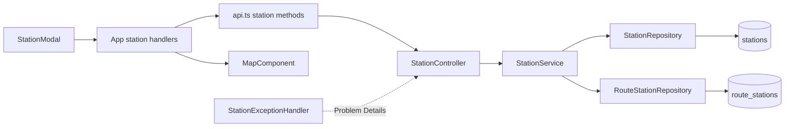
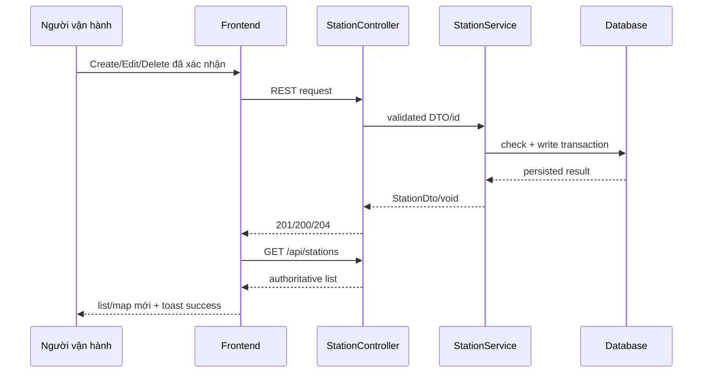

# Spec — Quản lý trạm đầu, trạm cuối và trạm dừng

## Thông tin tài liệu

| Thuộc tính | Giá trị |
|---|---|
| Feature ID | `001-station-management` |
| Requirement version | `2026-09-03` |
| Research/Survey version | `2026-09-03`, baseline commit `c427c90` |
| Trạng thái | `READY` |
| Người viết | `Codex` |
| Người duyệt | `Developer/User` |
| Ngày cập nhật | `2026-09-03` |

## Tổng quan

Feature mở rộng vertical slice station hiện có. Backend tiếp tục là nguồn dữ liệu chuẩn và dùng DTO validation, code normalization, transaction, repository guard và HTTP Problem Details. Frontend bổ sung edit mode, async operation state, update API, confirmation delete và refresh dữ liệu sau success. `MapComponent` render style theo `stationType` và không đưa chuỗi người dùng trực tiếp vào HTML.

## Mục tiêu

- Hoàn chỉnh REST/UI CRUD cho `REQ-001` đến `REQ-004`.
- Bảo vệ invariant và error semantics cho `REQ-005`.
- Đồng bộ list/map, hiển thị đúng type và an toàn output cho `REQ-006`.

## Không thuộc thiết kế này

- Không đổi schema, tạo migration, thêm dependency hoặc thêm state-management layer.
- Không thay đổi route ordering, route creation, trip/check-in/simulator/traffic.
- Không thêm authorization hoặc realtime station event.
- Không refactor error handling của API ngoài `StationController`.

## Kiến trúc



Tái sử dụng toàn bộ controller/service/repository/component hiện có. `StationExceptionHandler` chỉ chuẩn hóa lỗi thuộc `StationController`, tránh đổi contract của controller khác.

## Luồng xử lý

### Luồng chính

1. `StationModal` nhận create/edit input, kiểm tra cơ bản và gọi async callback trong `App`.
2. `api.ts` gọi endpoint station và chỉ resolve khi `res.ok`.
3. Controller dùng `@Valid`; service chuẩn hóa, kiểm tra business rule và ghi trong transaction.
4. Sau response thành công, `App` tải lại danh sách authoritative từ backend rồi báo thành công.
5. Modal reset/thoát edit; `MapComponent` rerender marker từ danh sách mới.



### Luồng lỗi hoặc fallback

1. Client-side invalid: không gọi API, hiển thị lỗi cạnh form.
2. Backend invalid/not-found/conflict: trả Problem Details 400/404/409; frontend giữ form edit/create, dừng loading và hiển thị `detail` hoặc fallback theo status.
3. Lỗi network/5xx: frontend không giả cập nhật danh sách, giữ dữ liệu form và hiển thị lỗi thử lại.
4. Refresh sau write thành công nhưng GET thất bại: thao tác ghi vẫn được báo là đã lưu, đồng thời báo không thể làm mới và cho phép tải lại; không optimistic-update bằng dữ liệu chưa xác minh.

## Business Rules

### BR-001 — Representation hợp lệ

**Liên kết:** `REQ-001`, `REQ-002`, `REQ-003`, `REQ-005`; `AC-REQ-005-01`

**Quy tắc:** Request create/update phải có code/name không rỗng sau trim, latitude `[-90,90]`, longitude `[-180,180]`, radius `30–150`, type thuộc `START|STOP|END`; address là tùy chọn. Giới hạn độ dài: code 50, name 150, address 255 ký tự.

**Lý do:** Khớp constraint entity và control radius hiện tại, đồng thời bảo vệ dữ liệu tọa độ/check-in.

### BR-002 — Chuẩn hóa và duy nhất mã trạm

**Liên kết:** `REQ-002`, `REQ-003`, `REQ-005`; `AC-REQ-002-02`, `AC-REQ-003-02`

**Quy tắc:** Trước mọi lookup duplicate và ghi, code được trim rồi uppercase bằng `Locale.ROOT`. Giá trị đã chuẩn hóa phải unique; update được giữ code của chính trạm nhưng không được dùng code của trạm khác.

**Lý do:** Tránh khác biệt giữa duplicate pre-check và giá trị thực lưu.

### BR-003 — Phân loại trạm

**Liên kết:** `REQ-002`, `REQ-003`, `REQ-006`; `AC-REQ-002-01`, `AC-REQ-006-01`

**Quy tắc:** Mỗi station có đúng một type `START`, `STOP` hoặc `END`. Danh mục toàn cục được có nhiều station cùng type; style/label UI lấy trực tiếp từ field này.

**Lý do:** Requirement phân biệt vai trò nhưng không đặt cardinality toàn cục; cardinality theo route ngoài scope.

### BR-004 — Xóa an toàn

**Liên kết:** `REQ-004`; `AC-REQ-004-01`, `AC-REQ-004-02`

**Quy tắc:** DELETE chỉ thành công nếu station tồn tại và không có `RouteStation` tham chiếu. Nếu đang được dùng, trả 409 và không xóa station/route; nếu không tồn tại, trả 404.

**Lý do:** Bảo toàn route và không cascade dữ liệu ngoài phạm vi.

### BR-005 — UI chỉ commit state sau success

**Liên kết:** `REQ-002`, `REQ-003`, `REQ-004`, `REQ-006`

**Quy tắc:** Trong khi request đang chạy, nút tương ứng bị disable. Create/edit chỉ reset/đóng sau success; delete phải xác nhận. Khi failure, giữ form/danh sách cũ và hiển thị lỗi.

**Lý do:** Tránh trạng thái UI báo thành công khi backend từ chối.

### BR-006 — Output popup an toàn

**Liên kết:** `REQ-006`; `AC-REQ-006-02`

**Quy tắc:** Code/name/address/type đưa vào popup phải được gắn như text hoặc escape HTML đầy đủ trước khi dùng trong HTML string.

**Lý do:** Các trường này đến từ input người dùng.

## Data Model

Không thay đổi schema hoặc migration. Tái sử dụng model hiện có.

### Entity/Table: `stations`

| Field | Type | Nullable | Default | Constraint/Index | Ý nghĩa |
|---|---|---|---|---|---|
| `id` | bigint | Không | generated | PK | Định danh |
| `code` | varchar(50) | Không | Không | unique | Mã đã normalize |
| `name` | varchar(150) | Không | Không | Không | Tên hiển thị |
| `latitude` | double | Không | Không | App validation | Vĩ độ |
| `longitude` | double | Không | Không | App validation | Kinh độ |
| `address` | varchar(255) | Có | null | Không | Địa chỉ tùy chọn |
| `radius_meters` | double | Không | `50` ở entity | App validation 30–150 | Bán kính check-in |
| `station_type` | varchar(20) | Không | `STOP` ở entity | Enum | Vai trò trạm |
| `created_at` | timestamp | Không sau persist | `now` | Không | Thời điểm tạo |

### Relationship và lifecycle

- `route_stations.station_id` là FK non-null tới station; không thêm cascade remove.
- Service dùng `existsByStationId` trước delete và vẫn xử lý database conflict nếu có race.

### Migration và compatibility

- Migration cần tạo: Không có.
- Backfill: Không có.
- Rollback/forward compatibility: code/data hiện tại giữ nguyên; validation mới chỉ chặn request mới không hợp lệ.

## API Contract

### Station representation dùng chung

```json
{
  "id": 12,
  "code": "ST-01",
  "name": "Trạm Đại học",
  "latitude": 10.762622,
  "longitude": 106.660172,
  "address": "227 Nguyễn Văn Cừ",
  "radiusMeters": 60,
  "stationType": "STOP",
  "createdAt": "2026-09-03T10:00:00"
}
```

Trong POST/PUT, client gửi `code`, `name`, `latitude`, `longitude`, `radiusMeters`, `stationType`; `address` tùy chọn. `id` và `createdAt` là output do server quản lý; nếu client gửi thì không được dùng để đổi identity/audit field.

| Method/Endpoint | Mục đích | Success | Contract |
|---|---|---|---|
| `GET /api/stations` | Lấy danh sách | `200`, JSON array | Không đặt ordering guarantee mới |
| `GET /api/stations/{id}` | Lấy một trạm | `200`, Station | `404` nếu id không tồn tại |
| `POST /api/stations` | Tạo trạm | `201`, Station đã normalize | Body theo representation input |
| `PUT /api/stations/{id}` | Thay thế trường editable | `200`, Station đã normalize | Giữ `id`, `createdAt`; body đầy đủ |
| `DELETE /api/stations/{id}` | Xóa trạm an toàn | `204`, không body | Cần thỏa BR-004 |

**Authentication/Authorization:** Không thay đổi cơ chế hiện tại.

**Error response:** `application/problem+json` theo RFC 9457, tối thiểu có `status`, `title`, `detail`; validation có thể thêm extension `errors` chứa field/message. Không trả stack trace, SQL hay secret.

```json
{
  "type": "about:blank",
  "title": "Conflict",
  "status": 409,
  "detail": "Mã trạm đã tồn tại: ST-01",
  "instance": "/api/stations"
}
```

| Điều kiện | HTTP status | Error contract | Side effect |
|---|---|---|---|
| JSON/field/enum không hợp lệ | `400` | Problem Details; detail an toàn, field errors nếu có | Không ghi |
| Station id không tồn tại | `404` | Problem Details | Không ghi |
| Code trùng sau normalize | `409` | Problem Details | Không ghi/rollback |
| Station đang được route dùng | `409` | Problem Details | Không xóa station/route |
| Lỗi không dự kiến | `500` | Detail chung, không lộ nội bộ | Transaction rollback |

**Idempotency/Concurrency:**

- GET là safe; PUT cùng payload cho cùng id cho cùng field state nhưng response/audit không được đổi `createdAt`.
- DELETE lần đầu thành công 204; lần sau 404.
- POST không idempotent; unique normalized code ngăn tạo duplicate.
- Service pre-check phục vụ lỗi rõ; DB unique/FK là hàng rào cuối và violation tương ứng phải được chuyển thành 409.

## Event / Realtime Contract

Không áp dụng. Feature không thêm WebSocket/message event; frontend hiện tại refresh REST sau mutation.

## Validation

| Input/Field | Rule | Nơi kiểm tra | Kết quả khi vi phạm |
|---|---|---|---|
| `code` | trim, nonblank, max 50, uppercase, unique | Frontend + backend + DB unique | 400 hoặc 409 |
| `name` | trim, nonblank, max 150 | Frontend + backend | 400 |
| `latitude` | required, finite, -90 đến 90 | Frontend + backend | 400 |
| `longitude` | required, finite, -180 đến 180 | Frontend + backend | 400 |
| `address` | optional, trim, max 255; blank lưu null hoặc empty nhất quán | Frontend + backend | 400 nếu quá dài |
| `radiusMeters` | required, finite, 30 đến 150 | Frontend + backend | 400 |
| `stationType` | required, enum START/STOP/END | Frontend + backend/Jackson | 400 |
| delete id | tồn tại và không được route dùng | Backend + DB FK | 404/409 |

Backend bảo vệ invariant; frontend validation chỉ phục vụ UX.

## Error Handling

| Failure mode | Phát hiện | Hành vi hệ thống | Log/Metric | Response/UI |
|---|---|---|---|---|
| Invalid request | Bean Validation/Jackson | Không gọi service write hoặc rollback | Không log dữ liệu nhạy cảm | 400 + field/detail; giữ form |
| Not found | Repository lookup | Không ghi | Expected domain error | 404 + toast/form error |
| Duplicate | Normalized lookup/DB unique | Không ghi/rollback | Có thể log code an toàn | 409 + thông báo mã trùng |
| Station in use | `existsByStationId`/FK | Không xóa | Có thể log station id | 409 + yêu cầu gỡ khỏi tuyến |
| Network/5xx | `fetch`/response | Không optimistic commit | Browser/server logging hiện có | Thông báo thử lại, giữ state |

## Security

- Authentication/Authorization: giữ nguyên; không nới hoặc bổ sung quyền.
- Input/output safety: validate length/range/enum; popup dùng text/escape, không chèn raw user content.
- Secret/configuration: không thêm cấu hình/secret.
- Sensitive data/logging: error không lộ stack trace, SQL hoặc config.
- External service boundary: Không áp dụng.

## Performance và Reliability

- Số lượng/tần suất dự kiến: thao tác quản trị tần suất thấp; chưa có yêu cầu phân trang.
- Query/index/caching: dùng unique index code hiện có; delete thêm một existence query; không thêm per-row query khi list.
- Timeout/retry/backoff: không tự retry mutation để tránh duplicate; người dùng chủ động thử lại.
- Transaction/idempotency/concurrency: create/update/delete transactional; DB constraint xử lý race.
- Tiêu chí đo được: các API test hoàn tất trong test suite local; không đặt SLA production chưa được Requirement cung cấp.

## Edge Cases

| ID | Tình huống | Hành vi mong đợi | Requirement/BR |
|---|---|---|---|
| `EC-001` | Code khác case/khoảng trắng | Cùng normalized code, duplicate 409 | `REQ-005`, `BR-002` |
| `EC-002` | Update giữ nguyên code chính nó | Thành công | `REQ-003`, `BR-002` |
| `EC-003` | NaN/Infinity hoặc tọa độ ngoài biên | 400, không ghi | `REQ-005`, `BR-001` |
| `EC-004` | Radius 30/150 | Hợp lệ; dưới/trên biên trả 400 | `REQ-005`, `BR-001` |
| `EC-005` | Delete id thiếu | 404 | `REQ-004`, `BR-004` |
| `EC-006` | Delete station đang ở nhiều route | 409, mọi dữ liệu giữ nguyên | `REQ-004`, `BR-004` |
| `EC-007` | API fail khi form đang submit | Stop loading, giữ form/list | `REQ-006`, `BR-005` |
| `EC-008` | Chuỗi `` trong tên | Hiển thị text, không thực thi | `REQ-006`, `BR-006` |

## Compatibility

- Public API/Event: giữ method/path và success shape; bổ sung error contract/status rõ hơn. Validation chặt hơn là thay đổi behavior có chủ đích.
- Database/data cũ: không migration; dữ liệu cũ không tự sửa. Nếu dữ liệu cũ ngoài range tồn tại, GET vẫn trả và chỉ request ghi mới bị validation.
- Frontend/backend version lệch: frontend mới xử lý cả Problem Details và fallback message; backend cũ vẫn đáp ứng success shape.
- Browser/runtime: theo Vite manifest; verification cần Node `^20.19.0 || >=22.12.0`.

## Configuration và vận hành

Không thêm biến hoặc cấu hình. API base URL hard-code hiện tại không được mở rộng trong feature này.

## Observability

- Log: expected 400/404/409 không cần stack trace; unexpected 500 dùng logging hiện có và không lộ dữ liệu trong response.
- Metric: Không áp dụng vì repository chưa có metric convention cho CRUD.
- Trace/Audit: `createdAt` phải được giữ qua update; không thêm audit fields.

## Những phần không được thay đổi

- Route/trip/simulator/incident/WebSocket contracts và logic.
- Schema/database profile/seed data.
- API base configuration ngoài station methods.
- Thứ tự tuyến hoặc diễn giải station type theo route.

## Quyết định và trade-off

| ID | Quyết định | Lý do | Phương án không chọn | Hệ quả |
|---|---|---|---|---|
| `DEC-001` | Giữ PUT/full editable representation | RFC 9110 + endpoint hiện có | PATCH mới | Client phải gửi đủ field editable |
| `DEC-002` | Dùng 409 cho duplicate/in-use | Conflict với current state | 400/500 chung | Client phân biệt và hướng dẫn người dùng |
| `DEC-003` | Problem Details scoped cho station | Error body chuẩn, không refactor toàn app | Error DTO tùy biến/global refactor | Thêm một handler scoped |
| `DEC-004` | Reject delete referenced station | Bảo toàn route | Cascade delete | Người dùng phải gỡ khỏi tuyến trước |
| `DEC-005` | Manual UI evidence, không thêm frontend test dependency | Frontend chưa có test framework | Thêm Vitest/RTL | Ít automation UI hơn trong feature này |

## Traceability

| Spec ID | Requirement/AC | Business Rule/API/Event | Test dự kiến | Evidence dự kiến |
|---|---|---|---|---|
| `SPEC-001` | `REQ-001`, `AC-REQ-001-01` | GET contracts | `TC-001`, `TC-002` | API test + UI screenshot |
| `SPEC-002` | `REQ-002`, `AC-REQ-002-01/02` | `BR-001`–`BR-003`, POST | `TC-003`–`TC-005` | Test/API/UI |
| `SPEC-003` | `REQ-003`, `AC-REQ-003-01/02` | `BR-001`–`BR-003`, PUT | `TC-006`–`TC-008` | Test/API/UI |
| `SPEC-004` | `REQ-004`, `AC-REQ-004-01/02` | `BR-004`, DELETE | `TC-009`–`TC-011` | Test/API/DB/UI |
| `SPEC-005` | `REQ-005`, `AC-REQ-005-01` | Validation/error contract | `TC-004`, `TC-005`, `TC-007`, `TC-010` | Test/API |
| `SPEC-006` | `REQ-006`, `AC-REQ-006-01/02` | `BR-005`, `BR-006` | `TC-012`–`TC-014` | UI/manual + build/lint |

## Câu hỏi còn mở

Không có câu hỏi chặn implementation. Các quyết định `DEC-*` chờ Developer/User duyệt cùng Plan.

## Checklist duyệt Spec

- [x] Spec đáp ứng mọi Requirement trong phạm vi.
- [x] Business Rule và contract không mơ hồ.
- [x] Validation, error, security và edge case liên quan đã được xử lý.
- [x] Data migration/backward compatibility được xem xét.
- [x] Không tạo abstraction hoặc dependency ngoài nhu cầu hiện tại.
- [x] Mọi phần quan trọng có traceability về Requirement.
