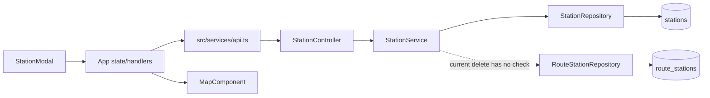
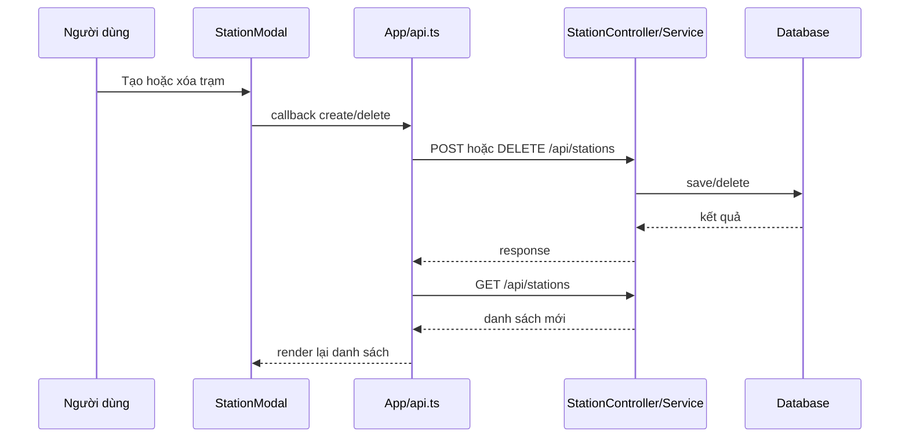

# Survey repository — Quản lý trạm đầu, trạm cuối và trạm dừng

## Thông tin tài liệu

| Thuộc tính | Giá trị |
|---|---|
| Feature ID | `001-station-management` |
| Requirement liên quan | `REQ-001` đến `REQ-006` |
| Trạng thái | `READY` |
| Người khảo sát | `Codex` |
| Commit/worktree được khảo sát | `c427c90`; worktree sạch trước khi tạo feature docs |
| Ngày khảo sát | `2026-09-03` |

## Tổng quan repository

Repository có hai application: frontend thật tại `vehicletracking-frontend` và backend thật tại `vehiceltracking-backend`. Tên backend đang có lỗi chính tả `vehiceltracking`; tài liệu và Plan giữ nguyên path thực tế theo `AGENTS.md`. Frontend gọi REST `/api/stations`; backend xử lý qua controller → service → JPA repository → database. Danh sách trạm cũng được đưa vào `MapComponent` để render marker.

## Tech stack

| Thành phần | Công nghệ/Version | Bằng chứng |
|---|---|---|
| Frontend | React `19.2.0`, TypeScript, Vite `8.2.2`, Leaflet | `vehicletracking-frontend/package.json`, `package-lock.json`; `EVD-003` |
| Backend | Spring Boot `4.1.1`, Java target `26`, Spring WebMVC/JPA/Validation | `vehiceltracking-backend/pom.xml`; `EVD-003` |
| Database | H2 in-memory ở profile `dev`; PostgreSQL ở profile `postgres`/Compose | `application.yaml`, `docker-compose.yml`; `EVD-003` |
| Realtime/Queue | Spring WebSocket/STOMP và Redis có trong project, không tham gia CRUD trạm hiện tại | `pom.xml`, `src/services/websocket.ts`; `EVD-003` |
| Test | JUnit/Spring test ở backend; frontend có lint/build nhưng không có test script | `pom.xml`, `src/test`, `package.json`; `EVD-010` |

## Claim và Evidence từ repository

| Claim | Evidence ID | Nguồn trong repository | Cách kiểm chứng | Trạng thái |
|---|---|---|---|---|
| Stack và module thực tế đúng như bảng Tech stack | `EVD-003` | manifests/config và directory root | Đọc manifest/config, liệt kê thư mục thật | `PASS` |
| Backend đã có REST list/get/create/update/delete cho station | `EVD-004` | `StationController`, `StationService` | Trace annotation endpoint tới service | `PASS` |
| Entity có unique code, trường bắt buộc và enum ba loại; DTO mới chỉ bắt buộc code/name/tọa độ | `EVD-005` | `Station.java`, `StationDto.java`, `StationType.java` | Đọc annotation JPA/Validation và enum | `PASS` |
| Trạm được `RouteStation` tham chiếu bằng FK non-null, nhưng delete service chưa có guard | `EVD-006` | `RouteStation.java`, `RouteStationRepository`, `StationService#deleteStation` | Trace relationship, repository method và delete path | `PASS` |
| Frontend có get/create/delete station nhưng không có update client | `EVD-007` | `src/services/api.ts`, `src/types/index.ts` | Đọc API methods và Station type | `PASS` |
| Modal hiện chỉ create/delete và đóng ngay sau callback đồng bộ | `EVD-008` | `StationModal.tsx` | Trace props và `handleSubmit` | `PASS` |
| Marker suy START/END từ index thay vì `stationType`; popup chèn chuỗi vào HTML template | `EVD-009` | `MapComponent.tsx` | Đọc effect tạo marker/popup | `PASS` |
| Chưa có station test và frontend không có test script | `EVD-010` | `src/test`, frontend `package.json` | Liệt kê test files và scripts | `PASS` |
| `DataSeeder` là `@Component`/`CommandLineRunner`, seed dữ liệu khi station count bằng 0 | `EVD-015` | `config/DataSeeder.java` | Đọc class annotation, interface và `run` guard | `PASS` |
| Backend test chưa xác minh được trên JDK local 17 trong khi target/class là Java 26 | `EVD-011` | `pom.xml`, output `bash mvnw test` | Chạy command và đối chiếu runtime/class version | `INCONCLUSIVE` |
| Frontend lint chạy exit 0 nhưng còn 8 warning | `EVD-012` | output `npm run lint` | Chạy command | `PASS` |
| Frontend build không chạy được với Node 18; Vite yêu cầu Node `^20.19.0 || >=22.12.0` | `EVD-013` | output build và `node_modules/vite/package.json` | Chạy build, đọc engine và runtime | `INCONCLUSIVE` |

## Cấu trúc thư mục liên quan

```text
vehiceltracking-backend/
├── pom.xml
└── src/main/java/com/quangkhai/vehiceltracking_backend/
    ├── controller/StationController.java
    ├── dto/StationDto.java
    ├── entity/Station.java
    ├── entity/RouteStation.java
    ├── enums/StationType.java
    ├── repository/StationRepository.java
    ├── repository/RouteStationRepository.java
    └── service/StationService.java
vehicletracking-frontend/
├── package.json
└── src/
    ├── App.tsx
    ├── components/MapComponent.tsx
    ├── components/StationModal.tsx
    ├── services/api.ts
    └── types/index.ts
```

## Kiến trúc hiện tại



Business logic hiện nằm ở `StationService`; request validation nằm ở `StationDto` và `@Valid` tại controller. Frontend giữ station list trong `App`, truyền callback/data xuống modal và map.

## Thành phần liên quan đến feature

| Loại | Path/Symbol | Trách nhiệm hiện tại | Requirement liên quan |
|---|---|---|---|
| Controller/API | `.../controller/StationController.java#StationController` | Expose năm endpoint station, dùng `@Valid` cho POST/PUT | `REQ-001`–`REQ-005` |
| Service | `.../service/StationService.java#StationService` | CRUD, uppercase/trim code ở create/update, transaction write | `REQ-001`–`REQ-005` |
| Repository | `.../repository/StationRepository.java#StationRepository` | JPA CRUD, `findByCode`, `existsByCode` | `REQ-001`–`REQ-005` |
| Repository | `.../repository/RouteStationRepository.java#RouteStationRepository` | Query/delete theo route; chưa có lookup theo station | `REQ-004` |
| Entity/Table | `.../entity/Station.java` / `stations` | Dữ liệu trạm, unique code, type enum | `REQ-001`–`REQ-005` |
| Entity/Table | `.../entity/RouteStation.java` / `route_stations` | FK non-null từ route stop tới station | `REQ-004` |
| DTO/Type | `.../dto/StationDto.java`; `src/types/index.ts#Station` | REST representation ở backend/frontend | `REQ-001`–`REQ-005` |
| Frontend component | `src/components/StationModal.tsx#StationModal` | Form create và danh sách/delete | `REQ-001`–`REQ-005` |
| Frontend component | `src/components/MapComponent.tsx#MapComponent` | Marker/popup trạm trên Leaflet | `REQ-006` |
| Frontend orchestration | `src/App.tsx` | Load list, create/delete handler, toast/state | `REQ-001`–`REQ-006` |

## Luồng xử lý hiện tại



Update đã có ở backend nhưng không xuất hiện trong luồng frontend. `StationModal#handleSubmit` không await callback và đóng form ngay, nên response lỗi có thể xảy ra sau khi UI đã đóng.

## API và Event hiện tại

| Loại | Method/Topic | Request/Payload | Response/Consumer | Bằng chứng |
|---|---|---|---|---|
| REST | `GET /api/stations` | Không có | `List<StationDto>`, HTTP 200 | `StationController.java:20-23` |
| REST | `GET /api/stations/{id}` | Path id | `StationDto`, HTTP 200 nếu có | `StationController.java:25-28` |
| REST | `POST /api/stations` | `@Valid StationDto` | `StationDto`, HTTP 201 | `StationController.java:30-33` |
| REST | `PUT /api/stations/{id}` | `@Valid StationDto` | `StationDto`, HTTP 200 | `StationController.java:35-38` |
| REST | `DELETE /api/stations/{id}` | Path id | HTTP 204 | `StationController.java:40-44` |
| Event | Không áp dụng | CRUD trạm hiện không publish/consume event | Không áp dụng | Không có station topic trong luồng đã trace |

## Data model hiện tại

| Entity/Table | Field/Constraint liên quan | Relationship | Ghi chú |
|---|---|---|---|
| `Station` / `stations` | `code` non-null unique length 50; `name` non-null length 150; lat/lon/radius/type non-null | Được `RouteStation` tham chiếu | DB đã bảo vệ unique/not-null nhưng chưa có check range |
| `RouteStation` / `route_stations` | `station_id` non-null; `(route_id, stop_order)` unique | `ManyToOne Station` không khai báo cascade remove | Delete station cần explicit in-use guard |
| `StationType` | `START`, `STOP`, `END` | Enum string trong `Station` | Có thể tái sử dụng nguyên trạng |

## Convention đang được sử dụng

### Naming và cấu trúc

- Backend chia `controller/service/repository/entity/dto/enums`; constructor injection dùng Lombok. Nguồn: `StationController`, `StationService`, `pom.xml`.
- Frontend tập trung REST call trong `src/services/api.ts`, type dùng `src/types/index.ts`. Nguồn: `App.tsx`, `api.ts`.

### Error handling và validation

- Controller đã có `@Valid`; DTO chỉ có `@NotBlank` cho code/name và `@NotNull` cho tọa độ. Nguồn: `StationController.java`, `StationDto.java`.
- Service dùng `IllegalArgumentException` cho not-found/duplicate và repository không có `ControllerAdvice`; HTTP status/message chưa có contract rõ. Nguồn: `StationService.java`, command tìm exception handler (`EVD-004`, `EVD-005`).
- Duplicate pre-check dùng code thô trước khi code được trim/uppercase, nên không đồng nhất với giá trị lưu. Nguồn: `StationService#createStation/updateStation` (`EVD-005`).

### Logging và configuration

- Backend dùng port 8080, profile mặc định `dev` với H2; profile `postgres` dùng biến môi trường. Nguồn: `application.yaml`.
- Feature không cần thêm config hoặc secret.

### Testing

- Backend có Spring/JUnit test dependencies và hai test hiện có, nhưng không có test station. Nguồn: `pom.xml`, `src/test` (`EVD-010`).
- `DataSeeder` chạy theo application context và chỉ bỏ qua khi đã có station; integration test phải dùng code riêng/transaction thay vì giả định database rỗng. Nguồn: `DataSeeder.java:24-41` (`EVD-015`).
- Frontend có `lint` và `build`, không có script/test file frontend. Nguồn: `package.json`, `src` (`EVD-010`).

### API/Realtime

- REST dùng prefix `/api`; station CRUD không dùng WebSocket. Nguồn: `StationController`, `src/services/api.ts`.

## Thành phần có thể tái sử dụng

| Thành phần | Lý do phù hợp | Giới hạn |
|---|---|---|
| `StationController` | Đủ endpoint và `@Valid` | Error status phụ thuộc exception từ service |
| `StationService` | Đúng nơi đặt invariant/transaction | Cần normalize trước check và safe delete |
| `StationDto`/`Station` types | Shape đã đồng bộ phần lớn | DTO backend thiếu constraint biên |
| `StationModal` | Đã có form/list/type/radius controls | Chưa edit, tọa độ fallback ẩn, callback không async |
| `App` station state/toast | Đã refresh sau write và có toast infrastructure | Handler station chưa xử lý lỗi rõ |
| `MapComponent` | Đã render marker/popup và rerender theo stations | Type style theo index và popup dùng HTML interpolation |

## Khoảng cách giữa hiện trạng và Requirement

| Requirement | Hiện trạng | Gap | Mức ảnh hưởng | Bằng chứng |
|---|---|---|---|---|
| `REQ-001` | Một phần | List chưa hiển thị type rõ và get lỗi chưa kiểm tra `res.ok` | Vừa | `EVD-007`, `EVD-008` |
| `REQ-002` | Một phần | Create có fallback tọa độ ẩn, normalize duplicate chưa đúng, lỗi đóng form | Cao | `EVD-005`, `EVD-008` |
| `REQ-003` | Một phần | Backend có PUT; frontend không có API/callback/edit mode | Cao | `EVD-004`, `EVD-007`, `EVD-008` |
| `REQ-004` | Một phần | Có DELETE nhưng không confirmation và không guard route reference | Cao | `EVD-006`, `EVD-008` |
| `REQ-005` | Một phần | Thiếu range/size/type/radius validation và status 404/409 ổn định | Cao | `EVD-004`, `EVD-005` |
| `REQ-006` | Một phần | Refresh sau write có nhưng marker type theo index; lỗi write chưa giữ UI đúng | Cao | `EVD-008`, `EVD-009` |

## Điểm cần chú ý

- DB unique constraint vẫn cần giữ làm hàng rào cuối cho concurrent duplicate; service pre-check chỉ cải thiện UX.
- Delete guard và delete phải cùng transaction; vẫn cần xử lý FK conflict nếu route reference xuất hiện giữa check và delete.
- Nội dung popup Leaflet hiện được tạo bằng template HTML từ dữ liệu trạm; dữ liệu nhập mới phải được escape hoặc gắn bằng text node.
- Không dùng thứ tự `stations` để suy ra `START`/`END`; danh sách hiện không có contract sort.

## Technical debt liên quan

| Technical debt | Ảnh hưởng tới feature | Xử lý trong feature? | Lý do |
|---|---|---|---|
| API base URL hard-code `localhost:8080` | Ảnh hưởng deploy nhưng không riêng CRUD trạm | Không | Cần feature cấu hình môi trường riêng; không mở rộng scope |
| Frontend chưa có test framework | UI chưa có automated evidence | Không | Không thêm dependency; dùng backend test + manual UI evidence |
| Error handling giữa các API chưa thống nhất | Station UI cần lỗi rõ | Có, chỉ station methods | Refactor toàn bộ API ngoài scope |
| Popup station nội suy HTML | Có nguy cơ thực thi nội dung do người dùng nhập | Có | Trực tiếp phát sinh từ CRUD input |

## File dự kiến bị ảnh hưởng

### File có thể tạo mới

- `vehiceltracking-backend/src/test/java/com/quangkhai/vehiceltracking_backend/service/StationServiceTest.java` — kiểm thử business rule.
- `vehiceltracking-backend/src/test/java/com/quangkhai/vehiceltracking_backend/controller/StationControllerTest.java` — kiểm thử REST/validation/status.

### File có thể chỉnh sửa

- `vehiceltracking-backend/src/main/java/com/quangkhai/vehiceltracking_backend/dto/StationDto.java` — constraint.
- `vehiceltracking-backend/src/main/java/com/quangkhai/vehiceltracking_backend/repository/StationRepository.java` — duplicate check khi update.
- `vehiceltracking-backend/src/main/java/com/quangkhai/vehiceltracking_backend/repository/RouteStationRepository.java` — in-use query.
- `vehiceltracking-backend/src/main/java/com/quangkhai/vehiceltracking_backend/service/StationService.java` — normalization, status và safe delete.
- `vehicletracking-frontend/src/services/api.ts` — update API và station error parsing.
- `vehicletracking-frontend/src/App.tsx` — async CRUD handler/toast/refresh.
- `vehicletracking-frontend/src/components/StationModal.tsx` — create/edit/delete UX.
- `vehicletracking-frontend/src/components/MapComponent.tsx` — marker type và popup safety.

## Command khảo sát đã chạy

| Command | Exit code | Kết quả/tóm tắt | Evidence | Artifact nếu có |
|---|---|---|---|---|
| `git status --short && git rev-parse --short HEAD` | `0` | Worktree sạch; commit `c427c90` trước khi tạo docs | `EVD-003` | Output phiên khảo sát |
| `rg` trên controller/service/entity/repository/frontend station files | `0` | Xác định endpoint, flow, gap và path thật | `EVD-004`–`EVD-010` | Source paths trong từng Evidence |
| `bash mvnw test` | `1` | Tests run 0; class version 70, runtime hỗ trợ tối đa 61 (JDK 17) | `EVD-011` | `target/surefire-reports` nếu còn tồn tại |
| `npm run lint` | `0` | Hoàn thành, 8 warning ngoài/phần giao feature | `EVD-012` | Output phiên khảo sát |
| `npm run build` | `1` | `node:util.styleText` không có trên Node 18.19.1 | `EVD-013` | Output phiên khảo sát |
| Đọc engine Vite/plugin React | `0` | Vite 8.2.2 yêu cầu Node `^20.19.0 || >=22.12.0` | `EVD-013` | `node_modules/vite/package.json` |
| `nl -ba .../config/DataSeeder.java` và `rg DataSeeder|CommandLineRunner` | `0` | Xác nhận seeder là component runner và guard theo station count | `EVD-015` | Source path |

## Rủi ro và câu hỏi cần Spec giải quyết

- Xác định request fields bắt buộc và status 400/404/409.
- Xác định delete policy khi station đang ở route.
- Xác định cách UI giữ form/loading/error và marker theo type.
- Xác định prerequisite runtime để Evidence sau implementation có thể chạy.

## Checklist hoàn thành

- [x] Không sửa source code ứng dụng trong phase Survey.
- [x] Tên path, symbol, command và stack lấy từ repository thật.
- [x] Luồng hiện tại và gap có bằng chứng.
- [x] Mỗi Claim quan trọng về repository có `EVD-*` và nguồn cụ thể.
- [x] Không có kết luận chỉ dựa trên tên project/folder/file.
- [x] Convention tái sử dụng đã được ghi nhận.
- [x] Technical debt chỉ giới hạn phần ảnh hưởng feature.
- [x] File dự kiến bị ảnh hưởng đã đủ để bắt đầu Spec.
