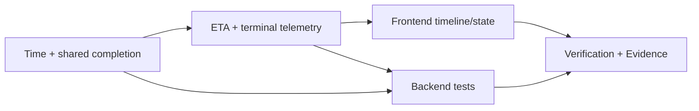

# Plan — 003-route-eta

## Thông tin tài liệu

| Thuộc tính | Giá trị |
| --- | --- |
| Feature ID | `003-route-eta` |
| Spec/Test-Plan version | 2026-09-04 |
| Trạng thái | `READY — chờ người dùng phê duyệt trước Gemini` |
| Planner | Codex |
| Implementer | Gemini |
| Ngày cập nhật | 2026-09-04 |

## Mục tiêu implementation

Hoàn thiện ETA theo Trip hiện có: schedule static từ route metrics, ETA dynamic/completion trong telemetry, state completion Trip/Vehicle nhất quán và Timeline có fallback/realtime. Không thay đổi route CRUD, map provider, database schema hoặc public REST backend.

## Phạm vi implementation

### Sẽ thực hiện

- Clock injectable và completion path dùng chung (`SPEC-001..SPEC-003`).
- Telemetry additive cho status/ETA completion, terminal telemetry (`SPEC-002`, `SPEC-003`).
- Timeline fallback schedule, dynamic completion, telemetry filter theo Trip (`SPEC-004`).
- Test/Evidence cho schedule, ETA, completion, UI và regression (`SPEC-005`, `SPEC-006`).

### Không thực hiện

- Provider traffic/routing, rerouting, ETA persistence/history, migration, multi-trip selector, frontend test framework hay dependency mới.

## Điều kiện tiên quyết

- [x] `requirement.md` có scope/AC không còn câu hỏi chặn.

- [x] `research.md` chọn reuse simulator + Clock JDK.

- [x] `survey.md` xác minh path/symbol/command.

- [x] `spec.md` và `test-plan.md` liên kết mọi REQ MUST.

- [x] Người dùng phê duyệt tài liệu trước khi Gemini implement.

## File sẽ tạo mới

### `vehiceltracking-backend/src/main/java/com/quangkhai/vehiceltracking_backend/config/TimeConfig.java`

- Trách nhiệm: Cung cấp `Clock.systemDefaultZone()` bean cho production.
- Liên kết: `BR-007`, `TC-001`, `TC-003`.
- Lý do cần file mới: Repository chưa có `Clock` bean; config class hiện là convention đã có.

### `vehiceltracking-backend/src/test/java/com/quangkhai/vehiceltracking_backend/service/TripServiceTest.java`

- Trách nhiệm: Test fixed-time schedule và idempotent completion.
- Liên kết: `TC-001`, `TC-006`.
- Lý do cần file mới: Survey EVD-009 xác nhận chưa có TripService test.

### `vehiceltracking-backend/src/test/java/com/quangkhai/vehiceltracking_backend/service/SimulatorServiceTest.java`

- Trách nhiệm: Test ETA ordered, checked-in/incident, terminal telemetry capture.
- Liên kết: `TC-003`, `TC-004`, `TC-005`.
- Lý do cần file mới: Survey EVD-009 xác nhận chưa có SimulatorService test.

### `vehiceltracking-backend/src/test/java/com/quangkhai/vehiceltracking_backend/service/GeofencingServiceTest.java`

- Trách nhiệm: Test final geofence delegates completion path đúng một lần.
- Liên kết: `TC-005`.
- Lý do cần file mới: Survey EVD-009 xác nhận chưa có GeofencingService test.

### `vehiceltracking-backend/src/test/java/com/quangkhai/vehiceltracking_backend/controller/TripControllerTest.java`

- Trách nhiệm: Controller integration cho `GET /api/trips/{id}` schedule ordered.
- Liên kết: `TC-002`.
- Lý do cần file mới: Baseline không có TripController test (Survey EVD-009).

## File sẽ chỉnh sửa

### `vehiceltracking-backend/src/main/java/com/quangkhai/vehiceltracking_backend/service/TripService.java`

- Trách nhiệm hiện tại: Tạo Trip/check-ins schedule và manual completion.
- Thay đổi: Inject Clock; dùng cùng source time cho create schedule; đưa completion có timestamp vào một path transaction/idempotent để final auto check-in tái sử dụng; giữ `TripDto`/endpoint shape.
- Liên kết: `BR-001`, `BR-004`, `BR-007`, `TC-001`, `TC-006`.
- Phần không được ảnh hưởng: Route selection, Trip code convention và public POST/GET endpoint hiện có.

### `vehiceltracking-backend/src/main/java/com/quangkhai/vehiceltracking_backend/service/GeofencingService.java`

- Trách nhiệm hiện tại: Auto check-in, event/alert và tự update final Trip.
- Thay đổi: Sau khi lưu final check-in, gọi completion path TripService với cùng `checkInTime`; bỏ duplicate direct completion state write; giữ event check-in/alert topics.
- Liên kết: `BR-004`, `TC-005`.
- Phần không được ảnh hưởng: Rule lấy next PENDING stop, radius geofence và payload CheckInEvent/Alert hiện có.

### `vehiceltracking-backend/src/main/java/com/quangkhai/vehiceltracking_backend/service/SimulatorService.java`

- Trách nhiệm hiện tại: Scheduler/session, speed incident, geofence, vehicle update và telemetry.
- Thay đổi: Inject Clock; giữ `calculateEtas`/single-step ở mức package-private đủ để unit test (không tạo service abstraction mới); derive explicit completion ETA từ final stop; nhận biết final check-in ngay trong tick để set session complete và phát terminal telemetry trước tick skip; không phát NaN/negative ETA.
- Liên kết: `BR-002..BR-005`, `TC-003..TC-005`.
- Phần không được ảnh hưởng: Scheduler frequency, waypoint generation, incident speed factor, existing telemetry fields/topics và speed multiplier meaning.

### `vehiceltracking-backend/src/main/java/com/quangkhai/vehiceltracking_backend/dto/VehicleTelemetryDto.java`

- Trách nhiệm hiện tại: DTO snapshot vị trí/speed/target/station ETA.
- Thay đổi: Thêm additive `tripStatus`, `etaSecondsToCompletion`, `estimatedCompletionTime`.
- Liên kết: `BR-003`, `BR-005`, `TC-005`.
- Phần không được ảnh hưởng: Tên/kiểu các field telemetry hiện có.

### `vehicletracking-frontend/src/types/index.ts`

- Trách nhiệm hiện tại: TypeScript types DTO/WebSocket.
- Thay đổi: Bổ sung optional type cho ba field telemetry completion/trip status để tương thích backend cũ.
- Liên kết: `BR-005`, `TC-008`, `TC-011`.
- Phần không được ảnh hưởng: Existing Route/Station/Trip and station ETA types.

### `vehicletracking-frontend/src/services/api.ts`

- Trách nhiệm hiện tại: Bao REST calls và `parseErrorMessage`.
- Thay đổi: Thêm `getTripById` bọc `GET /api/trips/{id}` đã tồn tại, dùng error parser hiện có.
- Liên kết: `BR-006`, `TC-002`, `TC-007`.
- Phần không được ảnh hưởng: API base URL và contracts khác.

### `vehicletracking-frontend/src/App.tsx`

- Trách nhiệm hiện tại: Owner currentTrip/telemetry/simulator state.
- Thay đổi: Bỏ qua telemetry không khớp `currentTrip`; khi nhận terminal telemetry của currentTrip thì cập nhật sim status và refresh Trip detail best-effort, không xóa telemetry nếu refresh fail.
- Liên kết: `BR-004..BR-006`, `TC-005`, `TC-007`.
- Phần không được ảnh hưởng: Route/Station/Incident modal state và simulator control API calls.

### `vehicletracking-frontend/src/components/TimelinePanel.tsx`

- Trách nhiệm hiện tại: Render telemetry stations ETA/check-in.
- Thay đổi: Render fallback từ `Trip.checkIns` khi không có matching telemetry; render explicit completion time/ETA and terminal state; guard missing optional fields.
- Liên kết: `BR-003`, `BR-005`, `BR-006`, `TC-007`, `TC-008`.
- Phần không được ảnh hưởng: Layout map, toast, RouteModal and StationModal.

## Database Changes

Không có. `TripCheckIn` đã có scheduled/actual time; ETA dynamic là snapshot realtime, không ghi database.

## API Changes

Không có backend REST API mới/sửa. Frontend thêm wrapper cho endpoint GET Trip đã tồn tại.

| Method/Endpoint | Loại thay đổi | Spec contract | Compatibility |
| --- | --- | --- | --- |
| `GET /api/trips/{id}` | Reuse ở frontend | Refresh schedule/actual completion sau terminal telemetry | Backward-compatible, response không đổi |

## Event / Realtime Changes

| Event/Topic | Producer/Consumer | Payload/Behavior change | Compatibility |
| --- | --- | --- | --- |
| `/topic/telemetry` | SimulatorService → WebSocketService/App/Timeline | Thêm `tripStatus`, `etaSecondsToCompletion`, `estimatedCompletionTime`; phát terminal snapshot trong final tick. | Additive; client cũ bỏ field lạ, client mới handles absence. |

## Dependency và Configuration Changes

| Loại | Thay đổi | Lý do | Security/Operation impact |
| --- | --- | --- | --- |
| Dependency | Không có | `java.time.Clock` là JDK 26. | Không có. |
| Configuration | `TimeConfig` Clock bean | Fixed Clock unit test và consistent source time. | Không secret; default system default zone giữ compatibility. |

## Implementation Steps

### Step 1 — Time source, schedule và completion chung

**Mục tiêu:** Lịch/actual completion dùng time source testable và auto/manual completion không còn split state.

**Liên kết:** `REQ-001`, `REQ-003`, `REQ-005`; `BR-001`, `BR-004`, `BR-007`; `TC-001`, `TC-005`, `TC-006`.

**File/thành phần:**

- `config/TimeConfig.java`
- `service/TripService.java`
- `service/GeofencingService.java`

**Thay đổi:**

1. Tạo Clock bean system-default.
2. Inject Clock vào TripService; schedule dùng `now(clock)`; completion overload/path chấp nhận completion time, idempotent và update Vehicle.
3. Geofence giữ final check-in/event nhưng delegate final Trip/Vehicle completion vào TripService cùng check-in time.

**Kết quả mong đợi:** Schedule deterministic under fixed Clock; final auto/manual completion không ghi khác nhau và Vehicle không còn `IN_TRANSIT` sau final.

**Dependency:** Không có.

**Kiểm tra ngay sau step:** TC-001, TC-006 unit tests.

**Evidence cần thu thập:** EVD-010/EVD-012 (TEST output và assertion actual).

**Rủi ro/rollback:** Không đổi schema; rollback chỉ cần revert service/config change. Không dùng Clock global cho phần ngoài ETA/completion.

### Step 2 — ETA và terminal telemetry

**Mục tiêu:** Có ETA per-stop/completion additive và snapshot terminal nhất quán.

**Liên kết:** `REQ-002`, `REQ-003`, `REQ-005`; `BR-002`, `BR-003`, `BR-005`; `TC-003..TC-005`.

**File/thành phần:**

- `service/SimulatorService.java`
- `dto/VehicleTelemetryDto.java`

**Thay đổi:**

1. Dùng Clock cho ETA timestamp; expose minimal package-private calculation/single-tick seam để test, không thêm calculator service mới.
2. Bảo đảm `stationsEta` ordered, check-in/ETA semantics và effective speed validation.
3. Derive completion fields từ final stop; sau final geofence phát terminal payload exactly once và complete session.
4. Thêm field DTO additive, không đổi các field cũ/topic.

**Kết quả mong đợi:** `/topic/telemetry` có completion ETA/time/tripStatus, tick cuối status IDLE/COMPLETED and zero pending ETA.

**Dependency:** Step 1.

**Kiểm tra ngay sau step:** TC-003, TC-004, TC-005 via mocked repositories/messaging.

**Evidence cần thu thập:** EVD-011/EVD-012 (TEST, captured payload).

**Rủi ro/rollback:** Không persist snapshot; if terminal logic fails test, do not change scheduler frequency/waypoint math as workaround.

### Step 3 — Frontend state, fallback và presentation

**Mục tiêu:** Người dùng thấy schedule trước Start, ETA/completion trong khi chạy, và state terminal đúng Trip.

**Liên kết:** `REQ-004`, `REQ-005`; `BR-005`, `BR-006`; `TC-007`, `TC-008`.

**File/thành phần:**

- `vehicletracking-frontend/src/types/index.ts`
- `vehicletracking-frontend/src/services/api.ts`
- `vehicletracking-frontend/src/App.tsx`
- `vehicletracking-frontend/src/components/TimelinePanel.tsx`

**Thay đổi:**

1. Extend telemetry TS type optional/additive and add `getTripById` with existing parser.
2. App filters telemetry by current Trip and refreshes current Trip after terminal event best-effort.
3. Timeline derives local fallback entries from check-ins when no matching telemetry; shows named completion time/ETA with safe missing-field state.

**Kết quả mong đợi:** No blank timeline before simulator; unrelated message cannot overwrite; terminal UI reflects persisted completion after refresh.

**Dependency:** Step 2.

**Kiểm tra ngay sau step:** TC-007 manual flow and TC-008 type compatibility.

**Evidence cần thu thập:** EVD-013 (UI screenshot/manual), EVD-014/015 (type/lint/build output).

**Rủi ro/rollback:** Do not modify MapComponent or websocket URL; retain current telemetry subscription cleanup.

### Step 4 — Automated test coverage

**Mục tiêu:** Bảo vệ business rules/terminal state thay vì chỉ kiểm tra build.

**Liên kết:** `REQ-001..REQ-006`; `TC-001..TC-006`, `TC-009`.

**File/thành phần:**

- `service/TripServiceTest.java`
- `service/SimulatorServiceTest.java`
- `service/GeofencingServiceTest.java`
- `controller/TripControllerTest.java`

**Thay đổi:**

1. Tạo fixtures ordered START/STOP/END and fixed Clock.
2. Assert cumulative schedule, checked/pending ETA and incident effective speed.
3. Capture messaging template terminal payload; assert exact completion/Vehicle state/idempotency.
4. Add GET Trip integration case with ordered check-ins/scheduled timestamps.

**Kết quả mong đợi:** Every critical acceptance behavior fails deterministically when contract regresses.

**Dependency:** Steps 1-3.

**Kiểm tra ngay sau step:** `./mvnw clean test` Java 26.

**Evidence cần thu thập:** EVD-010, EVD-011, EVD-012.

**Rủi ro/rollback:** Avoid waits/sleeps/scheduler timing in tests; test single tick seam with fixed Clock.

### Step 5 — Verification, artifacts và Evidence

**Mục tiêu:** Thu thập evidence thực tế đúng scope before review.

**Liên kết:** `REQ-006`; `TC-007..TC-011`.

**File/thành phần:**

- `docs/features/003-route-eta/evidence.md`
- `docs/features/003-route-eta/artifacts/` (chỉ output/screenshot thật)

**Thay đổi:**

1. Run backend clean test, frontend lint/type-check/build and `git diff --check`.
2. Run manual UI scenario no telemetry → live ETA → final completion; save screenshots with clear state/timestamp.
3. Update every EVD/matrix actual result; mark any command/manual step not run `INCONCLUSIVE`.

**Kết quả mong đợi:** Reviewer can trace REQ → SPEC → TC → EVD without relying on narrative claim.

**Dependency:** Steps 1-4.

**Kiểm tra ngay sau step:** Commands in table below.

**Evidence cần thu thập:** EVD-010..EVD-015.

**Rủi ro/rollback:** Do not claim PASS from generated/blank recording; screenshots must show relevant result.

## Tests cần implement hoặc cập nhật

| Test Case | Loại | Test file dự kiến | Step | Nội dung chính |
| --- | --- | --- | --- | --- |
| TC-001, TC-006 | Unit | `service/TripServiceTest.java` | 1, 4 | Schedule fixed Clock, completion idempotency. |
| TC-002 | Integration/API | `controller/TripControllerTest.java` | 4 | Ordered schedule serialization. |
| TC-003, TC-004 | Unit | `service/SimulatorServiceTest.java` | 2, 4 | Pending/checked/incident ETA and completion fields. |
| TC-005 | Unit/Realtime | `GeofencingServiceTest.java`, `SimulatorServiceTest.java` | 1, 2, 4 | Final check-in, Trip/Vehicle, captured terminal telemetry. |
| TC-007, TC-008 | Manual/Type | Frontend files in Step 3 | 3, 5 | Fallback/live/terminal/isolation and optional compatibility. |
| TC-009..TC-011 | Regression | Existing Maven/npm scripts | 5 | Test/lint/type/build/whitespace. |

## Evidence cần thu thập

| Evidence dự kiến | Requirement/Spec/Test | Plan Step | Loại | Claim cần chứng minh | Nguồn/Artifact dự kiến |
| --- | --- | --- | --- | --- | --- |
| EVD-010 | REQ-001, SPEC-001, TC-001/002/009 | 1,4,5 | TEST | Schedule/API ordered và backend regression pass. | `artifacts/mvn-clean-test.log` |
| EVD-011 | REQ-002, SPEC-002, TC-003/004 | 2,4,5 | TEST | ETA cumulative/checked/incident exact fixed time. | Test output/report |
| EVD-012 | REQ-003/005, SPEC-003, TC-005/006 | 1,2,4,5 | TEST | Atomic/idempotent completion and terminal telemetry. | Test output/report |
| EVD-013 | REQ-004, SPEC-004, TC-007 | 3,5 | MANUAL/UI | Fallback/live/final Timeline flow. | Timestamp screenshots/steps |
| EVD-014 | REQ-005/006, SPEC-005, TC-008/010 | 3,5 | TYPE_CHECK/LINT | Safe TS telemetry and lint exit 0. | `artifacts/frontend-verification.log` |
| EVD-015 | REQ-006, SPEC-006, TC-011 | 3,5 | BUILD | Type-check/build/diff check actual results. | `artifacts/frontend-verification.log` |

## Lệnh kiểm tra

| Thứ tự | Command | Working directory | Mục đích | Điều kiện đạt |
| --- | --- | --- | --- | --- |
| 1 | `./mvnw clean test` | `vehiceltracking-backend` | Backend tests/compile | Java 26, exit 0, new + regression test pass. |
| 2 | `npm run lint` | `vehicletracking-frontend` | Lint | Exit 0; classify baseline warnings. |
| 3 | `npx tsc --noEmit` | `vehicletracking-frontend` | Type check | Exit 0. |
| 4 | `npm run build` | `vehicletracking-frontend` | Production build | Exit 0. |
| 5 | `git diff --check` | repository root | Whitespace | No output/exit 0. |

## Thứ tự implementation và dependency

## Rủi ro

| ID | Rủi ro | Khả năng | Ảnh hưởng | Giảm thiểu | Step kiểm soát |
| --- | --- | --- | --- | --- | --- |
| RISK-001 | Final tick skipped before terminal telemetry | Vừa | Cao | Detect completion in same tick, captured payload test. | 2, 4 |
| RISK-002 | Duplicate completion overwrites actual end time | Vừa | Cao | Shared idempotent TripService completion. | 1, 4 |
| RISK-003 | Timestamp tests flaky | Vừa | Vừa | Fixed Clock, no sleep. | 1, 4 |
| RISK-004 | UI accepts unrelated telemetry | Thấp | Vừa | Filter current Trip + manual evidence. | 3, 5 |
| RISK-005 | Scope drifts to live traffic provider | Thấp | Cao | No dependency/config/API provider in Plan. | All |

## Kế hoạch bàn giao cho Review

Gemini phải báo cáo file/step đã làm, test/TC mapping, EVD-010..EVD-015 actual result/exit code/artifact, diff, và mọi limitation. Gemini không self-approve. Nếu browser/manual flow không chạy, giữ EVD-013 `INCONCLUSIVE` và nêu lý do.

## Definition of Done

- [x] Mọi step liên kết Spec/Test Case/Evidence.

- [x] File tạo/sửa có path và trách nhiệm từ Survey.

- [x] Không có DB/API provider/dependency ngoài scope.

- [x] Command verification đã được Survey/AGENTS xác minh.

- [x] Gemini có thể implement mà không phải tự thiết kế lại feature.

- [x] Chờ người dùng review/approve trước Implement.