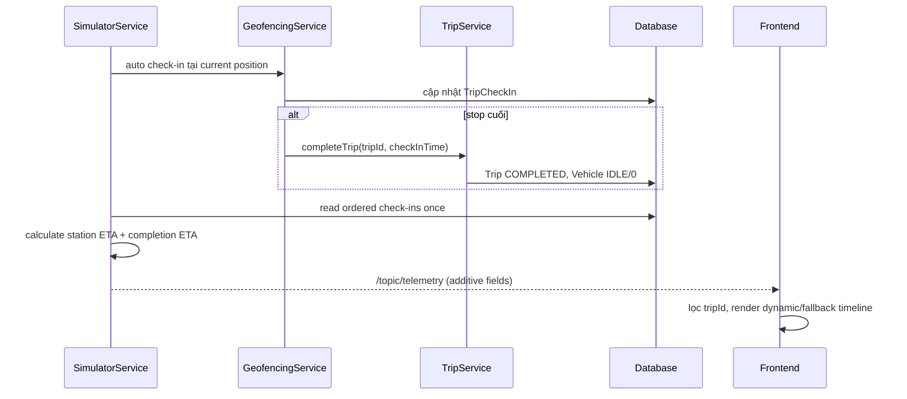

# Spec — 003-route-eta

## Thông tin tài liệu

| Thuộc tính | Giá trị |
|---|---|
| Feature ID | `003-route-eta` |
| Requirement version | 2026-09-04 |
| Research/Survey version | 2026-09-04, baseline `0cc54fe` |
| Trạng thái | `READY — chờ người dùng phê duyệt trước Gemini` |
| Người viết | Codex |
| Người duyệt | Người dùng |
| Ngày cập nhật | 2026-09-04 |

## Tổng quan

Feature hoàn thiện luồng ETA đã tồn tại. `TripCheckIn` tiếp tục là source of truth cho lịch khởi tạo và actual arrival. `SimulatorService` tiếp tục là nguồn snapshot ETA động; payload `/topic/telemetry` được mở rộng additive bằng thông tin completion và Trip status. Không thêm provider bên ngoài, REST endpoint, table/column hay persistence snapshot ETA mỗi tick.

## Mục tiêu

- `TripDto.checkIns` mô tả lịch dự kiến đầy đủ, gồm thời điểm hoàn thành dự kiến suy ra từ stop cuối.
- Telemetry mô tả ETA/cumulative distance của mọi stop và completion tường minh.
- Auto check-in trạm cuối dùng cùng hành vi completion với `TripService`, phát đúng một terminal telemetry và đưa Vehicle về `IDLE`.
- Timeline có fallback schedule và chỉ nhận telemetry đúng Trip đang xem.

## Không thuộc thiết kế này

- Real traffic/routing, ETA GPS thật, rerouting, data migration, history ETA và multi-trip selection.
- Thay đổi công thức metric Route (`estimatedTimeToNextMinutes`) hoặc ý nghĩa speed multiplier.
- Thay thế STOMP/SockJS/API base URL hoặc thêm test framework frontend.

## Kiến trúc

```mermaid
flowchart LR
    R[RouteStation metrics] --> T[TripService]
    C[Clock] --> T
    C --> G[GeofencingService]
    C --> S[SimulatorService]
    T --> DB[(Trip + TripCheckIn + Vehicle)]
    S --> G
    G --> T
    S --> W[/topic/telemetry]
    W --> A[App]
    A --> L[TimelinePanel]
```

- Một `Clock` system-default được bean-inject vào `TripService`, `GeofencingService` và `SimulatorService` thay cho current time trực tiếp của luồng ETA/completion.
- `GeofencingService` gọi completion path của `TripService` khi không còn `PENDING`, thay vì tự ghi state Trip riêng.
- `SimulatorService` tạo telemetry thường và terminal từ cùng một `StationEtaDto` list. Không thêm event/topic mới.
- `TimelinePanel` tạo một view model cục bộ từ telemetry hợp lệ, nếu không có thì từ `Trip.checkIns`.

## Luồng xử lý

### Luồng chính

1. `TripService#createTrip` lấy `RouteStation` tăng dần theo `stopOrder`, tạo check-in schedule cumulative từ `startTime`.
2. Khi simulator tick, service xác định speed effective hiện có, process auto check-in, đọc ordered check-ins một lần và tính ETA cumulative cho các stop PENDING.
3. Service lấy phần tử stop cuối để điền `etaSecondsToCompletion` và `estimatedCompletionTime`.
4. Nếu tick vừa check-in stop cuối, `GeofencingService` gọi completion path chung; simulator đánh session completed, phát telemetry terminal rồi tick sau không xử lý session đó.
5. Frontend chỉ nhận telemetry có `tripId` bằng `currentTrip.id`; Timeline render dynamic ETA hoặc fallback schedule.



### Luồng fallback/lỗi

1. Chưa có telemetry: Timeline dùng `currentTrip.checkIns` theo `stopOrder`, `scheduledArrivalTime` và stop cuối làm completion dự kiến.
2. Telemetry của Trip khác hoặc telemetry không có `tripId`: App bỏ qua, không mutate timeline của current Trip.
3. Nếu no `PENDING` stop: ETA completion là `0`; completion time là actual arrival stop cuối/end time; terminal telemetry không có target pending.
4. Nếu Trip không tồn tại ở API/service hiện có: giữ behavior hiện tại (exception/error response hiện hành); feature không thêm REST endpoint/error handler mới.

## Business Rules

### BR-001 — Lịch khởi tạo cumulative

**Liên kết:** `REQ-001`, `AC-REQ-001-01`.

**Quy tắc:** Với ordered `RouteStation[0..n-1]`, `TripCheckIn[i].scheduledArrivalTime` bằng `startTime + sum(estimatedTimeToNextMinutes[0..i-1])`, làm tròn giây như dữ liệu metric hiện có. Stop đầu bằng đúng `startTime`; completion schedule bằng scheduled time stop có `stopOrder` lớn nhất.

**Lý do:** Bảo toàn dữ liệu schedule hiện có và tạo một điểm chuẩn trước realtime ETA.

### BR-002 — ETA động từng stop

**Liên kết:** `REQ-002`, `AC-REQ-002-01`, `AC-REQ-002-02`.

**Quy tắc:** Telemetry `stationsEta` luôn có đúng một item cho từng `TripCheckIn` tăng dần theo `stopOrder`.

- Item `CHECKED_IN`: `distanceRemainingMeters = 0`, `etaSeconds = 0`, `estimatedArrivalTime = actualArrivalTime`.
- Item `PENDING`: distance là tổng từ vị trí hiện tại đến pending stop đầu và từ mỗi pending stop tới stop pending sau, dùng `GeoUtil.calculateDistanceMeters`; ETA giây là `round(cumulativeDistanceMeters / effectiveSpeedMetersPerSecond)`; time là `now(clock) + etaSeconds`.
- `effectiveSpeedMetersPerSecond` dùng base speed nhân incident speed factor đang có. Không dùng playback multiplier để thay đổi ETA nghiệp vụ.
- Các số distance/ETA không âm. Nếu service không thể xác định speed dương, không được chia 0; áp dụng fallback an toàn hiện có hoặc báo lỗi internal có log, không phát giá trị vô hạn/NaN.

**Lý do:** Phù hợp dữ liệu/mô hình simulator hiện tại, không tuyên bố ETA giao thông thật.

### BR-003 — Completion ETA tường minh

**Liên kết:** `REQ-003`, `AC-REQ-003-01`.

**Quy tắc:** `etaSecondsToCompletion` và `estimatedCompletionTime` lấy từ item có `stopOrder` cuối:

- Khi còn stop PENDING: bằng ETA/time động của stop cuối.
- Khi tất cả stop CHECKED_IN: `etaSecondsToCompletion = 0` và `estimatedCompletionTime` bằng actual arrival của stop cuối (và `Trip.endTime` sau completion).

Không suy diễn completion ở client từ index danh sách.

### BR-004 — Completion atomic và idempotent

**Liên kết:** `REQ-003`, `REQ-005`, `AC-REQ-003-01`, `AC-REQ-005-01`.

**Quy tắc:** Khi geofence check-in stop PENDING cuối cùng, service completion chung thực hiện trong transaction:

1. Ghi actual arrival/check-in trước.
2. Nếu Trip chưa `COMPLETED`, set `Trip.status = COMPLETED`, `Trip.endTime = checkInTime`, `Vehicle.status = IDLE`, `Vehicle.currentSpeed = 0`.
3. Nếu đã `COMPLETED`, giữ `endTime` đã có và không ghi đè lại.
4. Simulator set session completed và phát đúng một terminal telemetry trong tick hiện tại; terminal có `status = IDLE`, `tripStatus = COMPLETED`, no pending target, `etaSecondsToTarget = 0`, `etaSecondsToCompletion = 0`, `stationsEta` toàn `CHECKED_IN`.

`TripService#completeTrip` từ REST tiếp tục hoạt động và dùng chung logic; khi không có check-in time truyền vào, dùng `now(clock)`.

### BR-005 — Contract telemetry additive

**Liên kết:** `REQ-003`, `REQ-005`, `AC-REQ-005-01`.

Các field hiện có của `VehicleTelemetryDto` giữ nguyên tên/kiểu. Thêm:

| Field | Type | Ý nghĩa |
|---|---|---|
| `tripStatus` | `TripStatus` | Trạng thái nghiệp vụ Trip tại tick. |
| `etaSecondsToCompletion` | `Long` | ETA giây đến stop cuối/completion, `0` khi complete. |
| `estimatedCompletionTime` | `LocalDateTime` | Thời điểm completion dự kiến hoặc actual terminal. |

Không ghi snapshot này vào database. Client mới coi fields này optional để vẫn render được với backend cũ; client cũ bỏ qua field JSON lạ.

### BR-006 — Timeline fallback và isolation theo Trip

**Liên kết:** `REQ-004`, `AC-REQ-004-01`.

1. Không có telemetry phù hợp: render `Trip.checkIns` ordered với `scheduledArrivalTime`, status persisted và completion schedule từ check-in cuối.
2. Có telemetry `tripId === currentTrip.id`: render `stationsEta`, completion ETA/time và terminal completion từ telemetry.
3. Telemetry Trip khác/không xác định không được thay telemetry của `currentTrip`.
4. Sau terminal telemetry, App lấy lại Trip bằng `GET /api/trips/{id}` hiện có để đồng bộ `endTime`/check-ins; failure refresh không được xóa terminal telemetry đã nhận.

### BR-007 — Nguồn thời gian testable

**Liên kết:** `REQ-005`, `REQ-006`.

`TimeConfig` cung cấp `Clock.systemDefaultZone()` trong production. Unit test truyền `Clock.fixed` để expected schedule/ETA/completion time chính xác; không hard-code một timestamp runtime.

## Data Model

Không thay đổi schema hoặc migration.

- `TripCheckIn.scheduledArrivalTime` tiếp tục lịch baseline; `actualArrivalTime` tiếp tục time check-in thật/simulator.
- `Trip.endTime` tiếp tục là actual completion, không là ETA dự kiến.
- ETA dynamic/completion chỉ là fields DTO telemetry snapshot, tránh write DB mỗi tick.

## API Contract

Không có REST endpoint backend mới hay thay đổi response bắt buộc.

- Tiếp tục dùng `GET /api/trips/{id}` để frontend refresh `TripDto` sau terminal telemetry.
- Frontend thêm helper `api.getTripById(id)` cho endpoint hiện hữu; lỗi HTTP dùng `parseErrorMessage` như route/station methods hiện có.

## Event / Realtime Contract

### Event: `/topic/telemetry`

**Producer:** `SimulatorService`.

**Consumer:** `WebSocketService` → `App` → `TimelinePanel`/`MapComponent`.

**Thời điểm phát:** Mỗi tick simulation active, gồm tick có final auto check-in. Tick sau terminal không phát nữa vì session complete.

```json
{
  "tripId": 101,
  "status": "IN_TRANSIT",
  "tripStatus": "RUNNING",
  "etaSecondsToTarget": 72,
  "etaSecondsToCompletion": 420,
  "estimatedCompletionTime": "2026-09-04T10:07:00",
  "stationsEta": []
}
```

| Field | Type | Bắt buộc với producer mới | Ý nghĩa |
|---|---|---|---|
| `tripId` | `Long` | Có | Khóa isolation frontend. |
| `stationsEta` | `List<StationEtaDto>` | Có | Ordered ETA/check-in của toàn route. |
| `tripStatus` | `TripStatus` | Có | `RUNNING` hoặc `COMPLETED` trong phạm vi feature. |
| `etaSecondsToCompletion` | `Long` | Có | Không âm; 0 terminal. |
| `estimatedCompletionTime` | `LocalDateTime` | Có | Dynamic ETA hoặc actual time terminal. |

STOMP delivery/reconnect không có persistence/ack trong broker hiện tại. App luôn dùng telemetry mới nhất cùng `tripId`; sau reconnect, tick sau phát snapshot mới. Feature không giải quyết replay lịch sử.

## Validation

| Input/Field | Rule | Nơi kiểm tra | Kết quả khi vi phạm |
|---|---|---|---|
| `tripId` simulator | Trip/route phải tồn tại, route phải có đủ stop | Simulator service hiện có | Giữ error hiện có; không tạo partial session. |
| Ordered check-ins | Đọc qua repository `OrderByStopOrderAsc` | Backend | ETA không dựa vào insert order. |
| `effectiveSpeed` | Phải dương hữu hạn trước phép chia | Backend ETA calculation | Không phát NaN/infinity/negative ETA. |
| Telemetry incoming | `tripId` phải khớp current Trip để update dashboard | Frontend App | Bỏ qua event không khớp. |

## Error Handling

| Failure mode | Phát hiện | Hành vi hệ thống | Log/Metric | Response/UI |
|---|---|---|---|---|
| Trip không tồn tại khi start/complete | Repository current behavior | Không tạo session/state mới. | Log/exception theo hiện có. | Giữ message API hiện có. |
| Vehicle null trong manual completion | Defensive existing path | Complete Trip; không dereference vehicle. | Không secret. | Không đổi REST contract. |
| Refresh Trip sau terminal fail | `api.getTripById` rejects | Giữ terminal telemetry, log error; không reset ETA UI. | console error hiện có style. | User vẫn thấy completion terminal. |
| Event của Trip khác | `App` compare IDs | Bỏ qua event. | Không cần log mỗi tick. | Không flicker/ghi đè timeline. |

## Security

- Không thêm authentication/authorization hoặc external call; giữ boundary hiện có.
- Không thêm API key/config secret; Clock config không có secret.
- Telemetry chỉ chứa thông tin vehicle/trip đã được payload hiện có sử dụng; không thêm PII mới.
- Không đưa stack trace/secret vào UI/evidence.

## Performance và Reliability

- Reuse `findByTripIdOrderByStopOrderAsc` một lần/tick để tính all ETA; không query từng Station.
- Không thêm browser polling/timer; đợi snapshot STOMP tick hiện có.
- Completion transition idempotent để retry/manual call không ghi lại `endTime`.
- Session map/scheduler hiện có được giữ; feature chỉ bảo đảm terminal emission trước khi tick skip session completed.

## Edge Cases

| ID | Tình huống | Hành vi mong đợi | Requirement/BR |
|---|---|---|---|
| EC-001 | Chưa start simulator | Timeline dùng TripCheckIn schedule, không hiển thị ETA động giả. | REQ-001, REQ-004, BR-006 |
| EC-002 | Một/vài stop đã CHECKED_IN | Các stop đó ETA 0/actual; pending ETA bắt đầu từ current position. | REQ-002, BR-002 |
| EC-003 | Sự cố giảm tốc | Effective speed thay đổi; ETA pending/completion tính lại từ snapshot. | REQ-002, BR-002 |
| EC-004 | Check-in final | Chốt Trip/Vehicle, terminal telemetry/ETA 0, session complete. | REQ-003, BR-003/004 |
| EC-005 | Completion gọi lại | `endTime` không đổi. | REQ-005, BR-004 |
| EC-006 | Telemetry Trip không phải current | App bỏ qua. | REQ-004, BR-006 |
| EC-007 | Backend cũ chưa có field completion | Frontend dùng optional fallback/không crash. | REQ-005, BR-005 |

## Compatibility

- REST `TripDto`/endpoint giữ nguyên. Method client mới chỉ bọc GET hiện có.
- JSON telemetry additive; client cũ bỏ qua extra fields, client mới handles absence defensively.
- Database data cũ có schedule/check-in fields hiện có; không backfill/migration.
- Java 26 theo `pom.xml`; no new dependency.

## Configuration và vận hành

| Biến/cấu hình | Nơi sử dụng | Bắt buộc | Default an toàn | Secret? |
|---|---|---|---|---|
| `Clock` bean | backend ETA/completion services | Có, bean nội bộ | `Clock.systemDefaultZone()` | Không |

## Observability

- Giữ log check-in/completion hiện có, bổ sung trip ID/status khi terminal telemetry phát nếu cần.
- Không log toàn payload mỗi tick hoặc timestamp/secret không cần thiết.
- Evidence lưu test output và screenshot/manual flow, không ghi API key.

## Những phần không được thay đổi

- Công thức Route metric, Route/Station management, topics `/topic/checkins`/`/topic/alerts`, simulator controls và speed multiplier semantics.
- Cấu hình map/CARTO, WebSocket URL, dependency/package lock.
- Database schema/migration và external traffic integration.

## Quyết định và trade-off

| ID | Quyết định | Lý do | Phương án không chọn | Hệ quả |
|---|---|---|---|---|
| DEC-001 | Reuse simulator speed/incident data | Có sẵn, không dependency/key. | Routing provider ngoài. | ETA không phải traffic thật. |
| DEC-002 | Completion fields explicit trên telemetry | Contract rõ cho UI/client khác. | Suy diễn stop cuối ở UI. | Thêm additive DTO/type fields. |
| DEC-003 | Không persist ETA dynamic | Snapshot chỉ cần realtime, tránh write/tick load. | Table/history ETA. | Không có lịch sử ETA/replay. |
| DEC-004 | Clock injectable system-default | Test exact timestamp mà giữ behavior time zone hiện có. | Static `now()`/mock library. | Thêm một config bean, không dependency. |
| DEC-005 | Completion chung qua TripService | Đồng bộ auto/manual completion và Vehicle state. | Geofence tự save Trip riêng. | Geofence phụ thuộc TripService nhưng không circular. |

## Traceability

| Spec ID | Requirement/AC | Business Rule/API/Event | Test dự kiến | Evidence dự kiến |
|---|---|---|---|---|
| SPEC-001 | REQ-001, AC-REQ-001-01 | BR-001 | TC-001, TC-002 | EVD-010, EVD-013 |
| SPEC-002 | REQ-002, AC-REQ-002-01/02 | BR-002 | TC-003, TC-004 | EVD-011 |
| SPEC-003 | REQ-003, AC-REQ-003-01 | BR-003, BR-004, telemetry | TC-005, TC-006 | EVD-011, EVD-012 |
| SPEC-004 | REQ-004, AC-REQ-004-01 | BR-006, `GET /api/trips/{id}` client reuse | TC-007 | EVD-012 |
| SPEC-005 | REQ-005, AC-REQ-005-01 | BR-004, BR-005, BR-007 | TC-004, TC-006, TC-008 | EVD-001, EVD-011, EVD-013 |
| SPEC-006 | REQ-006, AC-REQ-006-01 | Verification/Evidence gate | TC-009..TC-012 | EVD-010..EVD-015 |

## Câu hỏi còn mở

Không có câu hỏi chặn implementation. Mọi giới hạn có thể làm đổi scope đã nằm trong Requirement/Research.

## Checklist duyệt Spec

- [x] Spec đáp ứng toàn bộ Requirement trong phạm vi.
- [x] Business Rule/telemetry contract không mơ hồ.
- [x] Validation, edge case, completion idempotency và compatibility đã xử lý.
- [x] Không migration, provider hay dependency ngoài nhu cầu.
- [x] Mọi phần quan trọng có traceability.
