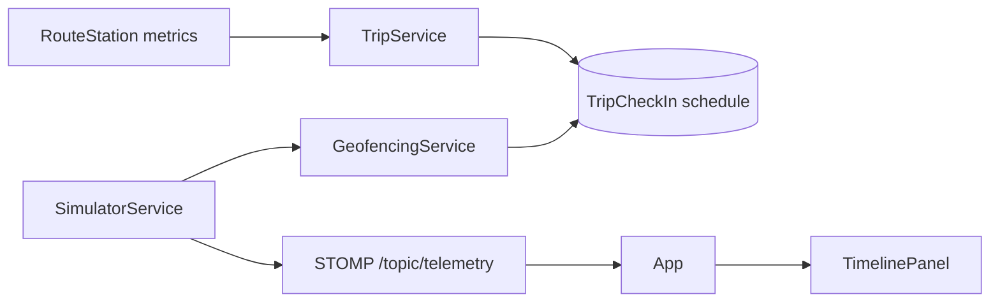
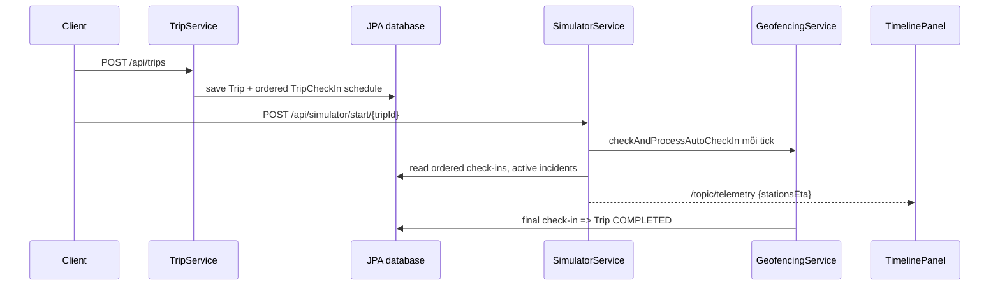

# Survey repository — 003-route-eta

## Thông tin tài liệu

| Thuộc tính | Giá trị |
|---|---|
| Feature ID | `003-route-eta` |
| Requirement liên quan | `REQ-001..REQ-006` |
| Trạng thái | `READY — chờ người dùng phê duyệt trước Gemini` |
| Người khảo sát | Codex |
| Commit/worktree được khảo sát | `0cc54fe`; `git status --short` không có output trước khi tạo tài liệu feature 003 |
| Ngày khảo sát | 2026-09-04 |

## Tổng quan repository

Repository có hai application: `vehiceltracking-backend` (Spring Boot/JPA/STOMP) và `vehicletracking-frontend` (React/Vite). Backend simulator cập nhật state/persistence rồi phát STOMP telemetry; frontend `App` nhận telemetry và đưa cho `TimelinePanel`/`MapComponent`.

## Tech stack

| Thành phần | Công nghệ/Version | Bằng chứng |
|---|---|---|
| Frontend | React 19, TypeScript 7, Vite 8, STOMP client | `vehicletracking-frontend/package.json`; `src/services/websocket.ts` |
| Backend | Spring Boot 4.1.1, Java 26, JPA, WebSocket | `vehiceltracking-backend/pom.xml`; `WebSocketConfig.java` |
| Database dev | H2 runtime; PostgreSQL runtime có trong Maven | `vehiceltracking-backend/pom.xml` |
| Realtime | STOMP simple broker `/topic`, endpoint `/ws-raw` | `WebSocketConfig.java:14-30` |
| Test | JUnit/Spring test modules; không có frontend test script | `pom.xml`; `package.json`; EVD-008 |

## Claim và Evidence từ repository

| Claim | Evidence ID | Nguồn trong repository | Cách kiểm chứng | Trạng thái |
|---|---|---|---|---|
| Trip creation đã lưu lịch từng trạm theo metric RouteStation. | EVD-003 | `TripService#createTrip:41-101` | Đọc loop `runningSchedule`, `scheduledArrivalTime`, `estimatedTimeToNextMinutes`. | PASS |
| Simulator đã phát `stationsEta` theo STOMP nhưng thiếu ETA completion tường minh/tripStatus. | EVD-004 | `SimulatorService#calculateEtas:304-355`, telemetry builder `274-298`; DTO `VehicleTelemetryDto:16-36` | Đối chiếu payload builder/DTO và search field completion. | PASS |
| Auto check-in trạm cuối chốt Trip nhưng không dùng `TripService#completeTrip`, nên không chuyển Vehicle sang IDLE. | EVD-005 | `GeofencingService:96-115`; `TripService#completeTrip:104-118` | Đối chiếu hai completion path. | PASS |
| Frontend chỉ render ETA khi có telemetry; `Trip.checkIns` chưa là fallback Timeline. | EVD-006 | `TimelinePanel:11-12,133-221`; `types/index.ts:57-115` | Trace `stationsEta = telemetry?.stationsEta || []`. | PASS |
| API Trip GET và telemetry consumer đã tồn tại, có thể tái sử dụng không cần REST mới. | EVD-007 | `TripController:19-37`; `api.ts:124-133`; `websocket.ts:34-40,73-78` | Đọc endpoint/API client/subscription. | PASS |
| Repository không chứa adapter/provider routing/traffic bên ngoài. | EVD-008 | `rg -n -i "here|routing|route api|traffic api|directions|osrm|mapbox" ...` | Command chỉ trả dòng comment wrapper Maven, không có application integration. | PASS |
| Baseline chưa có test TripService, GeofencingService hoặc SimulatorService. | EVD-009 | `rg --files vehiceltracking-backend/src/test/java` | Danh sách chỉ có Geo, Application, Route/Station controller/service tests. | PASS |

## Cấu trúc thư mục liên quan

```text
vehiceltracking-backend/src/main/java/.../
├── config/WebSocketConfig.java
├── controller/SimulatorController.java
├── controller/TripController.java
├── dto/{StationEtaDto,TripDto,TripCheckInDto,VehicleTelemetryDto}.java
├── entity/{Trip,TripCheckIn,RouteStation,Vehicle}.java
├── repository/{TripRepository,TripCheckInRepository,RouteStationRepository}.java
└── service/{TripService,SimulatorService,GeofencingService}.java
vehicletracking-frontend/src/
├── App.tsx
├── components/TimelinePanel.tsx
├── services/{api,websocket}.ts
└── types/index.ts
```

## Kiến trúc hiện tại



- `TripService` tạo Trip/check-ins và map `TripDto`.
- `SimulatorService` giữ session trong memory, chạy tick mỗi giây, xử lý incident, gọi geofence, tính ETA rồi phát telemetry.
- `GeofencingService` cập nhật check-in và hiện tự đánh dấu Trip completed ở stop cuối.
- Frontend không polling ETA; `App` ghi state telemetry mới nhất và truyền cho Timeline.

## Thành phần liên quan đến feature

| Loại | Path/Symbol | Trách nhiệm hiện tại | Requirement liên quan |
|---|---|---|---|
| Service | `TripService#createTrip`, `completeTrip`, `toDto` | Tạo schedule, chốt completion manual, map Trip DTO. | REQ-001, REQ-003 |
| Service | `SimulatorService#tickSingleSimulation`, `calculateEtas` | Tính effective speed, ETA stop và phát telemetry. | REQ-002, REQ-003, REQ-005 |
| Service | `GeofencingService#checkAndProcessAutoCheckIn` | Đánh dấu stop, phát check-in/alert, completion route cuối. | REQ-002, REQ-003 |
| Repository | `TripCheckInRepository#findByTripIdOrderByStopOrderAsc` | Đọc check-ins theo stop order. | REQ-001, REQ-002 |
| DTO | `StationEtaDto`, `VehicleTelemetryDto` | Shape ETA stop và telemetry realtime. | REQ-002, REQ-003 |
| Controller | `TripController`, `SimulatorController` | Cung cấp Trip read/completion và simulator controls/status. | REQ-004 |
| Event | `/topic/telemetry` | Simulator producer; WebSocket service/App consumer. | REQ-002..REQ-005 |
| Frontend | `TimelinePanel` | Hiển thị stationsEta, target ETA, actual check-in. | REQ-004 |
| Frontend | `App#onTelemetry` | Giữ telemetry/simulator state. | REQ-003, REQ-004 |

## Luồng xử lý hiện tại



Gap: tick sau terminal đang bị skip khi session `isCompleted`; completion path Geofencing không cập nhật Vehicle như `TripService#completeTrip`, và telemetry DTO không có field completion/tripStatus (EVD-004, EVD-005).

## API và Event hiện tại

| Loại | Method/Topic | Request/Payload | Response/Consumer | Bằng chứng |
|---|---|---|---|---|
| REST | `GET /api/trips/{id}` | Path id | `TripDto` có ordered `checkIns`, scheduled/actual time. | `TripController:24-27`, `TripService#toDto` |
| REST | `POST /api/trips/{id}/complete` | Path id | 200 no body; gọi `TripService#completeTrip`. | `TripController:34-37` |
| REST | `POST /api/simulator/{start,pause,resume,reset}/{tripId}` | Path id | control response map. | `SimulatorController:17-39` |
| WebSocket | `/topic/telemetry` | `VehicleTelemetryDto` | `WebSocketService#onTelemetry`, `App`. | `SimulatorService:274-298`; `websocket.ts:34-40` |
| WebSocket | `/topic/checkins`, `/topic/alerts` | CheckInEvent/Alert | toast frontend. | `GeofencingService:69-115`; `websocket.ts:42-56` |

## Data model hiện tại

| Entity/Table | Field/Constraint liên quan | Relationship | Ghi chú |
|---|---|---|---|
| `Trip` / `trips` | `startTime`, `endTime`, `status` | ManyToOne Route/Vehicle; OneToMany checkIns | `endTime` là actual completion, không dùng cho ETA dự kiến. |
| `TripCheckIn` / `trip_checkins` | `stopOrder`, `scheduledArrivalTime`, `actualArrivalTime`, `status` | ManyToOne Trip/Station | Đủ để lưu lịch tĩnh và arrival thực tế; không cần schema mới. |
| `RouteStation` / `route_stations` | `stopOrder`, `distanceToNextKm`, `estimatedTimeToNextMinutes` | ManyToOne Route/Station | Metric nguồn của lịch ban đầu. |
| `Vehicle` / `vehicles` | `status`, `currentSpeed`, vị trí | ManyToOne từ Trip | Completion path manual đã set IDLE/0; auto path chưa dùng lại. |

## Convention đang được sử dụng

- **Backend:** `@RequiredArgsConstructor`, service layer, JPA repository và `@Transactional` cho write (`TripService`, `GeofencingService`).
- **Realtime:** `SimpMessagingTemplate.convertAndSend` trên `/topic/*`; client singleton STOMP giữ subscriber callbacks.
- **Frontend state:** `App` là owner của data/telemetry, component nhận props; `TimelinePanel` đang có helper format time/ETA local.
- **Testing:** JUnit test đặt ở `src/test/java/.../service` và controller; frontend chỉ có `npm run lint`/`npm run build` (EVD-009, `package.json`).

## Thành phần có thể tái sử dụng

| Thành phần | Lý do phù hợp | Giới hạn |
|---|---|---|
| `TripCheckInRepository#findByTripIdOrderByStopOrderAsc` | Cung cấp tất cả stop đúng thứ tự cho schedule/ETA. | Snapshot trong DB; không lưu dynamic ETA. |
| `GeoUtil.calculateDistanceMeters` | Route và simulator hiện dùng cho khoảng cách. | Không phải routing theo đường thật. |
| `TrafficIncidentRepository#findByActiveTrue`/speed factor hiện có | Đã là nguồn tác động speed simulator. | Không phải traffic provider. |
| `VehicleTelemetryDto` + `/topic/telemetry` | Contract realtime có consumer sẵn. | Cần additive fields và terminal emission. |
| `TripService#completeTrip` | Có logic set Trip/Vehicle completion. | Auto check-in hiện không gọi logic này. |
| `TimelinePanel` | Có hiển thị stop ETA/check-in sẵn. | Không có fallback `Trip.checkIns` hoặc summary completion. |

## Khoảng cách giữa hiện trạng và Requirement

| Requirement | Hiện trạng | Gap | Mức ảnh hưởng | Bằng chứng |
|---|---|---|---|---|
| REQ-001 | Một phần | Schedule từng stop có, nhưng UI chưa dùng trước telemetry và completion initial không explicit. | Vừa | EVD-003, EVD-006 |
| REQ-002 | Một phần | `stationsEta` đã có nhưng chưa có test deterministic/contract coverage toàn bộ. | Cao | EVD-004, EVD-009 |
| REQ-003 | Một phần | Geofence complete Trip nhưng không reset Vehicle; telemetry không có completion fields/terminal state. | Cao | EVD-004, EVD-005 |
| REQ-004 | Một phần | Timeline dùng telemetry nhưng rỗng trước simulator và App không lọc trip ID. | Vừa | EVD-006, EVD-007 |
| REQ-005 | Một phần | DTO additions chưa có; completion paths bị split. | Cao | EVD-004, EVD-005 |
| REQ-006 | Chưa có | Chưa có test ETA/Trip/Geofence/Simulator; frontend không có test script. | Cao | EVD-009 |

## Technical debt liên quan

| Technical debt | Ảnh hưởng tới feature | Xử lý trong feature? | Lý do |
|---|---|---|---|
| `LocalDateTime.now()` rải trong time-sensitive service | Khó assert ETA/completion timestamp. | Có, chỉ cho flow ETA/completion. | Clock injection là thay đổi tối thiểu cho test deterministic. |
| Completion logic split giữa TripService và GeofencingService | Auto completion để Vehicle IN_TRANSIT. | Có. | Cần một path chung để đáp ứng REQ-003. |
| Không có frontend test runner | Không thể thêm `npm test` không có kế hoạch/dependency. | Không. | Dùng build/lint và manual evidence theo AGENTS. |

## File dự kiến bị ảnh hưởng

### File có thể tạo mới

- `vehiceltracking-backend/src/main/java/com/quangkhai/vehiceltracking_backend/config/TimeConfig.java` — Clock production default.
- `vehiceltracking-backend/src/test/java/com/quangkhai/vehiceltracking_backend/service/TripServiceTest.java` — schedule/completion unit tests.
- `vehiceltracking-backend/src/test/java/com/quangkhai/vehiceltracking_backend/service/SimulatorServiceTest.java` — ETA/terminal telemetry tests.
- `vehiceltracking-backend/src/test/java/com/quangkhai/vehiceltracking_backend/service/GeofencingServiceTest.java` — final check-in completion delegation test.

### File có thể chỉnh sửa

- `.../service/TripService.java`, `SimulatorService.java`, `GeofencingService.java` — shared completion, Clock, ETA/terminal state.
- `.../dto/VehicleTelemetryDto.java` — fields completion/trip status additive.
- `vehicletracking-frontend/src/types/index.ts`, `services/api.ts`, `App.tsx`, `components/TimelinePanel.tsx` — types, Trip detail read, state filter/refresh và presentation.

## Command khảo sát đã chạy

| Command | Exit code | Kết quả/tóm tắt | Evidence | Artifact nếu có |
|---|---:|---|---|---|
| `rg -n -i "eta|estimated|arrival|TripCheckIn|..." backend frontend` | 0 | Xác định service/DTO/UI ETA hiện có. | EVD-003..EVD-007 | Không có |
| `rg -n "estimatedCompletion|etaSecondsToCompletion|completionEta|Clock" ...` | 0 | Không có completion field hoặc Clock ứng dụng. | EVD-004 | Không có |
| `rg -n -i "here|routing|route api|traffic api|directions|osrm|mapbox" ...` | 0 | Không có integration application provider ngoài. | EVD-008 | Không có |
| `rg --files vehiceltracking-backend/src/test/java` | 0 | Không có test Trip/Simulator/Geofence. | EVD-009 | Không có |

## Rủi ro và câu hỏi cần Spec giải quyết

- Chỉ phát terminal telemetry trong tick final để UI nhận `COMPLETED` trước session skip.
- Chọn contract additive/timestamp semantics và idempotency completion.
- Dùng fallback schedule của `Trip.checkIns`; không tạo API/entity snapshot ETA mới.

## Checklist hoàn thành

- [x] Không sửa source code ứng dụng trong phase Survey.
- [x] Path, symbol và command lấy từ repository thật.
- [x] Luồng/gap và convention có Evidence EVD cụ thể.
- [x] File dự kiến ảnh hưởng đủ để bắt đầu Spec.
