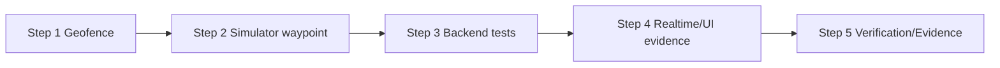

# Plan — 004-automatic-station-checkin

## Thông tin tài liệu

| Thuộc tính | Giá trị |
| --- | --- |
| Feature ID | `004-automatic-station-checkin` |
| Spec/Test-Plan version | 2026-09-04 |
| Trạng thái | `READY — chờ người dùng review trước Gemini` |
| Planner | Codex |
| Implementer | Gemini |
| Ngày cập nhật | 2026-09-04 |

## Mục tiêu implementation

Hoàn thiện auto check-in cho `START`, `STOP`, `END` trong luồng simulator: xác định geofence bằng khoảng cách mét, cập nhật state/timestamp, phát event hiện có, không bỏ qua waypoint và không tạo transition/event trùng trong các lần gọi tuần tự. Không thêm REST endpoint, schema, dependency hoặc provider mới.

## Phạm vi implementation

### Sẽ thực hiện

- Củng cố `GeofencingService#checkAndProcessAutoCheckIn` theo `SPEC-001`, `SPEC-002`, `SPEC-005`: validation defensive, boundary `<=`, state transition, save-before-publish, fixed Clock và completion path.
- Cập nhật `SimulatorService#tickSingleSimulation` theo `SPEC-003`: kiểm tra waypoint index 0 trước movement và giữ việc kiểm tra mọi waypoint trong đoạn nhảy.
- Bổ sung/cập nhật test backend theo `TC-001..TC-007`, `TC-009`, `TC-010`.
- Xác minh frontend contract hiện có theo `TC-008`: `/topic/checkins`, filter `tripId`, toast/timeline; chỉ sửa `App.tsx`, `websocket.ts` hoặc `types/index.ts` nếu test/manual chứng minh contract chưa đúng.
- Chạy verification và cập nhật `evidence.md`; Gemini không cập nhật kết luận approve trong `review.md`.

### Không thực hiện

- Không thêm endpoint nhận check-in từ frontend hoặc GPS thật.
- Không đổi `TripCheckIn` schema, `CheckInEventDto` shape, route/station CRUD, ETA, traffic incident, broker/replay hoặc authentication.
- Không thêm distributed lock/event store, external provider, frontend test framework hay refactor không liên quan.

## Điều kiện tiên quyết

- [x] `requirement.md` có REQ và Acceptance Criteria.

- [x] `spec.md` có BR, validation, event, edge case và traceability.

- [x] `test-plan.md` liên kết mọi Acceptance Criteria.

- [x] Research/Survey đã xác định thành phần tái sử dụng và gap.

- [x] Người dùng review và chấp thuận Plan này.

- [x] Maven dependencies và Node runtime tương thích khả dụng khi Gemini implement.

## File sẽ tạo mới

Không tạo file production mới.

Gemini có thể tạo artifact verification dưới `docs/features/004-automatic-station-checkin/artifacts/` theo Evidence; các artifact không chứa secret/token/password.

## File sẽ chỉnh sửa

### `vehiceltracking-backend/src/main/java/com/quangkhai/vehiceltracking_backend/service/GeofencingService.java`

- Trách nhiệm hiện tại: chọn PENDING đầu tiên, đo khoảng cách, save, phát event và gọi completion.
- Thay đổi: áp dụng validation finite/range cho trip/coordinate/station/radius; chỉ transition PENDING trong geofence; save trước publish; dùng cùng `Clock` time cho save/event/completion; giữ Optional/no-op contract.
- Liên kết: `SPEC-001`, `SPEC-002`, `SPEC-004`, `SPEC-005`; `BR-001..BR-007`; `TC-001..TC-004`, `TC-007`, `TC-009`, `TC-010`.
- Phần không được ảnh hưởng: `CheckInEventDto` shape, `/topic/checkins`, INFO alert hiện có nếu không cần thiết, `TripService` completion implementation.

### `vehiceltracking-backend/src/main/java/com/quangkhai/vehiceltracking_backend/service/SimulatorService.java`

- Trách nhiệm hiện tại: tạo waypoint, tick session, phát telemetry và gọi geofence cho các waypoint sau current index.
- Thay đổi: ở tick đầu/index 0 gọi geofence cho waypoint hiện tại trước movement; tiếp tục gọi lần lượt `(currentIndex, nextIndex]` để không bỏ sót station waypoint.
- Liên kết: `SPEC-003`; `BR-004`; `TC-005`, `TC-006`, `TC-009`.
- Phần không được ảnh hưởng: speed/incident/ETA calculation, pause/resume/reset và telemetry contract ngoài side effect cần thiết.

### `vehiceltracking-backend/src/test/java/com/quangkhai/vehiceltracking_backend/service/GeofencingServiceTest.java`

- Trách nhiệm hiện tại: có test final station/completion.
- Thay đổi: bổ sung happy path, boundary/outside, order, repeat, invalid/no-pending, payload/save order và fixed completion time.
- Liên kết: `TC-001..TC-004`, `TC-007`, `TC-009`, `TC-010`.

### `vehiceltracking-backend/src/test/java/com/quangkhai/vehiceltracking_backend/service/SimulatorServiceTest.java`

- Trách nhiệm hiện tại: test ETA, terminal telemetry và multi-waypoint call.
- Thay đổi: bổ sung expected call cho START index 0 và bảo đảm loop waypoint trung gian không regression.
- Liên kết: `TC-005`, `TC-006`, `TC-009`, `TC-011`.

### `vehicletracking-frontend/src/services/websocket.ts`, `src/App.tsx`, `src/types/index.ts`

- Trách nhiệm hiện tại: STOMP subscribe, typed event, filter theo current Trip và toast.
- Thay đổi: mặc định không sửa; chỉ chỉnh nếu manual/type verification phát hiện event contract không khớp Spec.
- Liên kết: `SPEC-004`, `BR-008`, `TC-008`, `TC-011`.

## Database Changes

Không có.

| Thay đổi | Migration/File | Compatibility/Backfill | Rollback/Rủi ro |
| --- | --- | --- | --- |
| Không đổi bảng/cột/index | Không có | Record `TripCheckIn` cũ tiếp tục dùng | Rollback chỉ ở service/test; không có migration |

## API Changes

Không có API mới hoặc breaking change.

| Method/Endpoint | Loại thay đổi | Spec contract | Compatibility |
| --- | --- | --- | --- |
| `POST /api/simulator/start/{tripId}` | Không đổi contract; side effect geofence được hoàn thiện | `SPEC-003` | Giữ response hiện có |

## Event / Realtime Changes

Không đổi topic hoặc payload bắt buộc.

| Event/Topic | Producer/Consumer | Payload/Behavior change | Compatibility |
| --- | --- | --- | --- |
| `/topic/checkins` | `GeofencingService` → `WebSocketService`/`App` | Phát sau transition/save thành công; không phát outside/invalid/no-pending/repeat | Giữ `CheckInEventDto` field hiện có |

## Dependency và Configuration Changes

| Loại | Thay đổi | Lý do | Security/Operation impact |
| --- | --- | --- | --- |
| Dependency | Không có | Tái sử dụng `GeoUtil`, Spring/JPA/STOMP | Không tăng supply-chain surface |
| Configuration | Không có | Dùng `Station.radiusMeters`, `Clock` và WebSocket config hiện có | Không thêm secret |

## Implementation Steps

### Step 1 — Hoàn thiện quyết định geofence và transition

**Mục tiêu:** `GeofencingService` đáp ứng BR-001..BR-007 với behavior an toàn.

**Liên kết:** `REQ-001`, `REQ-002`, `REQ-004`, `REQ-005`; `SPEC-001`, `SPEC-002`, `SPEC-004`, `SPEC-005`; `TC-001..TC-004`, `TC-007`, `TC-009`, `TC-010`.

**File/thành phần:**

- `GeofencingService#checkAndProcessAutoCheckIn`
- `TripCheckInRepository#findFirstByTripIdAndStatusOrderByStopOrderAsc`
- `GeoUtil#calculateDistanceMeters`

**Thay đổi:**

1. Giữ query PENDING theo `stopOrder`; no-op khi không có record hoặc `tripId` không hợp lệ.
2. Reject/log warning cho tọa độ/radius null, non-finite hoặc ngoài range; không dùng fallback âm thầm cho dữ liệu không hợp lệ.
3. So sánh `distanceMeters <= radiusMeters`; khi match, đặt status/time và save đúng record.
4. Chỉ sau save thành công mới phát `/topic/checkins`; dùng cùng timestamp cho event và completion.
5. Sau save kiểm tra PENDING còn lại; nếu không còn, gọi `TripService#completeTrip(tripId, now)` đúng một lần.

**Kết quả mong đợi:** Unit assertions cho state, invocation count, payload, order và completion đều khớp Spec.

**Dependency:** Không có.

**Kiểm tra ngay sau step:** Chạy test tập trung `GeofencingServiceTest` và `GeoUtilTest` bằng Maven.

**Evidence cần thu thập:** EVD-011..EVD-015 dự kiến; loại `TEST`, claim về boundary/order/idempotency/event/completion.

**Rủi ro/rollback:** Có thể làm thay đổi behavior mock cũ; cập nhật fixture/test theo Spec, không nới expected để che lỗi. Rollback bằng revert file service/test nếu step fail.

### Step 2 — Gắn geofence với waypoint START và waypoint nhảy

**Mục tiêu:** Simulator không bỏ sót START hoặc station waypoint trung gian.

**Liên kết:** `REQ-003`; `SPEC-003`; `TC-005`, `TC-006`.

**File/thành phần:**

- `SimulatorService#tickSingleSimulation`
- `SimulatorService#generateDetailedWaypoints`

**Thay đổi:**

1. Khi tick bắt đầu tại index 0, gọi geofence cho `currentWp` trước khi tăng index.
2. Duy trì loop gọi geofence cho mọi waypoint từ `currentIndex + 1` đến `nextIndex` theo thứ tự.
3. Không trực tiếp mutate `TripCheckIn` trong simulator; để GeofencingService làm source of truth.

**Kết quả mong đợi:** Test capture được START trước waypoint kế tiếp và tất cả waypoint trung gian; không đổi speed/ETA/incident behavior.

**Dependency:** Step 1.

**Kiểm tra ngay sau step:** Chạy `SimulatorServiceTest` và kiểm tra invocation order/arguments.

**Evidence cần thu thập:** EVD-016..EVD-017 dự kiến; loại `TEST`.

**Rủi ro/rollback:** Thêm call ở tick đầu có thể làm test terminal/ETA thấy invocation mới; chỉ cập nhật assertion liên quan, giữ terminal semantics ngoài scope.

### Step 3 — Bổ sung test và regression coverage

**Mục tiêu:** Test-Plan được hiện thực đầy đủ ở backend.

**Liên kết:** `TC-001..TC-007`, `TC-009`, `TC-010`, `TC-011`.

**File/thành phần:**

- `GeofencingServiceTest.java`
- `SimulatorServiceTest.java`
- Có thể chạy lại `TripServiceTest.java`, `TripControllerTest.java`, `StationServiceTest.java`, `RouteServiceTest.java` nhưng chỉ sửa nếu regression do feature chứng minh được.

**Thay đổi:**

1. Dùng `Clock` fixed và tọa độ fixture không chứa dữ liệu nhạy cảm.
2. Assert cả positive và negative invocation (`save`, `convertAndSend`, `completeTrip`).
3. Assert event topic/payload và thứ tự save trước publish.
4. Không tạo frontend test framework mới.

**Kết quả mong đợi:** Critical tests có assertion business behavior, không chỉ compile.

**Dependency:** Step 1, Step 2.

**Kiểm tra ngay sau step:** `bash ./mvnw test` tại backend nếu dependency/network khả dụng.

**Evidence cần thu thập:** EVD-018 dự kiến; loại `TEST`, full suite output.

**Rủi ro/rollback:** Test không deterministic nếu dùng system time; bắt buộc fixed Clock, không sleep/retry để làm test pass.

### Step 4 — Xác minh event và dashboard isolation

**Mục tiêu:** Chứng minh frontend hiện có nhận event đúng Trip và không hiển thị foreign event.

**Liên kết:** `REQ-004`; `SPEC-004`; `BR-008`; `TC-008`.

**File/thành phần:**

- `vehicletracking-frontend/src/services/websocket.ts#onCheckIn`
- `vehicletracking-frontend/src/App.tsx` check-in callback
- `vehicletracking-frontend/src/types/index.ts#CheckInEvent`
- `ToastNotification`, `TimelinePanel`

**Thay đổi:**

1. Ưu tiên không sửa source vì subscription/filter/toast đã tồn tại.
2. Chạy manual live event với current Trip và foreign Trip đã redact; lưu browser log/screenshot nếu có thể.
3. Nếu cần sửa type/callback, chỉ giữ payload/topic và isolation đã nêu trong Spec.

**Kết quả mong đợi:** current event tạo toast; foreign event không đổi toast/timeline/map của current Trip.

**Dependency:** Step 1, Step 2 và backend chạy được.

**Kiểm tra ngay sau step:** Manual browser/WebSocket steps trong `TC-008`, không dùng `npm test`.

**Evidence cần thu thập:** EVD-019 dự kiến; loại `REALTIME`, `UI`, artifact đã redact.

**Rủi ro/rollback:** Browser/network không chạy được làm Evidence `INCONCLUSIVE`; không tuyên bố PASS dựa trên source code alone.

### Step 5 — Verification, evidence và bàn giao review

**Mục tiêu:** Đối chiếu diff, chạy command phù hợp và cập nhật `evidence.md` trung thực.

**Liên kết:** `REQ-001..REQ-005`, `SPEC-001..SPEC-005`, `TC-011`.

**File/thành phần:**

- `docs/features/004-automatic-station-checkin/evidence.md`
- `docs/features/004-automatic-station-checkin/artifacts/*`

**Thay đổi:**

1. Ghi EVD thực tế với source/worktree, command, exit code, expected/actual và trạng thái.
2. Cập nhật Evidence Matrix; Requirement quan trọng chưa đủ runtime evidence phải giữ `INCONCLUSIVE`.
3. Kiểm tra `git diff --check`, diff scope và không ghi secret.

**Kết quả mong đợi:** Gemini bàn giao file diff, test output, artifact và vấn đề còn lại; không tự approve.

**Dependency:** Step 1..4.

**Kiểm tra ngay sau step:** Các command trong bảng Lệnh kiểm tra.

**Evidence cần thu thập:** EVD-020 trở đi; full suite/build/lint/type-check/manual evidence theo thực tế.

**Rủi ro/rollback:** Nếu command bị block bởi dependency/network, ghi `INCONCLUSIVE` và lý do; Codex sẽ quyết định review.

## Tests cần implement hoặc cập nhật

| Test Case | Loại | Test file dự kiến | Step | Nội dung chính |
| --- | --- | --- | --- | --- |
| TC-001 | Unit | `GeofencingServiceTest.java` | 1 | In-geofence transition/time |
| TC-002 | Unit | `GeofencingServiceTest.java` | 1 | Boundary/outside |
| TC-003 | Unit | `GeofencingServiceTest.java` | 1 | No skip order |
| TC-004 | Unit | `GeofencingServiceTest.java` | 1 | Repeat idempotency |
| TC-005 | Unit | `SimulatorServiceTest.java` | 2 | START index 0 |
| TC-006 | Unit | `SimulatorServiceTest.java` | 2 | All intermediate waypoints |
| TC-007 | Unit/Realtime | `GeofencingServiceTest.java` + artifact | 1/4 | Save-before-publish/payload |
| TC-008 | Manual | Artifact | 4 | Matching/foreign event UI isolation |
| TC-009 | Unit | Geofencing/Simulator tests | 1/3 | Invalid/no-pending safe no-op |
| TC-010 | Unit | `GeofencingServiceTest.java` | 1 | Final completion same time |
| TC-011 | Regression | Commands | 3/5 | Full suite/lint/type-check/build/diff |

## Evidence cần thu thập

| Evidence dự kiến | Requirement/Spec/Test | Plan Step | Loại | Claim cần chứng minh | Nguồn/Artifact dự kiến |
| --- | --- | --- | --- | --- | --- |
| EVD-011 | REQ-001/SPEC-001/TC-001 | Step 1 | TEST | In-geofence đổi state/time | `GeofencingServiceTest` report |
| EVD-012 | REQ-001,REQ-005/SPEC-001/TC-002 | Step 1 | TEST | Boundary pass, outside no-op | Test report |
| EVD-013 | REQ-002/SPEC-002/TC-003 | Step 1 | TEST | Không skip station | Test report |
| EVD-014 | REQ-002/SPEC-002/TC-004 | Step 1 | TEST | Repeat không duplicate | Invocation assertions/report |
| EVD-015 | REQ-004,REQ-005/SPEC-004,005/TC-007,010 | Step 1 | TEST | Event/save/completion đúng time/order | Test report |
| EVD-016 | REQ-003/SPEC-003/TC-005 | Step 2 | TEST | START index 0 được gọi trước movement | `SimulatorServiceTest` |
| EVD-017 | REQ-003/SPEC-003/TC-006 | Step 2 | TEST | Multi-waypoint loop | Test report |
| EVD-018 | REQ-001..005/TC-011 | Step 3/5 | TEST/BUILD | Backend regression result | `artifacts/mvn-test.log` |
| EVD-019 | REQ-004/SPEC-004/TC-008 | Step 4 | REALTIME/UI | Live event/currentTrip isolation | Browser/STOMP log/screenshot |
| EVD-020+ | REQ-001..005/TC-011 | Step 5 | LINT/TYPE_CHECK/BUILD | Frontend verification and diff hygiene | Artifact logs |

## Lệnh kiểm tra

| Thứ tự | Command | Working directory | Mục đích | Điều kiện đạt |
| --- | --- | --- | --- | --- |
| 1 | `bash ./mvnw -Dtest=GeofencingServiceTest,SimulatorServiceTest test` | `vehiceltracking-backend` | Test tập trung sau Step 1/2 | exit 0, test assertions pass |
| 2 | `bash ./mvnw test` | `vehiceltracking-backend` | Backend full regression | exit 0, không failure/error |
| 3 | `npm run lint` | `vehicletracking-frontend` | Lint frontend | exit 0; warning baseline ghi rõ |
| 4 | `npx tsc --noEmit` | `vehicletracking-frontend` | Type-check | exit 0 |
| 5 | `node node_modules/vite/bin/vite.js build` với Node 24.16.0 | `vehicletracking-frontend` | Production build | exit 0 |
| 6 | `git diff --check` | repository root | Whitespace/diff hygiene | exit 0, không output |

`npm test` không được dùng vì `package.json` hiện không khai báo script test. Nếu Maven/network hoặc Node runtime không khả dụng, Gemini phải ghi command đã thử, exit code và `INCONCLUSIVE`.

## Thứ tự implementation và dependency

## Rủi ro

| ID | Rủi ro | Khả năng | Ảnh hưởng | Giảm thiểu | Step kiểm soát |
| --- | --- | --- | --- | --- | --- |
| RISK-001 | START bị bỏ qua nếu chỉ xét waypoint sau current | Đã quan sát | Cao | Check current waypoint index 0 trước movement + TC-005 | Step 2 |
| RISK-002 | GPS boundary/noise tạo check-in sớm | Vừa | Vừa | `<= radius`, radius 30–150 và test boundary/outside | Step 1 |
| RISK-003 | Duplicate khi gọi lặp | Thấp | Cao | Chỉ transition PENDING và invocation test; ghi rõ chưa distributed-safe | Step 1/3 |
| RISK-004 | Event không phản ánh save thành công | Thấp | Cao | Save trước publish, capture order, transaction test phù hợp | Step 1/3 |
| RISK-005 | Maven dependency/network bị block | Vừa | Cao | Chạy command thật, ghi INCONCLUSIVE; không đoán PASS | Step 3/5 |
| RISK-006 | Foreign event làm sai dashboard | Thấp | Cao | Manual STOMP/browser isolation TC-008 | Step 4 |

## Kế hoạch bàn giao cho Review

Gemini phải báo cáo:

- file đã tạo/sửa và Plan step đã hoàn thành;
- Test Case đã implement, test file và assertion chính;
- EVD-ID đã tạo/cập nhật cùng Evidence Matrix;
- command, working directory, exit code và actual result;
- artifact manual/realtime đã redact nếu có;
- sai lệch so với Plan, blocker và test chưa chạy;
- diff sẵn sàng cho Codex review; không tự sửa kết luận approve.

## Definition of Done

- [ ] Mọi step liên kết với Spec/Test Case.

- [ ] File tạo/sửa có path và trách nhiệm rõ ràng.

- [x] Database/API/Event compatibility strategy đã xác định.

- [x] Không có dependency/config mới ngoài Spec.

- [x] Mỗi Requirement quan trọng có Evidence dự kiến và Plan Step thu thập.

- [x] Không có refactor hay scope ngoài Requirement.

- [x] Gemini có thể implement mà không cần tự thiết kế lại feature.

- [x] Tiêu chí bàn giao cho Codex Review rõ ràng.