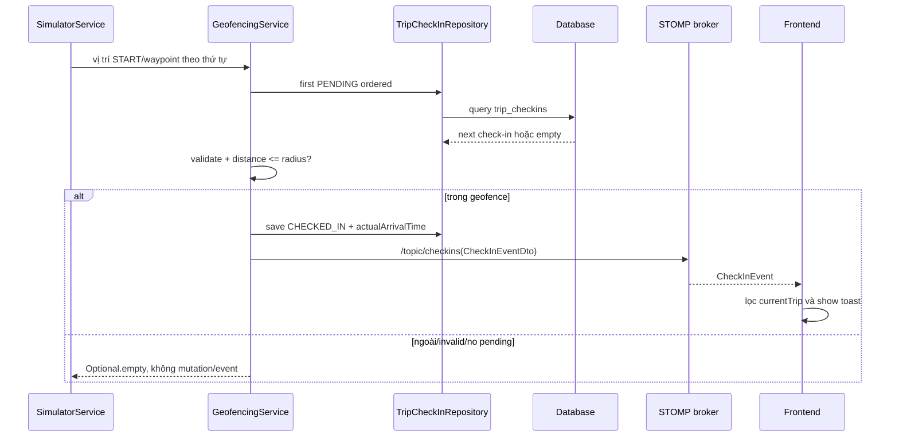

# Spec — 004-automatic-station-checkin

## Thông tin tài liệu

| Thuộc tính | Giá trị |
|---|---|
| Feature ID | `004-automatic-station-checkin` |
| Requirement version | 2026-09-04 |
| Research/Survey version | 2026-09-04, baseline `41154d4` |
| Trạng thái | `READY — chờ người dùng review Plan trước Gemini` |
| Người viết | Codex |
| Người duyệt | Người dùng |
| Ngày cập nhật | 2026-09-04 |

## Tổng quan

Feature dùng `GeofencingService` làm nơi quyết định và persist auto check-in. Service lấy trạm `PENDING` kế tiếp của một Trip, tính khoảng cách từ vị trí xe tới tâm Station bằng `GeoUtil`, rồi chuyển state và phát event sau khi save. `SimulatorService` gọi service cho waypoint tại trạm xuất phát trước khi rời điểm đầu và cho mọi waypoint đã đi qua trong mỗi tick. Frontend chỉ consume event hiện có và hiển thị thay đổi cho `currentTrip`.

Không thêm REST endpoint, bảng/cột, external provider hoặc dependency mới.

## Mục tiêu

- `REQ-001`: quyết định vào geofence đúng theo radius và ghi actual arrival.
- `REQ-002`: giữ thứ tự, tránh transition/event trùng trong các lần gọi tuần tự.
- `REQ-003`: không bỏ sót START, STOP hoặc END khi simulator di chuyển.
- `REQ-004`: duy trì contract `/topic/checkins` và hiển thị đúng Trip.
- `REQ-005`: input lỗi/no-op và completion an toàn, có thể kiểm thử.

## Không thuộc thiết kế này

- Nhận telemetry từ GPS thật hoặc map matching.
- Replay event, event store, distributed lock giữa nhiều instance.
- Thay đổi route/station CRUD, ETA, traffic provider hoặc WebSocket authentication.
- Check-in thủ công hoặc trạng thái `SKIPPED`.

## Kiến trúc

```mermaid
flowchart LR
    SIM[SimulatorService tick] --> GF[GeofencingService]
    GF --> GEO[GeoUtil distance]
    GF --> REP[TripCheckInRepository]
    REP --> DB[(trip_checkins)]
    GF --> COMPLETE[TripService completeTrip]
    GF --> PUB[SimpMessagingTemplate]
    PUB --> TOPIC[/topic/checkins]
    TOPIC --> WS[WebSocketService]
    WS --> APP[App currentTrip filter]
    APP --> UI[Toast + Trip UI]
```

## Luồng xử lý

### Luồng chính

1. `SimulatorService#tickSingleSimulation` lấy waypoint hiện tại và waypoint kế tiếp.
2. Ở tick đầu khi `currentWaypointIndex == 0`, service gọi geofence cho waypoint START hiện tại trước khi xử lý waypoint tiếp theo.
3. Service gọi geofence theo thứ tự cho từng waypoint từ `currentIndex + 1` đến `nextIndex`, không chỉ gọi điểm cuối.
4. `GeofencingService` tìm `TripCheckIn` có status `PENDING` nhỏ nhất theo `stopOrder`.
5. Service kiểm tra input hữu hạn/range và tính Haversine distance bằng mét.
6. Nếu `distanceMeters <= radiusMeters`, service đặt `CHECKED_IN`, đặt `actualArrivalTime = LocalDateTime.now(clock)` và `save` đúng record.
7. Sau save, service phát `CheckInEventDto` trên `/topic/checkins`. Có thể giữ INFO alert hiện có nhưng alert không thay thế check-in event.
8. Nếu sau transition không còn `PENDING`, service gọi `TripService#completeTrip(tripId, checkInTime)`.
9. Frontend nhận event, chỉ dispatch toast nếu `event.tripId === currentTrip.id`; timeline lấy trạng thái mới từ telemetry/Trip refresh hiện có.



### Luồng lỗi hoặc fallback

1. `tripId` null/không dương, latitude/longitude không hữu hạn hoặc ngoài giới hạn địa lý: ghi warning không chứa dữ liệu nhạy cảm, trả `Optional.empty`, không save/event.
2. Không có `PENDING`: trả `Optional.empty`, không save/event và không gọi completion thêm.
3. Station có tọa độ/radius null hoặc không hợp lệ: coi là dữ liệu không thể quyết định, ghi warning và no-op; không dùng fallback âm thầm để check-in sai.
4. Vị trí ngoài radius: trả `Optional.empty`, giữ nguyên state.
5. Lỗi repository: transaction rollback; exception không được biến thành event thành công. Simulator giữ behavior catch/log hiện có để session khác còn được xử lý; test phải xác nhận phần phù hợp.

## Business Rules

### BR-001 — Chọn trạm kế tiếp

**Liên kết:** `REQ-001, REQ-002, AC-REQ-001-01, AC-REQ-002-01`

**Quy tắc:** Với một `tripId`, chỉ record trả về bởi `findFirstByTripIdAndStatusOrderByStopOrderAsc(tripId, PENDING)` được xét. Nếu record stopOrder nhỏ nhất còn PENDING chưa vào geofence, các record sau không được check-in.

**Lý do:** Bảo toàn thứ tự route và tái sử dụng repository query đã có.

### BR-002 — Quyết định trong geofence

**Liên kết:** `REQ-001, REQ-005, AC-REQ-001-01, AC-REQ-001-02`

**Quy tắc:** Một điểm được coi là trong geofence khi `distanceMeters <= Station.radiusMeters`. `radiusMeters` là đơn vị mét và là giá trị authoritative của Station; radius/tọa độ không hợp lệ không được dùng để tự động check-in.

**Lý do:** Boundary phải xác định và tránh check-in do dữ liệu không hợp lệ.

### BR-003 — Transition và idempotency tuần tự

**Liên kết:** `REQ-002, REQ-005, AC-REQ-002-02`

**Quy tắc:** Chỉ transition `PENDING → CHECKED_IN`, ghi `actualArrivalTime` cùng lần save và phát tối đa một event cho transition đó. Lần gọi tuần tự sau khi state đã `CHECKED_IN` phải không save/event lại cho record đó.

**Lý do:** Không tạo lịch sử/toast/completion trùng.

### BR-004 — Không bỏ sót waypoint

**Liên kết:** `REQ-003, AC-REQ-003-01, AC-REQ-003-02`

**Quy tắc:** Khi tick đầu bắt đầu ở waypoint index 0, geofence kiểm tra vị trí hiện tại trước khi xe rời START. Sau đó tất cả waypoint trong đoạn `(currentIndex, nextIndex]` được gửi theo thứ tự tăng dần; waypoint có station phải dùng tọa độ của chính waypoint đó.

**Lý do:** Multiplier có thể làm `nextIndex` vượt nhiều waypoint.

### BR-005 — Timestamp từ server Clock

**Liên kết:** `REQ-001, REQ-004, REQ-005, AC-REQ-001-01, AC-REQ-005-02`

**Quy tắc:** `actualArrivalTime`, `CheckInEventDto.checkInTime` và thời điểm truyền cho completion dùng cùng một `LocalDateTime.now(clock)` trong lần transition thành công.

**Lý do:** Database, event và completion phải cùng mốc; test dùng fixed `Clock` được.

### BR-006 — Persist trước khi publish

**Liên kết:** `REQ-004, REQ-005, AC-REQ-004-01`

**Quy tắc:** Không phát `CheckInEventDto` nếu transition chưa gọi save thành công. Payload phải lấy `tripId`, `tripCode`, vehicle, station, stopOrder và checkInTime từ context của record được lưu.

**Lý do:** Event thành công không được nói ngược state database.

### BR-007 — Completion của trạm cuối

**Liên kết:** `REQ-005, AC-REQ-005-02`

**Quy tắc:** Nếu không còn record PENDING sau khi lưu transition cuối, gọi `TripService#completeTrip(tripId, checkInTime)`. Không tự cập nhật Trip/Vehicle tại GeofencingService và không gọi completion khi transition không thành công.

**Lý do:** Giữ một completion path và tránh split state.

### BR-008 — Isolation frontend

**Liên kết:** `REQ-004, AC-REQ-004-01, AC-REQ-004-02`

**Quy tắc:** Frontend chỉ hiển thị toast/check-in event nếu `currentTrip` tồn tại và `event.tripId` bằng `currentTrip.id`; event Trip khác bị bỏ qua.

**Lý do:** Một dashboard không được hiển thị trạng thái của chuyến khác.

## Data Model

Không thay đổi data model.

### Entity/Table: `TripCheckIn` / `trip_checkins`

| Field | Type | Nullable | Default | Constraint/Index | Ý nghĩa |
|---|---|---|---|---|---|
| `trip_id` | FK | Không | — | Many-to-one | Chuyến chứa check-in |
| `station_id` | FK | Không | — | Many-to-one | Trạm được check-in |
| `stop_order` | Integer | Không | — | Được query tăng dần | Thứ tự lịch trình |
| `status` | `CheckInStatus` | Không | `PENDING` | Enum string | State check-in |
| `actual_arrival_time` | `LocalDateTime` | Có | null | — | Thời điểm auto check-in |

### Relationship và lifecycle

- `Trip` có danh sách `TripCheckIn` theo `stopOrder`.
- Lifecycle của feature: `PENDING → CHECKED_IN`; không đổi `SKIPPED`.
- Không thêm migration, backfill hoặc cleanup.

### Migration và compatibility

- Migration cần tạo: `Không có`.
- Backfill: `Không có`; record cũ PENDING tiếp tục được xử lý.
- Rollback/forward compatibility: giữ nguyên enum/status/field và REST/WebSocket contract.

## API Contract

Không có API mới hoặc API sửa đổi. `POST /api/simulator/start/{tripId}` vẫn giữ response hiện có; geofence là side effect nội bộ của simulator.

## Event / Realtime Contract

### Event: `CheckInEventDto` trên `/topic/checkins`

**Producer:** `GeofencingService`

**Consumer:** `vehicletracking-frontend/src/services/websocket.ts`, `App.tsx`

**Thời điểm phát:** Sau khi một `TripCheckIn` chuyển `PENDING → CHECKED_IN` và save thành công.

```json
{
  "tripId": 100,
  "tripCode": "TRIP-100",
  "vehicleId": 10,
  "plateNumber": "51B-11111",
  "stationId": 2,
  "stationName": "Trạm giữa",
  "stopOrder": 2,
  "checkInTime": "2026-09-04T10:00:00",
  "message": "Xe ... đã check-in thành công tại ..."
}
```

| Field | Type | Bắt buộc | Ý nghĩa |
|---|---|---|---|
| `tripId` | `number` | Có | Trip phát sinh transition |
| `tripCode` | `string` | Có | Mã Trip hiện có |
| `vehicleId` | `number` | Có nếu Trip có xe | Xe đang chạy |
| `plateNumber` | `string` | Có | Biển số hoặc giá trị fallback hiện có |
| `stationId` | `number` | Có | Station vừa check-in |
| `stationName` | `string` | Có | Tên Station |
| `stopOrder` | `number` | Có | Vị trí trong route |
| `checkInTime` | `string` | Có | `actualArrivalTime` dạng JSON datetime |
| `message` | `string` | Có | Nội dung toast hiện có |

Event producer không phát cho outside/invalid/no-pending. Delivery là transient theo broker hiện có; không yêu cầu replay/retry trong feature này. Producer không phát event thứ hai cho cùng transition trong các lần gọi tuần tự.

## Validation

| Input/Field | Rule | Nơi kiểm tra | Kết quả khi vi phạm |
|---|---|---|---|
| `tripId` | Không null, > 0 | `GeofencingService` | Warning + `Optional.empty`, không mutation |
| `vehicleLat` | Finite, -90..90 | `GeofencingService` | Warning + no-op |
| `vehicleLng` | Finite, -180..180 | `GeofencingService` | Warning + no-op |
| Station latitude/longitude | Non-null, finite, đúng range | `GeofencingService` defensive check; dữ liệu tạo mới đã validate ở `StationService` | Warning + no-op |
| `Station.radiusMeters` | Finite, 30..150 theo data contract hiện có | `GeofencingService` defensive check; `StationService` boundary | Warning + no-op |
| Check-in status | Chỉ xét `PENDING` | Repository query/service | Không xét state khác |

Validation backend là source of truth; frontend chỉ hiển thị event, không quyết định check-in.

## Error Handling

| Failure mode | Phát hiện | Hành vi hệ thống | Log/Metric | Response/UI |
|---|---|---|---|---|
| Outside radius | Distance > radius | No-op | Có thể debug log | Không toast |
| Invalid coordinate/radius | Null/non-finite/out of range | No-op, không event | Warning không secret | Không toast |
| No pending | Optional empty | No-op, không completion thêm | Debug log tùy convention | Không toast |
| Repository save failure | Exception | Transaction rollback, không claim success event | Error log không secret | Simulator log lỗi; không fake toast |
| Foreign event | Frontend tripId mismatch | Bỏ qua callback | Không cần toast | UI currentTrip không đổi |

## Security

- Authentication/Authorization: Không thay đổi; không thêm endpoint nhận check-in từ client.
- Input/output safety: validate tọa độ/radius ở backend; event chỉ chứa các field DTO hiện có.
- Secret/configuration: Không thêm secret hoặc config.
- Sensitive data/logging: Không log token, credential; chỉ log mã xe/trạm cần cho vận hành hiện có.
- External service boundary: Không có.

## Performance và Reliability

- Mỗi lời gọi geofence query record PENDING đầu trước khi quyết định và chỉ query lại sau transition thành công để kiểm tra completion; không gọi external service.
- Một simulator scheduler hiện gọi tuần tự các waypoint trong một tick; feature bảo đảm idempotency tuần tự, không tuyên bố distributed concurrency safety.
- `@Transactional` bao quanh state transition; event phát sau save.
- Tiêu chí đo được: unit test xác nhận save/event bằng 0 khi outside/no-pending/invalid; gọi lặp xác nhận save/event cho record đã check-in chỉ một lần; test fixed Clock xác nhận timestamp bằng nhau.

## Edge Cases

| ID | Tình huống | Hành vi mong đợi | Requirement/BR |
|---|---|---|---|
| EC-001 | Distance bằng đúng radius | Check-in | REQ-001/BR-002 |
| EC-002 | Distance lớn hơn radius | No-op | REQ-001/BR-002 |
| EC-003 | START PENDING ở waypoint index 0 | Kiểm tra trước khi rời start | REQ-003/BR-004 |
| EC-004 | Later station gần vị trí nhưng earlier pending | Không check-in later | REQ-002/BR-001 |
| EC-005 | Gọi lại sau CHECKED_IN | Không save/event duplicate | REQ-002/BR-003 |
| EC-006 | Không còn PENDING | No-op, không gọi completion mới | REQ-005/BR-001 |
| EC-007 | NaN/infinite/out-of-range coordinates | No-op, không làm dừng session khác | REQ-005 |
| EC-008 | Nhiều waypoint trong một tick | Kiểm tra lần lượt mọi waypoint | REQ-003/BR-004 |
| EC-009 | Trạm cuối vào geofence | Save trước, event rồi completion cùng thời điểm | REQ-004/REQ-005/BR-005..007 |
| EC-010 | Event của Trip khác | Frontend bỏ qua | REQ-004/BR-008 |

## Compatibility

- Public API/Event: giữ nguyên endpoint `/api/simulator/*` và `/topic/checkins`; payload không bỏ field hiện có.
- Database/data cũ: dùng record `TripCheckIn` hiện tại, không migration.
- Frontend/backend version lệch: client cũ vẫn parse các field event hiện có; logic mới không yêu cầu field mới.
- Browser/runtime: giữ STOMP/native WebSocket hiện có; không đưa SockJS dependency mới vào feature.

## Configuration và vận hành

| Biến/cấu hình | Nơi sử dụng | Bắt buộc | Default an toàn | Secret? |
|---|---|---|---|---|
| `Station.radiusMeters` | GeofencingService | Có trong dữ liệu Station | 30–150 mét theo validation; invalid thì no-op | Không |
| `Clock` bean | GeofencingService/SimulatorService | Có | `Clock.systemDefaultZone()` hiện có | Không |
| WebSocket endpoint/topic | WebSocketConfig/frontend | Đã có | `/ws-raw`, `/topic/checkins` | Không |

## Observability

- Log: auto check-in thành công, outside/invalid input và repository failure; giữ thông tin cần tra cứu, không secret.
- Metric: Không thêm metric vì repository chưa có metrics convention; test/log là evidence trong scope.
- Trace/Audit: lịch sử nằm trong `TripCheckIn.actualArrivalTime/status`; không thêm audit table.

## Những phần không được thay đổi

- Contract `CheckInEventDto`, `/topic/checkins`, callback cleanup và filter foreign event hiện có.
- Route/station CRUD, ETA calculation, traffic incident behavior và simulator pause/reset ngoài side effect check-in cần thiết.
- `TripService#completeTrip` là completion path duy nhất.

## Quyết định và trade-off

| ID | Quyết định | Lý do | Phương án không chọn | Hệ quả |
|---|---|---|---|---|
| DEC-001 | Dùng `GeoUtil` Haversine | Đã có hàm mét và test, không thêm dependency | Spatial/provider | Không tính khoảng cách theo đường xe chạy |
| DEC-002 | Backend là source of truth | Client không đáng tin để persist | Tính/check-in ở frontend | Frontend chỉ hiển thị event |
| DEC-003 | Kiểm tra START trong tick trước movement | Tránh race của scheduler khi `startSimulation` khởi động | Chỉ kiểm tra waypoint kế tiếp | Cần test riêng tick đầu |
| DEC-004 | Idempotency theo state tuần tự, không distributed lock | Phù hợp simulator single-process hiện có | Redis/distributed lock | Khi có nhiều telemetry producer phải mở thiết kế mới |

## Traceability

| Spec ID | Requirement/AC | Business Rule/API/Event | Test dự kiến | Evidence dự kiến |
|---|---|---|---|---|
| SPEC-001 | REQ-001 / AC-REQ-001-01/02 | BR-001, BR-002 | TC-001, TC-002 | TEST + SOURCE_CODE |
| SPEC-002 | REQ-002 / AC-REQ-002-01/02 | BR-001, BR-003 | TC-003, TC-004 | TEST |
| SPEC-003 | REQ-003 / AC-REQ-003-01/02 | BR-004 | TC-005, TC-006 | TEST |
| SPEC-004 | REQ-004 / AC-REQ-004-01/02 | BR-005, BR-006, BR-008; `/topic/checkins` | TC-007, TC-008 | TEST + API/REALTIME + UI |
| SPEC-005 | REQ-005 / AC-REQ-005-01/02 | BR-005, BR-007 | TC-009, TC-010, TC-011 | TEST + BUILD/REGRESSION |

## Câu hỏi còn mở

| ID | Câu hỏi | Ảnh hưởng | Người quyết định | Trạng thái |
|---|---|---|---|---|
| SQ-001 | Có cần distributed idempotency khi có GPS thật không? | Có thể đổi repository/locking/event design | Người dùng | `RESOLVED — ngoài phạm vi feature 004` |
| SQ-002 | Có cần replay CheckInEvent sau reconnect không? | Có thể đổi persistence/event API | Người dùng | `RESOLVED — ngoài phạm vi feature 004` |

## Checklist duyệt Spec

- [x] Spec đáp ứng mọi Requirement trong phạm vi.
- [x] Business Rule và contract không mơ hồ.
- [x] Validation, error, security và edge case liên quan đã được xử lý.
- [x] Data migration/backward compatibility được xem xét.
- [x] Không tạo abstraction hoặc dependency ngoài nhu cầu hiện tại.
- [x] Mọi phần quan trọng có traceability về Requirement.
