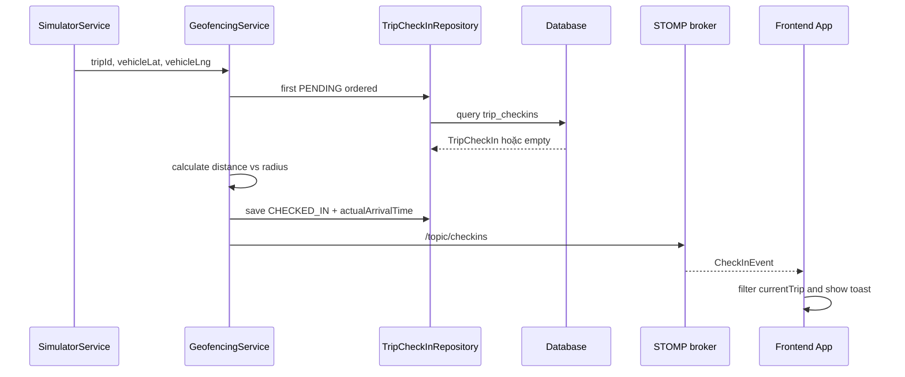

# Survey repository — 004-automatic-station-checkin

## Thông tin tài liệu

| Thuộc tính | Giá trị |
|---|---|
| Feature ID | `004-automatic-station-checkin` |
| Requirement liên quan | `REQ-001..REQ-005` |
| Trạng thái | `READY — chờ người dùng review Plan trước Gemini` |
| Người khảo sát | Codex |
| Commit/worktree được khảo sát | `41154d4`; `git status --short` không có output trước khi tạo feature 004 |
| Ngày khảo sát | 2026-09-04 |

## Tổng quan repository

Repository có backend `vehiceltracking-backend` và frontend `vehicletracking-frontend`. Backend lưu entity bằng JPA, expose REST dưới `/api`, chạy simulator theo scheduler và phát STOMP qua `/topic`. Frontend dùng React/TypeScript, gọi REST qua `src/services/api.ts`, nhận STOMP qua `src/services/websocket.ts`, rồi hiển thị map, timeline và toast trong `App.tsx`.

## Tech stack

| Thành phần | Công nghệ/Version | Bằng chứng |
|---|---|---|
| Frontend | React `^19.2.8`, TypeScript `^7.0.2`, Vite `^8.2.2`, Leaflet, `@stomp/stompjs` | `vehicletracking-frontend/package.json` |
| Backend | Spring Boot `4.1.1`, Java `26`, JPA, WebSocket | `vehiceltracking-backend/pom.xml` |
| Database | H2 runtime cho profile `dev`, PostgreSQL runtime/profile `postgres` | `application.yaml`, `pom.xml` |
| Realtime/Queue | STOMP simple broker với prefix `/topic`; native endpoint `/ws-raw` và SockJS `/ws` | `WebSocketConfig.java`, `websocket.ts` |
| Test | JUnit/JUnit Spring Boot test dependency; test backend ở `src/test/java` | `pom.xml`, `vehiceltracking-backend/src/test/java` |

## Claim và Evidence từ repository

| Claim | Evidence ID | Nguồn trong repository | Cách kiểm chứng | Trạng thái |
|---|---|---|---|---|
| Backend có service chuyên xử lý auto geofence, dùng query PENDING ordered, lưu check-in và phát event | `EVD-002` | `service/GeofencingService.java#checkAndProcessAutoCheckIn` | Đọc lines 27-122 bằng `nl -ba` | PASS |
| Khoảng cách địa lý hiện được tính bằng mét trong `GeoUtil` | `EVD-003` | `util/GeoUtil.java#calculateDistanceMeters`; `GeoUtilTest.java` | Đọc symbol và test | PASS |
| `TripCheckIn` lưu station, stopOrder, actual arrival và status; repository có query PENDING đầu tiên | `EVD-004` | `entity/TripCheckIn.java`, `repository/TripCheckInRepository.java` | Đọc annotation/field/method | PASS |
| Simulator tạo waypoint tại từng station và gọi geofence trên waypoint từ `currentIndex + 1` đến `nextIndex` | `EVD-005` | `service/SimulatorService.java#tickSingleSimulation`, `#generateDetailedWaypoints` | Trace start index, loop và builder waypoint | PASS |
| Frontend subscribe `/topic/checkins`, lọc event theo `currentTrip.id` và tạo toast | `EVD-006` | `services/websocket.ts`, `App.tsx` | Đọc subscription/callback | PASS |
| Radius qua DTO/service được giới hạn 30–150 mét và tọa độ giới hạn theo latitude/longitude | `EVD-007` | `dto/StationDto.java`, `service/StationService.java#validateStationDto` | Đọc annotation và validation runtime | PASS |
| Backend test fixture hiện có test geofence trạm cuối và simulator waypoint, nhưng chưa bao phủ đầy đủ start/boundary/outside/repeat | `EVD-008` | `GeofencingServiceTest.java`, `SimulatorServiceTest.java` | Đọc `@DisplayName` và test method | PASS |
| Stack và command frontend/backend được khai báo trong manifest/guidance | `EVD-009` | `package.json`, `pom.xml`, `application.yaml` | Đọc manifest và chạy command baseline | PASS |

## Cấu trúc thư mục liên quan

```text
vehiceltracking-backend/
├── src/main/java/com/quangkhai/vehiceltracking_backend/
│   ├── config/TimeConfig.java
│   ├── config/WebSocketConfig.java
│   ├── controller/SimulatorController.java
│   ├── dto/CheckInEventDto.java
│   ├── entity/{Station,Trip,TripCheckIn}.java
│   ├── repository/TripCheckInRepository.java
│   ├── service/{GeofencingService,SimulatorService,TripService}.java
│   └── util/GeoUtil.java
└── src/test/java/.../service/{GeofencingServiceTest,SimulatorServiceTest}.java

vehicletracking-frontend/src/
├── App.tsx
├── components/{MapComponent,TimelinePanel,ToastNotification,SimulatorPanel}.tsx
├── services/{api,websocket}.ts
└── types/index.ts
```

## Kiến trúc hiện tại

```mermaid
flowchart LR
    SIM[SimulatorController] --> SS[SimulatorService]
    SS --> GF[GeofencingService]
    GF --> TCR[TripCheckInRepository]
    GF --> TS[TripService completion]
    GF --> WS[SimpMessagingTemplate]
    TCR --> DB[(H2/PostgreSQL)]
    WS --> TOPIC[/topic/checkins]
    TOPIC --> FWS[WebSocketService]
    FWS --> APP[App.tsx]
    APP --> UI[Toast/Timeline/Map]
```

Business logic check-in nằm ở backend `GeofencingService`, không ở frontend. Frontend chỉ subscribe và trình bày event. Simulator là producer vị trí hiện có.

## Thành phần liên quan đến feature

| Loại | Path/Symbol | Trách nhiệm hiện tại | Requirement liên quan |
|---|---|---|---|
| Controller/API | `.../controller/SimulatorController.java` | Start/pause/resume/reset simulator qua `/api/simulator/*` | REQ-003 |
| Service | `.../service/GeofencingService.java#checkAndProcessAutoCheckIn` | Tìm pending đầu, đo khoảng cách, save, phát event, completion | REQ-001, REQ-002, REQ-004, REQ-005 |
| Service | `.../service/SimulatorService.java#tickSingleSimulation` | Tiến waypoint, gọi geofence, phát telemetry | REQ-003 |
| Service | `.../service/TripService.java#completeTrip` | Chuyển Trip hoàn thành và Vehicle về IDLE | REQ-005 |
| Repository | `.../repository/TripCheckInRepository.java` | Query check-in theo trip/stopOrder/status | REQ-001, REQ-002 |
| Entity/Table | `TripCheckIn` / `trip_checkins` | Lưu station, stopOrder, status, actual arrival | REQ-001, REQ-004 |
| Entity/Table | `Station` / `stations` | Lưu latitude, longitude, radiusMeters, stationType | REQ-001, REQ-005 |
| Utility | `.../util/GeoUtil.java#calculateDistanceMeters` | Tính khoảng cách Haversine theo mét | REQ-001 |
| DTO/Event | `.../dto/CheckInEventDto.java` | Payload event check-in | REQ-004 |
| Event config | `WebSocketConfig.java` | Broker `/topic`, endpoint `/ws` và `/ws-raw` | REQ-004 |
| Frontend service | `src/services/websocket.ts` | Subscribe `/topic/checkins` và dispatch callback | REQ-004 |
| Frontend UI | `src/App.tsx`, `ToastNotification`, `TimelinePanel` | Lọc trip và hiển thị toast/timeline | REQ-004 |

## Luồng xử lý hiện tại

1. `POST /api/simulator/start/{tripId}` gọi `SimulatorService#startSimulation`.
2. Simulator tạo waypoint chính tại từng station và waypoint nội suy giữa hai station.
3. Mỗi tick, simulator tăng `currentWaypointIndex`, gọi `GeofencingService` cho waypoint đã đi qua.
4. Geofencing query `findFirstByTripIdAndStatusOrderByStopOrderAsc(..., PENDING)`.
5. Nếu khoảng cách `<= station.radiusMeters`, service cập nhật `CHECKED_IN`, `actualArrivalTime`, lưu repository, phát `/topic/checkins` và alert.
6. Nếu không còn PENDING, service gọi `TripService#completeTrip`.
7. Frontend subscribe event, bỏ event không khớp `currentTrip.id`, tạo toast cho event khớp.



Gap quan trọng: `startSimulation` đặt `currentWaypointIndex = 0`; tick hiện tại chỉ gọi geofence từ index kế tiếp. Vì waypoint station đầu ở index 0, START đang PENDING có thể bị bỏ qua. Test hiện tại đặt sẵn station đầu là `CHECKED_IN`, nên chưa bắt lỗi này.

## API và Event hiện tại

| Loại | Method/Topic | Request/Payload | Response/Consumer | Bằng chứng |
|---|---|---|---|---|
| REST | `POST /api/simulator/start/{tripId}` | `tripId` path | `{message,status}`; khởi động simulator | `SimulatorController.java:17-21` |
| REST | `GET /api/trips/{id}` | `id` path | `TripDto` gồm `checkIns` | `TripController.java:24-27`, `TripService#toDto` |
| WebSocket/Event | `/topic/checkins` | `CheckInEventDto` gồm trip/vehicle/station/stopOrder/time/message | `WebSocketService` và `App` | `GeofencingService.java:71-84`, `websocket.ts:42-48` |
| WebSocket/Event | `/topic/alerts` | `AlertMessageDto` | Toast cảnh báo/info hiện có | `GeofencingService.java:86-115`, `websocket.ts:50-56` |

Feature không cần thêm REST endpoint. `CheckInEventDto` hiện không có event ID; idempotency phải được bảo đảm ở state transition phía server trong scope này.

## Data model hiện tại

| Entity/Table | Field/Constraint liên quan | Relationship | Ghi chú |
|---|---|---|---|
| `Station/stations` | `latitude`, `longitude` non-null; `radius_meters` non-null default 50.0; `station_type` non-null | Được `TripCheckIn` tham chiếu | DTO/service validate radius 30–150 |
| `Trip/trips` | `status`, `end_time` | `OneToMany` `TripCheckIn`, ordered `stopOrder` | Completion dùng `TripService` |
| `TripCheckIn/trip_checkins` | `trip_id`, `station_id`, `stop_order`, `status`, `actual_arrival_time` | `ManyToOne` Trip/Station | Status mặc định `PENDING`; chưa có unique constraint trực tiếp trên trip/station |

Không đề xuất migration. Dữ liệu hiện có đủ field để ghi nhận check-in.

## Convention đang được sử dụng

### Naming và cấu trúc

- Backend dùng `controller`, `service`, `repository`, `entity`, `dto`, `config`, `util`; service dùng Lombok `@RequiredArgsConstructor` (`GeofencingService.java`, `SimulatorService.java`).
- Frontend tập trung REST trong `src/services/api.ts` và STOMP trong `src/services/websocket.ts`.

### Error handling và validation

- `StationDto` dùng Bean Validation; `StationService#validateStationDto` kiểm tra finite/range runtime.
- Geofencing là method nội bộ không có controller boundary riêng; Plan phải quy định no-op/log an toàn cho input lỗi để không làm dừng scheduler.

### Logging và configuration

- Backend dùng `@Slf4j` ở simulator/geofence.
- `TimeConfig` cung cấp `Clock.systemDefaultZone()`; không hard-code timestamp trong feature.

### Testing

- Backend test dùng JUnit 5/Mockito extension; test service ở `src/test/java/.../service`.
- Frontend `package.json` chỉ có `lint`, `build`, không có script test; không được dùng `npm test` khi chưa thêm test framework trong Plan.

### API/Realtime

- REST prefix `/api`; STOMP subscribe prefix `/topic`.
- `websocket.ts` dùng native `brokerURL ws://localhost:8080/ws-raw`, có callback cleanup bằng hàm unsubscribe.

## Thành phần có thể tái sử dụng

| Thành phần | Lý do phù hợp | Giới hạn |
|---|---|---|
| `GeofencingService#checkAndProcessAutoCheckIn` | Đã có core query/measure/save/event | Cần bổ sung validation và coverage; hiện chưa xử lý START tại index 0 |
| `GeoUtil#calculateDistanceMeters` | Kết quả mét phù hợp với radius | Khoảng cách đường chim bay |
| `TripCheckInRepository#findFirstByTripIdAndStatusOrderByStopOrderAsc` | Bảo đảm lựa chọn stop nhỏ nhất trong query | Chưa có distributed lock |
| `TimeConfig#clock` | Test dùng fixed time | Zone hiện là system default |
| `WebSocketService#onCheckIn` và `App` callback | Đã có subscription/filter/toast | Không có replay sau reconnect |

## Khoảng cách giữa hiện trạng và Requirement

| Requirement | Hiện trạng | Gap | Mức ảnh hưởng | Bằng chứng |
|---|---|---|---|---|
| REQ-001 | Một phần | Core geofence tồn tại nhưng chưa có test đầy đủ cho START, STOP, boundary/outside và invalid input | Cao | EVD-002, EVD-008 |
| REQ-002 | Một phần | Query ordered có sẵn; chưa có test skip và gọi lặp, concurrency chưa được bảo đảm phân tán | Cao | EVD-004, EVD-008 |
| REQ-003 | Một phần | Waypoint giữa được loop nhưng waypoint đầu index 0 không được kiểm tra trước khi rời trạm | Cao | EVD-005, EVD-008 |
| REQ-004 | Có một phần | Backend/frontend contract và toast đã có; cần verification event payload/UI và isolation | Vừa | EVD-006 |
| REQ-005 | Một phần | Completion path có sẵn; validation/no-op và test transaction/error còn thiếu | Cao | EVD-002, EVD-007, EVD-008 |

## Điểm cần chú ý

- Gọi `GeofencingService` nhiều lần trong một tick phải giữ thứ tự waypoint; không gom chỉ vị trí cuối.
- Không được để một `TripCheckIn` đã `CHECKED_IN` quay lại PENDING trong luồng auto check-in; reset simulator là flow riêng.
- `SimpMessagingTemplate` hiện được gọi trong transactional service; event delivery là transient và không phải bằng chứng commit database nếu không có test tích hợp.
- Query `PENDING` + save chưa thể hiện pessimistic/distributed lock. Trong simulator hiện tại scheduler xử lý session theo một task; nếu scope mở sang nhiều instance cần thiết kế lại.

## Technical debt liên quan

| Technical debt | Ảnh hưởng tới feature | Xử lý trong feature? | Lý do |
|---|---|---|---|
| Chưa có lock phân tán cho cùng một Trip | Có thể duplicate nếu tương lai nhận nhiều nguồn GPS đồng thời | Không | Ngoài simulator single-process; ghi risk và test sequential idempotency |
| Event không có replay/eventId | Client reconnect có thể không thấy toast cũ | Không | Không thuộc yêu cầu; Trip GET là nguồn đọc lại |
| WebSocket allowed origin `*` | Rủi ro vận hành chung | Không | Không liên quan logic check-in; không mở rộng scope |

## File dự kiến bị ảnh hưởng

### File có thể tạo mới

- Không dự kiến file production mới.
- Có thể tạo artifact log/screenshot trong `docs/features/004-automatic-station-checkin/artifacts/` cho Evidence manual/API nếu Gemini chạy được.

### File có thể chỉnh sửa

- `vehiceltracking-backend/src/main/java/com/quangkhai/vehiceltracking_backend/service/GeofencingService.java` — validation/no-op, transition và event semantics.
- `vehiceltracking-backend/src/main/java/com/quangkhai/vehiceltracking_backend/service/SimulatorService.java` — kiểm tra waypoint START khi khởi động và giữ loop waypoint trung gian.
- `vehiceltracking-backend/src/test/java/com/quangkhai/vehiceltracking_backend/service/GeofencingServiceTest.java` — test rule geofence, order, duplicate, invalid và completion.
- `vehiceltracking-backend/src/test/java/com/quangkhai/vehiceltracking_backend/service/SimulatorServiceTest.java` — test start waypoint và multi-waypoint integration.
- `vehicletracking-frontend/src/App.tsx`, `src/services/websocket.ts`, `src/types/index.ts` — chỉ chỉnh nếu verification phát hiện contract/type hiện tại chưa đáp ứng; baseline hiện đã có subscription/filter.

## Command khảo sát đã chạy

| Command | Exit code | Kết quả/tóm tắt | Evidence | Artifact nếu có |
|---|---:|---|---|---|
| `git rev-parse --short HEAD` | 0 | `41154d4` | EVD-001 | Không có |
| `git status --short` | 0 | Không output, worktree sạch trước khi tạo feature | EVD-001 | Không có |
| `npm run lint` | 0 | 4 warning baseline, 0 error | EVD-009 | Không có |
| `/home/khainq/.nvm/versions/node/v24.16.0/bin/node node_modules/vite/bin/vite.js build` | 0 | Vite 8.2.2, 1831 modules transformed | EVD-009 | Không có |
| `./mvnw test` | 126 | Wrapper không có quyền execute trong môi trường khảo sát | EVD-010 | Không có |
| `bash ./mvnw test` | 1 | Maven không resolve được Spring Boot parent do DNS/network bị giới hạn | EVD-010 | Không có |

## Rủi ro và câu hỏi cần Spec giải quyết

- Spec phải quy định rõ boundary `<=`, radius authoritative, no-op khi input không hữu hạn và hành vi khi không còn PENDING.
- Spec phải giải quyết START index 0 mà không làm simulator check-in nhầm station sau.
- Test-Plan cần tách source evidence khỏi runtime/test evidence; source hiện có không đủ để kết luận implementation PASS.

## Checklist hoàn thành

- [x] Không sửa source code ứng dụng trong phase Survey.
- [x] Tên path, symbol, command và stack lấy từ repository thật.
- [x] Luồng hiện tại và gap có bằng chứng.
- [x] Mỗi Claim quan trọng về repository có `EVD-*` và nguồn cụ thể.
- [x] Không có kết luận chỉ dựa trên tên project/folder/file.
- [x] Convention tái sử dụng đã được ghi nhận.
- [x] Technical debt chỉ giới hạn phần ảnh hưởng feature.
- [x] File dự kiến bị ảnh hưởng đã đủ để bắt đầu Spec.
