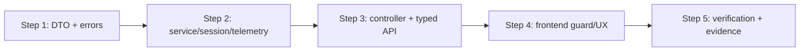

# Plan — 005-realtime-vehicle-simulator

## Thông tin tài liệu

| Thuộc tính | Giá trị |
|---|---|
| Feature ID | `005-realtime-vehicle-simulator` |
| Requirement/Spec/Test-Plan version | 2026-09-04 |
| Trạng thái | `READY — chờ người dùng review trước khi giao Gemini` |
| Người lập | Codex |
| Người thực thi dự kiến | Gemini |
| Ngày cập nhật | 2026-09-04 |

## Mục tiêu implementation

Hoàn thiện simulator hiện có thành state machine có REST contract rõ ràng, reset nhất quán và telemetry snapshot có `simulationRunId + sequence`; frontend nhận đúng snapshot mới nhất của run hiện hành. Plan không thay đổi route/station, ETA/geofence business rule, map provider, database schema, dependency hay hạ tầng broker.

## Điều kiện trước khi bắt đầu

- Người dùng review/phê duyệt các tài liệu `requirement.md` đến `plan.md` trong feature này.
- Gemini đọc tối thiểu `requirement.md`, `spec.md`, `test-plan.md`, `plan.md`, `evidence.md` và `GEMINI.md` trước khi sửa source.
- Base implementation là commit/worktree review thực tế; không ghi/commit API key, token, connection password hoặc raw WebSocket header vào source/artifact.
- Nếu `004-automatic-station-checkin` chưa ở worktree/branch target, Gemini dừng báo dependency thay vì tự tái thiết kế geofence/completion.

## File Inventory

### Tạo mới

| Path | Trách nhiệm | Liên kết |
|---|---|---|
| `vehiceltracking-backend/src/main/java/com/quangkhai/vehiceltracking_backend/dto/SimulatorResponseDto.java` | Public typed state/command response, không expose inner session | SPEC-001, SPEC-003 |
| `vehiceltracking-backend/src/main/java/com/quangkhai/vehiceltracking_backend/exception/SimulatorNotFoundException.java` | Signal 404 Trip simulator missing | BR-002 |
| `vehiceltracking-backend/src/main/java/com/quangkhai/vehiceltracking_backend/exception/SimulatorConflictException.java` | Signal 409 invalid/duplicate state | BR-002 |
| `vehiceltracking-backend/src/main/java/com/quangkhai/vehiceltracking_backend/exception/SimulatorExceptionHandler.java` | Controller-scoped `ProblemDetail` mapping | BR-002, TC-002 |
| `vehiceltracking-backend/src/test/java/com/quangkhai/vehiceltracking_backend/controller/SimulatorControllerTest.java` | REST success/problem-detail test | TC-002, TC-006 |
| `docs/features/005-realtime-vehicle-simulator/artifacts/send-telemetry-stimulus.mjs` | Optional test-only STOMP stimulus/subscriber confirmation for TC-009/TC-012 | TC-009, TC-012 |

### Chỉnh sửa

| Path | Thay đổi chính | Liên kết |
|---|---|---|
| `vehiceltracking-backend/src/main/java/com/quangkhai/vehiceltracking_backend/service/SimulatorService.java` | Session UUID/sequence/state guards, per-session scheduler catch, reset, Vehicle state/publish helper | SPEC-001..SPEC-005 |
| `vehiceltracking-backend/src/main/java/com/quangkhai/vehiceltracking_backend/controller/SimulatorController.java` | Return `SimulatorResponseDto`, delegate valid state/error behavior | SPEC-001, TC-002 |
| `vehiceltracking-backend/src/main/java/com/quangkhai/vehiceltracking_backend/dto/VehicleTelemetryDto.java` | Add additive `simulationRunId`, `sequence` | SPEC-004, TC-004, TC-008 |
| `vehiceltracking-backend/src/test/java/com/quangkhai/vehiceltracking_backend/service/SimulatorServiceTest.java` | Lifecycle/control/tick/reset/terminal/isolation assertions | TC-001, TC-003..TC-010 |
| `vehicletracking-frontend/src/types/index.ts` | Add typed telemetry and command response fields | SPEC-001, SPEC-004 |
| `vehicletracking-frontend/src/services/api.ts` | Typed simulator wrappers, check `res.ok`, use current error parser | SPEC-001, SPEC-003, TC-011 |
| `vehicletracking-frontend/src/services/websocket.ts` | Defensive telemetry parse; no raw sensitive body log | SPEC-004, TC-009, TC-012 |
| `vehicletracking-frontend/src/App.tsx` | Expected run/sequence ref, stable subscribe effect, controls/error/reset UI | SPEC-003..SPEC-005, TC-009, TC-011 |
| `vehicletracking-frontend/src/components/MapComponent.tsx` | Xóa vehicle marker khi telemetry bị reset về null để đồng bộ UI bản đồ | BR-004, TC-011, REV-004 |
| `docs/features/005-realtime-vehicle-simulator/evidence.md` | Replace planned `INCONCLUSIVE` records with actual verification/Evidence Matrix | All |

Không sửa `TripService`, `GeofencingService`, `WebSocketConfig`, `docker-compose.yml`, `.env`, dependency manifest/lockfile hay Timeline/SimulatorPanel trừ khi TypeScript compiler chỉ ra contract consumer bắt buộc phải sửa. Bất kỳ thay đổi ngoài inventory cần báo lại trước khi tiếp tục.

## Dependency và Configuration Changes

| Loại | Thay đổi | Lý do | Security/Operation impact |
|---|---|---|---|
| Dependency | Không có | Spring STOMP, JDK UUID, JUnit/Mockito và `@stomp/stompjs` đã có | Không thêm supply-chain risk |
| Database migration | Không có | UUID/sequence là telemetry/session in-memory | Không telemetry history/replay |
| Configuration | Không có | Giữ scheduler, broker `/topic`, endpoint `/ws-raw`, Clock hiện có | Không ghi secret/URL mới |

## Implementation Steps

### Step 1 — Public simulator response và error boundary

**Mục tiêu:** Public REST không còn trả success no-op hoặc serialize inner `SimulationSession`; các error 400/404/409 có `ProblemDetail` nhất quán.

**Liên kết:** `REQ-001`, `REQ-003`, `REQ-005`; `SPEC-001`, `SPEC-003`; `BR-002`; `TC-002`, `TC-006`.

**File/thành phần:**

- `.../dto/SimulatorResponseDto.java`
- `.../exception/SimulatorNotFoundException.java`
- `.../exception/SimulatorConflictException.java`
- `.../exception/SimulatorExceptionHandler.java`

**Thay đổi:**

1. Define DTO fields in Spec API table; nullable fields only state IDLE permits.
2. Copy controller-scoped `ProblemDetail` convention from Route/Station handler, without a catch-all advice that intercepts other controllers.
3. Define exception semantics only; service will throw them at Step 2.

**Kết quả mong đợi:** Controller can return typed fields and correct error status without leaking thread/session internals.

**Dependency:** Không có.

**Kiểm tra ngay sau step:** Compile/test driven by TC-002 after Step 3.

**Evidence cần thu thập:** `EVD-011` API result for success/400/404/409; source alone is not sufficient.

**Rủi ro/rollback:** Advice annotation scope sai có thể affect endpoint khác; scope `assignableTypes=SimulatorController.class`, run full controller regression. Roll back new DTO/handler with controller patch together only if requirement/spec withdrawn.

### Step 2 — Simulator state machine, reset và telemetry identity

**Mục tiêu:** Mỗi Trip chỉ có một session in-JVM; commands have valid transitions; normal/terminal telemetry has run ID/sequence and Vehicle state is persisted consistently.

**Liên kết:** `REQ-001..REQ-005`; `SPEC-001..SPEC-005`; `BR-001..BR-007`; `TC-001`, `TC-003..TC-010`.

**File/thành phần:**

- `.../service/SimulatorService.java#SimulationSession/#startSimulation/#pauseSimulation/#resumeSimulation/#resetSimulation/#setSpeedMultiplier/#tickAllSimulations/#tickSingleSimulation`
- `.../dto/VehicleTelemetryDto.java`
- `.../service/SimulatorServiceTest.java`

**Thay đổi:**

1. Add `simulationRunId` and `lastPublishedSequence` to session; generate UUID only after Trip/route validation and successful atomic map insertion.
2. Implement public status/response snapshot helper and guard all command transitions per BR-002; whitelist finite multiplier exact values `1,2,5,10`.
3. Synchronize per-session mutable reads/writes; keep map atomic per Trip. Do not add a global background task per session.
4. Extract one telemetry builder/publisher that increments sequence once and sends same logical DTO to global/per-vehicle topic; apply it in normal and terminal paths.
5. Preserve existing waypoint, incident, geofence and ETA semantics. Set persisted normal Vehicle status `IN_TRANSIT`; do not silently ignore persistence error before claiming telemetry success.
6. Change scheduler loop to catch/log each session independently, continue later session. Keep completed session so Reset is possible, but skip it in tick.
7. Implement transactional Reset per BR-004: validate first route station, reset check-ins/Trip/Vehicle, remove session only after successful state reset; no synthetic old-run message.
8. Add/extend tests strictly for TC-001, TC-003..TC-010. If exposing scheduler loop for test, use package-private method only; do not change REST visibility.

**Kết quả mong đợi:** Service test proves lifecycle, UUID/sequence, movement, two-topic payload, reset, terminal and scheduler isolation deterministically.

**Dependency:** Step 1 exceptions/DTO.

**Kiểm tra ngay sau step:** Run focused `SimulatorServiceTest`, then full Maven at Step 5.

**Evidence cần thu thập:** `EVD-012` lifecycle/control, `EVD-013` movement/pause, `EVD-014` two-topic/terminal/isolation, `EVD-015` reset.

**Rủi ro/rollback:** Race between control/tick and reset; tests must exercise state retention and no double Start. Scope changes to 003/004 behavior are regression and must be reverted, not hidden by changed expected tests.

### Step 3 — Controller integration và REST client contract

**Mục tiêu:** Wire service outcomes through existing endpoints and make frontend receive typed success/error instead of treating every response as success.

**Liên kết:** `REQ-001`, `REQ-003`, `REQ-005`; `SPEC-001`, `SPEC-003`, `SPEC-005`; `TC-002`, `TC-006`, `TC-011`.

**File/thành phần:**

- `.../controller/SimulatorController.java`
- `.../controller/SimulatorControllerTest.java`
- `vehicletracking-frontend/src/types/index.ts`
- `vehicletracking-frontend/src/services/api.ts`

**Thay đổi:**

1. Change each current endpoint to use `SimulatorResponseDto`; retain `message/status`; GET returns public state DTO.
2. Add MockMvc tests for 200 and problem details with no session/invalid route/duplicate/multiplier error.
3. Define TS `SimulatorResponse`/extend `VehicleTelemetry` types; change all simulator API wrappers from `Promise<any>` to typed response and call `parseErrorMessage` on non-2xx.

**Kết quả mong đợi:** No endpoint returns silent success; UI API methods reject safely with user-readable error.

**Dependency:** Step 1 and Step 2.

**Kiểm tra ngay sau step:** Focused `SimulatorControllerTest`; frontend `npx tsc --noEmit` after Step 4.

**Evidence cần thu thập:** `EVD-011` including actual HTTP status/content type/body fields.

**Rủi ro/rollback:** Existing consumers may only read message/status; preserve these fields and endpoint paths. Do not alter route/station exception handler.

### Step 4 — Frontend run/sequence guard và control UX

**Mục tiêu:** Dashboard stays connected while state changes and only renders accepted snapshot of the selected/current run.

**Liên kết:** `REQ-003..REQ-005`; `SPEC-003..SPEC-005`; `BR-006`; `TC-009`, `TC-011`, `TC-012`.

**File/thành phần:**

- `vehicletracking-frontend/src/services/websocket.ts`
- `vehicletracking-frontend/src/App.tsx`
- `vehicletracking-frontend/src/components/MapComponent.tsx`
- `vehicletracking-frontend/src/types/index.ts`
- `vehicletracking-frontend/src/services/api.ts`

**Thay đổi:**

1. Parse telemetry safely in websocket service. Do not log full invalid body; dispatch only parsable object to App guard.
2. In App, add ref for expected trip/run/last sequence; synchronize it from typed Start, Reset and GET status response. Clear it when selected Trip changes or Reset succeeds.
3. Filter each telemetry according BR-006 before calling `setTelemetry`; retain existing CheckIn/Alert trip filtering.
4. Remove `simStatus` from STOMP subscribe effect dependencies; retain unsubscribe/disconnect unmount cleanup.
5. Wrap all simulator control handlers in error handling: only change UI state after success; use `addToast` warning on API error. Reset refreshes the same Trip via `getTripById`, clears telemetry and places UI IDLE.
6. In MapComponent, remove Leaflet vehicleMarker and reset ref to null when vehicleTelemetry is null (Reset), preventing stale position marker from persisting on the map. Keep Timeline/SimulatorPanel props/visuals; only adjust consumer type usage if compiler requires.

**Kết quả mong đợi:** Foreign/stale run payload cannot change UI; error action does not falsely change status; no state-change reconnect churn.

**Dependency:** Step 3 typed contract.

**Kiểm tra ngay sau step:** `npm run lint`, `npx tsc --noEmit`, manual TC-009/TC-011/TC-012.

**Evidence cần thu thập:** `EVD-016` realtime isolation, `EVD-017` UI reset/error/no reconnect; `EVD-019`, `EVD-020` static checks.

**Rủi ro/rollback:** A wrong guard can drop all live telemetry. Verify one valid run sequence following stimuli and source code contract; do not loosen guard to accept missing run identity.

### Step 5 — Verification, artifact và Evidence handoff

**Mục tiêu:** Chạy verification thật, update matrix không suy đoán và bàn giao reviewable diff.

**Liên kết:** Tất cả `REQ-*`, `TC-001..TC-016`, `SPEC-006`.

**File/thành phần:**

- `docs/features/005-realtime-vehicle-simulator/evidence.md`
- `docs/features/005-realtime-vehicle-simulator/artifacts/*`
- Các test/source từ Step 1–4

**Thay đổi:**

1. Run focused/new tests then full Maven using Java 26; save unmodified relevant logs.
2. Run frontend lint/type-check/build and `git diff --check`; distinguish existing warnings from introduced issue.
3. Execute manual browser/STOMP stimulus TC-009/TC-011/TC-012 only if local services run; subscribe confirmation plus before/after screenshot/video must show visible outcome.
4. Update every planned EVD record with actual command/result/exit code/artifact/current worktree. Keep blocked/manual-unrun record `INCONCLUSIVE`.
5. Update Evidence Matrix/Coverage Summary and report file list, Plan steps, tests, evidence, command exit codes, deviations and unresolved issues to Codex.

**Kết quả mong đợi:** Evidence has sufficient direct records for all important requirements or explicitly marks gaps; ready for Codex review, not self-approval.

**Dependency:** Steps 1–4.

**Kiểm tra ngay sau step:** Commands table below and artifact review.

**Evidence cần thu thập:** `EVD-011..EVD-020` exact status after run.

**Rủi ro/rollback:** A passing build does not prove realtime flow; preserve manual/stimulus evidence and mark unavailable environments `INCONCLUSIVE`. Do not redact/modify test output meaning.

## Tests cần implement hoặc cập nhật

| Test Case | Loại | Test file/artifact dự kiến | Step | Nội dung chính |
|---|---|---|---|---|
| TC-001 | Unit | `service/SimulatorServiceTest.java` | 2 | Start UUID/session/duplicate conflict |
| TC-002 | API | `controller/SimulatorControllerTest.java` | 3 | Typed success + 400/404/409 ProblemDetail |
| TC-003 | Unit | `service/SimulatorServiceTest.java` | 2 | Pause/resume state/UUID/sequence retention |
| TC-004 | Unit/Realtime | `service/SimulatorServiceTest.java` | 2 | Normal tick Vehicle + sequence |
| TC-005 | Unit | `service/SimulatorServiceTest.java` | 2 | Pause no movement/publish |
| TC-006 | Unit/API | service + controller test | 2, 3 | Multiplier whitelist/invalid no mutation |
| TC-007 | Unit | `service/SimulatorServiceTest.java` | 2 | Reset entities/session/new UUID |
| TC-008 | Unit/Realtime | `service/SimulatorServiceTest.java` | 2 | Same payload two topic/terminal sequence |
| TC-009 | Manual/UI | stimulus script + App/websocket | 4, 5 | Foreign/run/stale accepted only valid sequence |
| TC-010 | Unit | `service/SimulatorServiceTest.java` | 2 | Terminal once + per-session exception isolation |
| TC-011 | Manual/UI/API | App + browser artifacts | 4, 5 | Error toast/stable connection/reset UX |
| TC-012 | Manual/Realtime | stimulus script + App | 4, 5 | Malformed message safely dropped |
| TC-013..TC-016 | Regression | Maven/frontend/diff logs | 5 | Full backend/frontend/hygiene |

## Evidence cần thu thập

| Evidence dự kiến | Requirement/Spec/Test | Plan Step | Loại | Claim cần chứng minh | Nguồn/Artifact dự kiến |
|---|---|---|---|---|---|
| EVD-011 | REQ-001/003, TC-002 | 1,3 | API | REST response/status/error semantics | `SimulatorControllerTest` output |
| EVD-012 | REQ-001/003, TC-001/003/006 | 2 | TEST | Session lifecycle/UUID/control validation | `SimulatorServiceTest` output |
| EVD-013 | REQ-002, TC-004/005 | 2 | TEST | Normal movement, Vehicle persist, pause no-op | `SimulatorServiceTest` output |
| EVD-014 | REQ-002/004/005, TC-008/010 | 2 | TEST | Two-topic same payload, terminal once, isolation | `SimulatorServiceTest` output |
| EVD-015 | REQ-003, TC-007 | 2 | TEST | Reset state/session removal/new run | `SimulatorServiceTest` output |
| EVD-016 | REQ-004, TC-009/012 | 4,5 | UI | Browser drops foreign/stale/malformed and accepts new sequence | stimulus log + screenshot/video |
| EVD-017 | REQ-005, TC-011 | 4,5 | MANUAL | Error UI/stable connection/reset UI | browser steps/artifact |
| EVD-018 | all, TC-013 | 5 | TEST | Backend regression actually passes | `artifacts/mvn-clean-test.log` |
| EVD-019 | REQ-004/005, TC-014 | 5 | LINT | Frontend lint result | `artifacts/frontend-verification.log` |
| EVD-020 | all, TC-015/016 | 5 | TYPE_CHECK | Type check/build/diff hygiene | `artifacts/frontend-verification.log`, `diff-check.log` |

## Lệnh kiểm tra

| Thứ tự | Command | Working directory | Mục đích | Điều kiện đạt |
|---:|---|---|---|---|
| 1 | `./mvnw clean test` | `vehiceltracking-backend` | New + full backend regression | exit 0; record tests/failures/errors/skips |
| 2 | `npm run lint` | `vehicletracking-frontend` | Lint frontend shared code | exit 0; document warnings |
| 3 | `npx tsc --noEmit` | `vehicletracking-frontend` | Type contract validation | exit 0 |
| 4 | `npm run build` | `vehicletracking-frontend` | Vite production build | exit 0 |
| 5 | `git diff --check` | repository root | Whitespace/conflict guard | exit 0/no output |

The manual commands/stimulus in TC-009/TC-011/TC-012 are not listed as unconditional pass gates: only run them after local backend/frontend are up, and document exact command/environment in EVD-016/EVD-017.

## Thứ tự implementation và dependency

## Rủi ro

| ID | Rủi ro | Khả năng | Ảnh hưởng | Giảm thiểu | Step kiểm soát |
|---|---|---|---|---|---|
| RISK-001 | Terminal branch bỏ run/sequence hoặc publish double | Vừa | Cao | One publish helper + TC-008/TC-010 | 2 |
| RISK-002 | Reset deletes session trước DB reset failure | Thấp | Cao | Validate/persist before remove; TC-007 | 2 |
| RISK-003 | Client guard drops valid live data | Vừa | Cao | TC-009 proves valid sequence 8 accepted after invalid stimuli | 4,5 |
| RISK-004 | Exception catch scope still stops B session | Vừa | Cao | Try/catch per loop entry, TC-010 | 2 |
| RISK-005 | New advice changes other controller error behavior | Thấp | Vừa | `assignableTypes`, full Maven controller regression | 1,5 |
| RISK-006 | Manual realtime environment unavailable | Vừa | Vừa | Preserve automated coverage and mark UI evidence INCONCLUSIVE | 5 |

## Kế hoạch bàn giao cho Review

Gemini phải báo cáo:

- file đã tạo/sửa và Plan Step 1..5 completed/partial;
- test case đã implement, gồm method names và manual TC actually executed;
- tất cả EVD update, Evidence Matrix và Coverage Summary;
- command/working directory/exit code/actual test counts/artifact paths;
- deviation được phê duyệt (nếu có), blocker/unrun manual checks;
- `git diff --check` result và diff ready cho Codex.

Gemini không tự kết luận approved. Codex sẽ đối chiếu code/diff/Evidence, chạy lại verification quan trọng khi có thể và cập nhật `review.md`.

## Definition of Done

- [x] Mọi Step liên kết Requirement/Spec/Test Case.
- [x] File create/edit có path và trách nhiệm rõ ràng.
- [x] API/Event compatibility và no dependency/migration change được nêu rõ.
- [x] Command lấy từ Survey; không dùng frontend test script không tồn tại.
- [x] Mỗi Requirement quan trọng có Evidence dự kiến/Plan Step.
- [x] Không có refactor hoặc scope ngoài Requirement.
- [x] Gemini có thể implement mà không thiết kế lại state/contract.
- [x] Tiêu chí bàn giao Codex Review rõ ràng.
