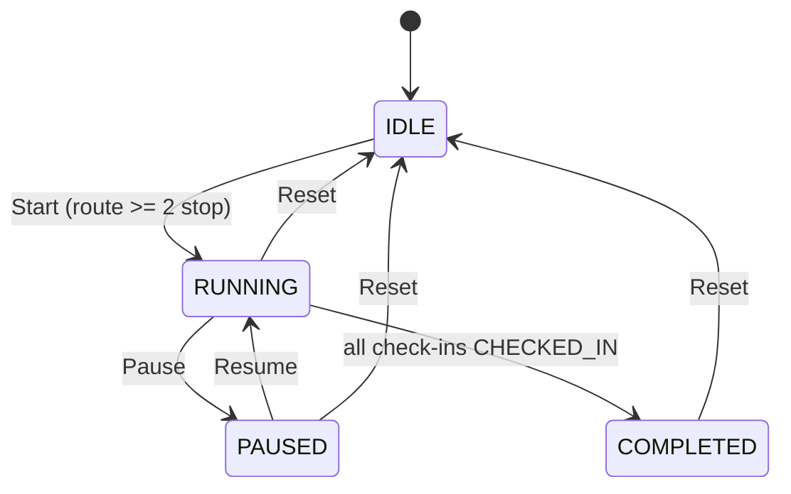

# Spec — 005-realtime-vehicle-simulator

## Thông tin tài liệu

| Thuộc tính | Giá trị |
|---|---|
| Feature ID | `005-realtime-vehicle-simulator` |
| Requirement version | 2026-09-04 |
| Research/Survey version | 2026-09-04, baseline `f81419d` |
| Trạng thái | `READY — chờ người dùng phê duyệt trước Gemini` |
| Người viết | Codex |
| Người duyệt | Người dùng |
| Ngày cập nhật | 2026-09-04 |

## Tổng quan

Feature chuẩn hóa simulator đang có thành một session state machine có control REST rõ ràng và một telemetry snapshot contract có identity/thứ tự. Backend tiếp tục tạo waypoint nội suy, áp dụng incident speed factor, gọi ETA/check-in của feature trước và dùng STOMP simple broker. Frontend tiếp tục dùng một connection STOMP và render Map/Timeline hiện có, nhưng không còn chấp nhận message foreign, run cũ hoặc sequence cũ.

Không thêm broker, persistence telemetry, table/migration, external service hay dependency.

## Mục tiêu

- Session simulator của một Trip có lifecycle/response chính xác, reset được và không ghost tick.
- Vehicle persistence và telemetry normal/terminal phản ánh cùng trạng thái simulation.
- Telemetry `/topic/telemetry` và `/topic/vehicle/{vehicleId}` có run identity/sequence để UI tự bảo vệ against stale delivery.
- Frontend không reconnect khi chỉ state simulator thay đổi và báo lỗi REST control cho người dùng.

## Không thuộc thiết kế này

- Công thức ETA, geofence transition, routing map matching, live traffic hoặc rerouting.
- Multi-instance session ownership, event replay/audit, broker relay và quyền user.
- Selector Trip mới, thay UI map/CARTO hoặc thêm frontend automated test framework.

## Kiến trúc

```mermaid
flowchart LR
    C[SimulatorController] --> S[SimulatorService]
    S --> M[activeSessions: ConcurrentHashMap]
    S --> DB[(Trip / CheckIn / Vehicle)]
    S --> G[GeofencingService]
    S --> E[ETA calculation]
    S --> W[SimpMessagingTemplate]
    W --> T1[/topic/telemetry]
    W --> T2[/topic/vehicle/{vehicleId}]
    T1 --> WS[WebSocketService]
    WS --> A[App expected run + sequence guard]
    A --> MAP[MapComponent]
    A --> TIME[TimelinePanel]
```

- `SimulatorService` giữ ownership session, state transition và reset. Không thêm `TripService` dependency để tránh mở rộng responsibility/circular wiring; reset mutate đúng entities/repositories đã được `SimulatorService` inject.
- `GeofencingService` và ETA calculation được gọi như hiện có; feature này không thay rule của chúng.
- Mọi publish telemetry đi qua một helper duy nhất để normal và terminal dùng cùng `simulationRunId`, `sequence`, `timestamp` và hai destination.
- `App.tsx` là owner consumer state: expected `tripId/runId/lastSequence` lưu ref, không phải Map/Timeline.

## State machine và luồng xử lý

### Trạng thái public

| Status | Session map | Hành vi |
|---|---|---|
| `IDLE` | Không có entry cho Trip | Có thể Start; GET status trả IDLE. |
| `RUNNING` | Có entry `paused=false`, `completed=false` | Scheduler tiến waypoint/publish. |
| `PAUSED` | Có entry `paused=true`, `completed=false` | Scheduler bỏ qua; chỉ Resume, Reset, multiplier hợp lệ. |
| `COMPLETED` | Có entry `completed=true` | Không tick/publish nữa; chỉ Reset. |

### Transition



Start khi map đã có session (`RUNNING`, `PAUSED`, `COMPLETED`) là `409`, không thay thế session. Người dùng phải Reset trước khi tạo run mới. Mọi mutation/read field session của cùng Trip phải được đồng bộ trên object session; map dùng atomic `putIfAbsent`/remove để không tạo hai session cho một Trip trong cùng JVM.

### Luồng Start/tick

1. Controller validate path ID; service tìm Trip. Trip không tồn tại là `404`.
2. Service lấy route stations ordered; dưới hai trạm là `400`, không create session.
3. Service sinh waypoint như hiện có, tạo UUID `simulationRunId`, `lastPublishedSequence=0`, base speed `40.0`, multiplier `1.0`, `paused=false`, `completed=false`.
4. `putIfAbsent` thành công mới start scheduler; nếu đã tồn tại session, throw conflict trước khi thay đổi state.
5. Scheduler có fixed period 1 giây. Với từng entry: bỏ qua paused/completed; gọi `tickSingleSimulation` trong `try/catch` riêng cho entry. Exception log với `tripId`/run ID, không chặn entry sau.
6. Tick tính heading, incident factor, effective speed, advance waypoint, gọi geofence (bao gồm START/waypoint intermediate theo feature 004), tính ETA theo feature 003, persist Vehicle rồi tạo snapshot.
7. Nếu all check-ins đã checked-in, set completed và tạo terminal snapshot; tick tiếp theo không publish run đó.

### Luồng frontend control/realtime

1. App load Trip hiện tại, gọi typed `GET /api/simulator/status/{tripId}` để đồng bộ state/run hiện hữu. Nếu status `IDLE`, clear expected run/sequence/telemetry; nếu RUNNING/PAUSED/COMPLETED có valid run, set expected run và `lastSequence=0`.
2. Start success response set expected `{tripId, simulationRunId, lastSequence: 0}` trước `setSimStatus(RUNNING)`; message có sequence cũ đến trước response bị bỏ qua, tick tiếp theo là snapshot hợp lệ.
3. Callback STOMP kiểm tra `tripId`, UUID không rỗng và integer `sequence >= 1`; nhận khi `tripId/runId` đều khớp expected ref và `sequence > lastSequence`. Sau đó cập nhật ref trước `setTelemetry`.
4. Pause/Resume chỉ đổi `simStatus` sau REST response thành công, run ID phải khớp run expected. Reset success clear expected ref + telemetry rồi refresh cùng `Trip` bằng GET; UI về `IDLE`.
5. WebSocket subscribe effect không phụ thuộc `simStatus`; cleanup chỉ khi App unmount hoặc `addToast` identity thực sự đổi.

## Business Rules

### BR-001 — Session hợp lệ và identity run

**Liên kết:** `REQ-001`, `REQ-004`, `AC-REQ-001-01`, `AC-REQ-001-02`.

- Một session chỉ đại diện một `tripId`; map có tối đa một entry Trip trong JVM.
- Start chỉ hợp lệ khi Trip tồn tại, route ordered có từ hai station trở lên, và không có entry session. UUID mới tạo bằng JDK `UUID.randomUUID()`; không lấy từ client.
- `simulationRunId` giữ không đổi từ Start đến Pause/Resume/terminal; Reset remove session nên Start sau Reset tạo UUID khác.
- `sequence` là integer dương, bắt đầu `1`, strictly increase một đơn vị cho mỗi telemetry logical snapshot trong run. Terminal snapshot cũng dùng increment kế tiếp.
- `timestamp` không dùng để quyết định ordering; chỉ là thông tin quan sát, lấy bằng injected `Clock`.

### BR-002 — State transition và REST semantics

**Liên kết:** `REQ-001`, `REQ-003`, `AC-REQ-001-02`, `AC-REQ-003-01`, `AC-REQ-003-02`.

| Command | Precondition | Success | Error không mutate |
|---|---|---|---|
| Start | Trip tồn tại, >=2 stop, session absent | `200 RUNNING`, UUID mới, multiplier 1 | 404 Trip missing; 400 route invalid; 409 session exists |
| Pause | session `RUNNING` | `200 PAUSED`, giữ UUID/index/sequence | 404 Trip missing; 409 IDLE/PAUSED/COMPLETED |
| Resume | session `PAUSED` | `200 RUNNING`, giữ UUID/index/sequence | 404 Trip missing; 409 IDLE/RUNNING/COMPLETED |
| Multiplier | session RUNNING hoặc PAUSED, request exact 1/2/5/10 finite | `200` multiplier đã apply, giữ UUID | 404 Trip missing; 400 multiplier invalid; 409 IDLE/COMPLETED |
| Reset | session RUNNING/PAUSED/COMPLETED, Trip tồn tại | `200 IDLE`, session remove và DB reset | 404 Trip missing; 409 IDLE/no session |
| Get status | bất kỳ Trip hợp lệ | `200` DTO public state | 404 Trip missing |

HTTP errors dùng `ProblemDetail` `application/problem+json` theo convention Route/Station hiện có. `SimulatorNotFoundException` map 404; `SimulatorConflictException` map 409; invalid route/multiplier map 400. Không trả `200` success cho no-op.

### BR-003 — Movement, traffic và Vehicle snapshot

**Liên kết:** `REQ-002`, `AC-REQ-002-01`, `AC-REQ-002-02`.

- Waypoint generation, heading, `GeoUtil`, incident factor và ETA reuse implementation semantics hiện có; playback multiplier chỉ thay quãng waypoint tiến trong một tick, không đổi công thức ETA nghiệp vụ của feature 003.
- Tick RUNNING tiến index không vượt `waypoints.size()-1`; tick PAUSED/COMPLETED không mutate index/Vehicle và không publish telemetry.
- Trước normal publish, `Vehicle` của session phải được persist `currentLatitude`, `currentLongitude`, rounded effective speed, heading và `status=IN_TRANSIT`. Telemetry timestamp dùng injected `Clock`; Vehicle lifecycle timestamp giữ convention entity hiện có.
- Terminal path persist Vehicle ở final waypoint, speed `0`, status `IDLE`; Completion/check-in semantics vẫn do feature 003/004. Không swallow persistence exception: fail tick được per-session catch/log, không phát snapshot khẳng định một persist không thành công.
- `activeIncidents` chỉ đọc một lần/session tick; không external call/new write log telemetry history.

### BR-004 — Reset simulator

**Liên kết:** `REQ-003`, `AC-REQ-003-02`.

Reset là reset có chủ ý cho simulator, không phải audit operation:

1. Xác định Trip và first `RouteStation` ordered; không có start station là `400`, không mutate partial.
2. Reset toàn bộ check-in Trip: `status=PENDING`, `actualArrivalTime=null`.
3. Set Trip `status=RUNNING`, `endTime=null`.
4. Set Vehicle location = START coordinates, speed `0.0`, heading `0.0`, status `IDLE`; timestamp entity giữ convention hiện có.
5. Persist các thay đổi DB trong một transactional service operation; chỉ sau khi operation thành công remove session from `activeSessions`.
6. Không phát synthetic telemetry `RESET` có run ID đã chết. UI clear snapshot khi response Reset success và GET Trip là source of truth persisted.

Nếu caller cần audit/khôi phục lịch sử một Trip completed, không dùng Reset; capability đó ngoài scope.

### BR-005 — Telemetry contract và publish hai topic

**Liên kết:** `REQ-002`, `REQ-004`, `AC-REQ-004-01`, `AC-REQ-004-02`.

`VehicleTelemetryDto` thêm additive field sau:

| Field | Type JSON | Producer mới | Ý nghĩa |
|---|---|---|---|
| `simulationRunId` | string UUID | Bắt buộc | Identity immutable của run. |
| `sequence` | number/integer >= 1 | Bắt buộc | Ordering monotonic trong run. |

Mọi field telemetry hiện có giữ nguyên tên/kiểu/ý nghĩa. `tripId`, `vehicleId`, `timestamp`, `stationsEta`, `status`, `tripStatus` vẫn bắt buộc ở normal/terminal payload producer mới.

Một helper build/publish duy nhất phải:

1. increment sequence đúng một lần;
2. xây `VehicleTelemetryDto` có run/sequence/timestamp;
3. gọi `/topic/telemetry` và `/topic/vehicle/{vehicleId}` bằng cùng instance hoặc object có field value tương đương;
4. không gọi lại khi session completed ở tick sau.

Payload terminal bắt buộc `tripStatus=COMPLETED`, `status=IDLE`, speed/ETA target/completion theo feature 003 và có run/sequence hợp lệ. Payload sample chỉ minh họa, không chứa secret:

```json
{
  "tripId": 101,
  "vehicleId": 55,
  "simulationRunId": "4a70e3b7-fad8-4c31-9bf3-2db46b1b62d7",
  "sequence": 8,
  "status": "IN_TRANSIT",
  "tripStatus": "RUNNING",
  "timestamp": "2026-09-04T10:00:08"
}
```

### BR-006 — Frontend acceptance/filter/reconnect

**Liên kết:** `REQ-004`, `REQ-005`, `AC-REQ-004-01`, `AC-REQ-005-02`.

- `VehicleTelemetry` TypeScript khai báo `simulationRunId: string` và `sequence: number` cho producer feature mới.
- `WebSocketService` parse mỗi message trong `try/catch`; JSON invalid hoặc object thiếu shape tối thiểu bị drop/log warning an toàn (không raw payload), không làm callback khác crash.
- `App` giữ `activeSimulationRef: { tripId, simulationRunId, lastSequence } | null`.
- Telemetry hợp lệ khi: active ref khác null; `data.tripId === ref.tripId === currentTripRef.current?.id`; `data.simulationRunId === ref.simulationRunId`; `Number.isSafeInteger(data.sequence)`; và `data.sequence > ref.lastSequence`.
- Trước `setTelemetry`, update `lastSequence` ref. Event fail guard không thay Map/Timeline/simStatus/current Trip.
- App không tự accept một run chưa được GET status/command response xác nhận. Sau reconnect, broker snapshot tick tiếp theo vẫn được accept vì identity sequence trong ref giữ nguyên.
- Effect đăng ký STOMP không phụ thuộc `simStatus`; cleanup individual callback và disconnect only unmount. Không sửa topic/transport URL trong feature.

### BR-007 — Terminal và scheduler isolation

**Liên kết:** `REQ-005`, `AC-REQ-005-01`.

- `allCheckedIn` là condition terminal hiện có. Tick terminal set `completed=true`, persist terminal state, publish chính xác một telemetry terminal. Tick sau early-return/skip session.
- `tickAllSimulations` đặt `try/catch` quanh từng call `tickSingleSimulation`, không phải quanh toàn `for`. Error log phải có Trip/run identifier và exception; loop tiếp tục session sau.
- Không retry tự động, remove session, hoặc mark Trip completed khi tick failed. Điều này tránh state change suy đoán; operator có thể Reset sau khi quan sát lỗi.

## Data Model

Không migration/schema change.

| Thành phần | Thay đổi |
|---|---|
| `SimulationSession` in-memory | Add `simulationRunId` và `lastPublishedSequence`; derive public state từ existing paused/completed flags. |
| `VehicleTelemetryDto` | Add `simulationRunId`, `sequence` additive. |
| `Vehicle` | Không field mới; normal tick phải set persisted `IN_TRANSIT`; reset/terminal set `IDLE`. |
| `Trip`, `TripCheckIn` | Không field mới; Reset dùng field status/endTime/actual arrival hiện có. |

## API Contract

### DTO public

Tạo một `SimulatorResponseDto` thay cho response `Map`/nested `SimulationSession` leak. Field nullable chỉ khi state `IDLE`:

| Field | Type | Start/Pause/Resume/Multiplier | Reset | GET IDLE |
|---|---|---|---|---|
| `message` | string | Có | Có | Có thể null |
| `status` | `IDLE/RUNNING/PAUSED/COMPLETED` | Có | `IDLE` | `IDLE` |
| `tripId` | long | Có | Có | Có |
| `simulationRunId` | UUID string | Có | null | null |
| `multiplier` | number | Có | `1` | `1` |
| `currentWaypointIndex` | integer | Có | null | null |
| `lastPublishedSequence` | integer | Có | null | null |

Endpoint path/method giữ nguyên:

| Endpoint | Success | Error |
|---|---|---|
| `POST /api/simulator/start/{tripId}` | 200 `SimulatorResponseDto RUNNING` | 400/404/409 ProblemDetail |
| `POST /api/simulator/pause/{tripId}` | 200 `PAUSED` | 404/409 ProblemDetail |
| `POST /api/simulator/resume/{tripId}` | 200 `RUNNING` | 404/409 ProblemDetail |
| `POST /api/simulator/reset/{tripId}` | 200 `IDLE` | 400/404/409 ProblemDetail |
| `POST /api/simulator/multiplier/{tripId}?multiplier=x` | 200 current state/selected multiplier | 400/404/409 ProblemDetail |
| `GET /api/simulator/status/{tripId}` | 200 public state DTO | 404 ProblemDetail |

Response vẫn giữ field `message`/`status`, nên existing client reading two fields không bị break. Client feature mới dùng typed DTO; no API key/credential added.

## Event / Realtime Contract

### `/topic/telemetry`

- Producer: `SimulatorService`.
- Consumer: global dashboard `WebSocketService` → `App`.
- Purpose: snapshot realtime cho Trip đang chọn.
- Frequency: một normal/terminal logical snapshot per running session tick; none when paused/completed/reset.
- Filtering/order: BR-006.

### `/topic/vehicle/{vehicleId}`

- Producer: cùng helper `SimulatorService`.
- Consumer: client theo xe hiện có/future.
- Payload: cùng logical `VehicleTelemetryDto` và cùng `tripId/simulationRunId/sequence/timestamp` với payload global topic của tick đó.

### Reconnect limitation

Simple broker hiện tại không persist/replay. Frontend không coi reconnect là evidence rằng đã nhận mọi old event. Khi connection khôi phục, backend tick snapshot mới sẽ được filter theo run/sequence; `GET /api/trips/{id}` phục hồi check-in/Trip persisted nếu cần.

## Validation và Error Handling

| Input/failure | Nơi phát hiện | Hành vi |
|---|---|---|
| Trip missing | service trước session operation | `SimulatorNotFoundException` → 404, no mutation |
| Route <2 / reset route missing START | service | `IllegalArgumentException` → 400, no partial session/DB reset |
| Session absent/sai state/Start duplicate | service state guard | `SimulatorConflictException` → 409, no mutation |
| `multiplier` NaN/Infinity/0/negative/not 1,2,5,10 | controller/service defensively | 400; existing multiplier unchanged |
| Malformed STOMP JSON/identity/sequence | `WebSocketService`/App guard | Drop safe, no UI mutation |
| Persist/geofence/ETA error in one tick | per-session `tickAllSimulations` catch | Log scoped identifier, no synthetic success telemetry, continue next session |
| REST fetch non-2xx | `api.ts` uses `parseErrorMessage` | Throw Error; App catch creates warning toast and preserves prior local state |

## Security

- Không thêm input WebSocket client-to-server, provider URL, API key, token, credential hay PII mới.
- UUID session không phải secret/authentication token.
- `ProblemDetail` chỉ return user-safe detail/status; không pass stack trace.
- Artifact/evidence phải redact WebSocket headers, environment value và credential nếu có.

## Performance và Reliability

- Giữ 1 scheduler task hiện có (1 giây), không browser poll/timer hoặc external call mới.
- Session lock là per session; error session A không block logical execution session B sau catch.
- `activeSessions` chỉ process-local. Không tuyên bố exactly-once, globally ordered broker delivery hay ownership multi-instance.
- Run/sequence contract giải quyết acceptance consumer-side, không phải network acknowledgement/persistence.

## Edge Cases

| ID | Tình huống | Hành vi mong đợi | Liên kết |
|---|---|---|---|
| EC-001 | Start route 1/0 stop | 400, no session | BR-002 |
| EC-002 | Start duplicate session | 409, retain original UUID/index/sequence | BR-001/002 |
| EC-003 | Pause tick | index/Vehicle/publish count unchanged | BR-003 |
| EC-004 | Multiplier NaN/10.1 | 400, retain old multiplier | BR-002 |
| EC-005 | Reset after terminal | check-ins pending, Trip RUNNING/end null, Vehicle START IDLE, no old run telemetry | BR-004 |
| EC-006 | Telemetry foreign Trip/run/stale sequence | Drop, no UI mutation | BR-006 |
| EC-007 | Out-of-order sequence 8 then 7 | Render 8 only | BR-006 |
| EC-008 | Terminal tick then next tick | one terminal publish only | BR-007 |
| EC-009 | Tick session A throws | session B executes in same iteration | BR-007 |
| EC-010 | STOMP message invalid JSON | no subscriber/UI crash | BR-006 |

## Compatibility

- Database unchanged; reset mutates existing records only after explicit REST action.
- REST endpoints/methods and `message`/`status` response fields retained; response JSON adds stable typed fields.
- Telemetry JSON additive: clients that ignore unknown fields continue. Feature frontend requires new fields and drops legacy/malformed payload rather than rendering uncertain state.
- `CheckInEvent`, `AlertMessage`, topics `/topic/checkins`/`/topic/alerts`, map config and transport endpoint unchanged.

## Configuration và vận hành

| Cấu hình | Nơi dùng | Thay đổi | Secret? |
|---|---|---|---|
| Scheduler period 1000 ms | `SimulatorService` | Giữ hiện có | Không |
| `Clock` bean | telemetry/reset timestamps | Tái sử dụng hiện có | Không |
| STOMP `/topic`, `/ws-raw` | broker/client | Giữ hiện có | Không |

## Observability

- `INFO`: start, pause, resume, reset, terminal; include `tripId`, run ID where applicable, state/sequence.
- `ERROR`: tick failure; include `tripId`, run ID, exception; never log full telemetry/secret.
- Gemini evidence: test output, API status/body redacted, STOMP transcript showing two topic payload identity, UI screenshots/video before/after reset and stale stimulus.

## Những phần không được thay đổi

- Business formula ETA/completion (003) và geofence/order (004), ngoại trừ invocation/integration needed for simulation.
- Station/Route CRUD, traffic incident CRUD, schema/migration, Docker/CARTO/WebSocket endpoint config, frontend dependency/lockfile.
- Topics CheckIn/Alert, retry/replay semantics and authorization.

## Quyết định và trade-off

| ID | Quyết định | Lý do | Phương án không chọn | Hệ quả |
|---|---|---|---|---|
| DEC-001 | Run UUID + sequence per telemetry | Chặn stale/out-of-order across Reset; docs Spring note receive order không mặc định | Sort timestamp / no identity | Add fields backend/frontend, no replay |
| DEC-002 | Keep simple broker, không set preserve publish order | Global setting có overhead và không giải quyết run identity | `setPreservePublishOrder(true)` | Client guard là source ordering app |
| DEC-003 | Reset remove session, no RESET payload | Không cho dead run tick/publish; UI GET persisted data | Reuse session/new reset message | Frontend clear local snapshot explicitly |
| DEC-004 | Typed DTO + controller-scoped errors | Không success no-op/inner session leak; follows existing advice convention | `Map` success mọi state | New small DTO/exception files |
| DEC-005 | No persistence telemetry | Snapshot needs realtime only, avoid writes each second | Event history/table | Reconnect waits next tick |

## Traceability

| Spec ID | Requirement/AC | Business Rule/API/Event | Test dự kiến | Evidence dự kiến |
|---|---|---|---|---|
| SPEC-001 | REQ-001, AC-REQ-001-01/02 | BR-001, BR-002, REST contract | TC-001, TC-002, TC-003 | EVD-011, EVD-012 |
| SPEC-002 | REQ-002, AC-REQ-002-01/02 | BR-003, BR-007 | TC-004, TC-005, TC-010 | EVD-013, EVD-014 |
| SPEC-003 | REQ-003, AC-REQ-003-01/02 | BR-002, BR-004 | TC-006, TC-007 | EVD-013, EVD-015 |
| SPEC-004 | REQ-004, AC-REQ-004-01/02 | BR-005, BR-006, realtime contract | TC-008, TC-009, TC-011 | EVD-014, EVD-016 |
| SPEC-005 | REQ-005, AC-REQ-005-01/02 | BR-006, BR-007, error handling | TC-010, TC-011, TC-012 | EVD-014, EVD-016, EVD-017 |
| SPEC-006 | All regression | Compatibility/verification gate | TC-013..TC-016 | EVD-017..EVD-020 |

## Câu hỏi còn mở

Không có câu hỏi chặn implementation. Các giới hạn replay/multi-instance được xác nhận ngoài phạm vi, không được ngầm implement.

## Checklist duyệt Spec

- [x] Spec đáp ứng toàn bộ Requirement trong phạm vi.
- [x] State/business rule/API/event contract không mơ hồ.
- [x] Validation, reset, error isolation, edge case và compatibility đã xử lý.
- [x] Không migration, provider hay dependency ngoài nhu cầu.
- [x] Mọi phần quan trọng có traceability.
