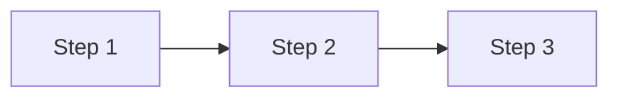

# Plan — <Tên feature>

## Thông tin tài liệu

| Thuộc tính | Giá trị |
|---|---|
| Feature ID | `<feature-id>` |
| Spec/Test-Plan version | `<commit/ngày>` |
| Trạng thái | `DRAFT` |
| Planner | `<Codex/tên>` |
| Implementer | `Gemini` |
| Ngày cập nhật | `<YYYY-MM-DD>` |

## Mục tiêu implementation

Tóm tắt kết quả code cần đạt theo Spec. Không thêm Requirement mới trong Plan.

## Phạm vi implementation

### Sẽ thực hiện

- `<thay đổi liên kết SPEC/REQ>`

### Không thực hiện

- `<phần ngoài scope hoặc để feature khác>`

## Điều kiện tiên quyết

- [ ] `requirement.md` ở trạng thái sẵn sàng.
- [ ] `spec.md` không còn câu hỏi chặn implementation.
- [ ] `test-plan.md` liên kết mọi Acceptance Criteria.
- [ ] Research/Survey cần thiết đã hoàn thành.
- [ ] `<quyền truy cập/config/dependency khác>`

## File sẽ tạo mới

### `<path/to/file>`

- Trách nhiệm: `<một trách nhiệm rõ ràng>`
- Liên kết: `<SPEC-*, TC-*>`
- Lý do cần file mới: `<vì sao không thể tái sử dụng file hiện có>`

Nếu không có file mới, ghi `Không có`.

## File sẽ chỉnh sửa

### `<path/to/existing-file>`

- Trách nhiệm hiện tại: `<theo Survey>`
- Thay đổi: `<symbol/hành vi/contract cụ thể>`
- Liên kết: `<SPEC-*, TC-*>`
- Phần không được ảnh hưởng: `<behavior/regression boundary>`

Không liệt kê path chưa được Survey xác minh như một sự thật.

## Database Changes

Nếu không áp dụng, ghi `Không có`.

| Thay đổi | Migration/File | Compatibility/Backfill | Rollback/Rủi ro |
|---|---|---|---|
| `<table/column/index/constraint>` | `<path>` | `<xử lý data cũ>` | `<...>` |

Không dựa vào thay đổi schema thủ công không được version-control nếu project có hoặc cần migration strategy.

## API Changes

Nếu không áp dụng, ghi `Không có`.

| Method/Endpoint | Loại thay đổi | Spec contract | Compatibility |
|---|---|---|---|
| `<METHOD /endpoint>` | `Mới/Sửa/Xóa` | `<SPEC-*>` | `<backward-compatible hay breaking>` |

## Event / Realtime Changes

Nếu không áp dụng, ghi `Không có`.

| Event/Topic | Producer/Consumer | Payload/Behavior change | Compatibility |
|---|---|---|---|
| `<name>` | `<...>` | `<...>` | `<...>` |

## Dependency và Configuration Changes

| Loại | Thay đổi | Lý do | Security/Operation impact |
|---|---|---|---|
| Dependency | `<package/version hoặc Không có>` | `<Research/Spec>` | `<...>` |
| Configuration | `<env/property hoặc Không có>` | `<...>` | `<không ghi secret>` |

Mọi dependency mới phải được Research/Spec cho phép. Không thêm dependency chỉ để tiện nếu project đã có giải pháp phù hợp.

## Implementation Steps

Mỗi step nên tạo một vertical slice nhỏ có thể kiểm tra. Ghi dependency và kết quả mong đợi, không dùng step mơ hồ như “làm backend”.

### Step 1 — <Tên bước>

**Mục tiêu:** `<kết quả cụ thể>`

**Liên kết:** `<REQ-*, SPEC-*, BR-*, TC-*>`

**File/thành phần:**

- `<path#symbol>`

**Thay đổi:**

1. `<thao tác logic cụ thể>`
2. `<thao tác>`

**Kết quả mong đợi:** `<state/contract có thể kiểm tra>`

**Dependency:** `<Step trước hoặc Không có>`

**Kiểm tra ngay sau step:** `<test/command>`

**Evidence cần thu thập:** `<EVD-* dự kiến, loại Evidence, output/artifact và Claim cần chứng minh>`

**Rủi ro/rollback:** `<rủi ro và cách quay lại an toàn>`

### Step 2 — <Tên bước>

Lặp lại cấu trúc Step 1.

## Tests cần implement hoặc cập nhật

| Test Case | Loại | Test file dự kiến | Step | Nội dung chính |
|---|---|---|---|---|
| `<TC-001>` | `<Unit/Integration/...>` | `<path>` | `<Step>` | `<assertion/flow>` |

Không thay expected result của Test-Plan chỉ để phù hợp implementation.

## Evidence cần thu thập

| Evidence dự kiến | Requirement/Spec/Test | Plan Step | Loại | Claim cần chứng minh | Nguồn/Artifact dự kiến |
|---|---|---|---|---|---|
| `<EVD-001>` | `<REQ-*/SPEC-*/TC-*>` | `<Step 1>` | `<TEST/API/UI/...>` | `<Claim cụ thể>` | `<command/path/screenshot>` |

ID có thể được cấp khi Evidence thực tế được tạo, nhưng Plan phải nêu loại bằng chứng cần có. Không dùng một Evidence yếu để chứng minh Claim rộng hơn khả năng của nó.

## Lệnh kiểm tra

Chỉ dùng command đã xác minh trong `survey.md` hoặc mô tả rõ step bổ sung command/script.

| Thứ tự | Command | Working directory | Mục đích | Điều kiện đạt |
|---|---|---|---|---|
| `1` | `<command>` | `<path>` | `<test/lint/build>` | `<exit code/expected>` |

Ví dụ chỉ được giữ nếu đúng với repository đã khảo sát:

```bash
cd <module>
<test-command>
```

## Thứ tự implementation và dependency



Điều chỉnh diagram hoặc thay bằng danh sách nếu feature đơn giản.

## Rủi ro

| ID | Rủi ro | Khả năng | Ảnh hưởng | Giảm thiểu | Step kiểm soát |
|---|---|---|---|---|---|
| `RISK-001` | `<...>` | `Thấp/Vừa/Cao` | `Thấp/Vừa/Cao` | `<...>` | `<Step/TC>` |

## Kế hoạch bàn giao cho Review

Gemini phải báo cáo:

- file đã tạo/sửa;
- Plan step đã hoàn thành;
- Test Case đã implement;
- Evidence `EVD-*` đã tạo/cập nhật và Evidence Matrix;
- command, exit code và kết quả;
- sai lệch đã được xác nhận;
- vấn đề hoặc test còn lại;
- diff sẵn sàng cho Codex review.

## Definition of Done

- [ ] Mọi step liên kết với Spec/Test Case.
- [ ] File tạo/sửa có path và trách nhiệm rõ ràng.
- [ ] Database/API/Event change có compatibility strategy.
- [ ] Dependency mới có lý do và nằm trong Spec.
- [ ] Command kiểm tra lấy từ Survey hoặc có step bổ sung cụ thể.
- [ ] Mỗi Requirement quan trọng có Evidence dự kiến và Plan Step thu thập.
- [ ] Không có refactor hay scope ngoài Requirement.
- [ ] Gemini có thể implement mà không cần tự thiết kế lại feature.
- [ ] Tiêu chí bàn giao cho Codex Review rõ ràng.
