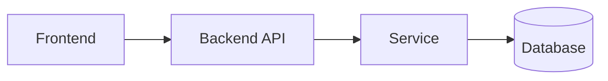
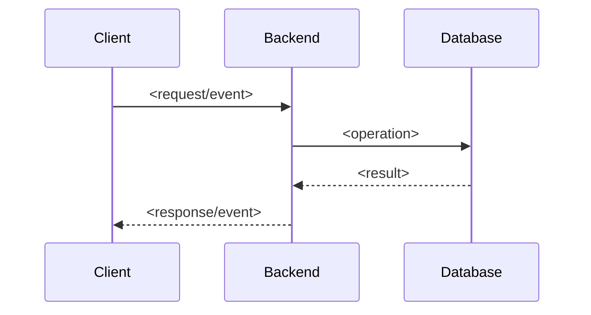

# Spec — <Tên feature>

## Thông tin tài liệu

| Thuộc tính | Giá trị |
|---|---|
| Feature ID | `<feature-id>` |
| Requirement version | `<commit/ngày>` |
| Research/Survey version | `<commit/ngày>` |
| Trạng thái | `DRAFT` |
| Người viết | `<tên>` |
| Người duyệt | `<tên>` |
| Ngày cập nhật | `<YYYY-MM-DD>` |

## Tổng quan

Tóm tắt giải pháp kỹ thuật và boundary của feature. Không lặp toàn bộ Requirement.

## Mục tiêu

- `<Kết quả kỹ thuật gắn với REQ-*>`

## Không thuộc thiết kế này

- `<Điều cố ý không giải quyết để tránh scope creep>`

## Kiến trúc

Mô tả thành phần mới/thay đổi, trách nhiệm và dependency direction. Nêu rõ phần tái sử dụng từ Survey.



Điều chỉnh diagram theo feature; không giữ node không áp dụng.

## Luồng xử lý

### Luồng chính

1. `<Bước và component chịu trách nhiệm>`
2. `<Bước>`



### Luồng lỗi hoặc fallback

1. `<Điều kiện lỗi>`
2. `<Cách phát hiện>`
3. `<Response/state/fallback mong đợi>`

## Business Rules

### BR-001 — <Tên quy tắc>

**Liên kết:** `<REQ-001, AC-REQ-001-01>`

**Quy tắc:** `<Mô tả không mơ hồ, gồm điều kiện và kết quả>`

**Lý do:** `<Nguồn Requirement hoặc quyết định Research>`

### BR-002 — <Tên quy tắc>

Lặp lại cấu trúc trên.

## Data Model

Nếu feature không thay đổi data model, ghi `Không áp dụng` và lý do.

### Entity/Table: `<tên>`

| Field | Type | Nullable | Default | Constraint/Index | Ý nghĩa |
|---|---|---|---|---|---|
| `<field>` | `<type>` | `Có/Không` | `<value>` | `<PK/FK/unique/index>` | `<mô tả>` |

### Relationship và lifecycle

- `<relationship, cascade, ownership, retention>`

### Migration và compatibility

- Migration cần tạo: `<path/tên dự kiến>`
- Backfill: `<cách xử lý dữ liệu cũ>`
- Rollback/forward compatibility: `<chiến lược>`

## API Contract

Nếu không có API change, ghi `Không áp dụng`.

### `<METHOD /endpoint>`

**Mục đích:** `<...>`

**Liên kết:** `<REQ-*, BR-*>`

**Authentication/Authorization:** `<quyền cần có hoặc Không áp dụng>`

**Request**

```json
{
  "field": "<value>"
}
```

| Field | Type | Bắt buộc | Validation | Ý nghĩa |
|---|---|---|---|---|
| `field` | `<type>` | `Có/Không` | `<constraint>` | `<mô tả>` |

**Success response — `<HTTP status>`**

```json
{
  "field": "<value>"
}
```

**Error cases**

| Điều kiện | HTTP status | Error code/message contract | Side effect |
|---|---|---|---|
| `<invalid/not found/conflict/...>` | `<status>` | `<contract>` | `<không có/rollback/...>` |

**Idempotency/Concurrency:** `<quy tắc nếu liên quan>`

## Event / Realtime Contract

Nếu không dùng WebSocket, message queue, domain event hoặc notification, ghi `Không áp dụng`.

### Event: `<event/topic>`

**Producer:** `<component>`

**Consumer:** `<component>`

**Thời điểm phát:** `<điều kiện>`

```json
{
  "eventId": "<id>",
  "occurredAt": "<ISO-8601>",
  "payload": {}
}
```

| Field | Type | Bắt buộc | Ý nghĩa |
|---|---|---|---|
| `eventId` | `string` | `Có` | `<quy tắc unique/deduplicate>` |

Ghi rõ ordering, duplicate delivery, retry, reconnect recovery và backward compatibility nếu liên quan.

## Validation

| Input/Field | Rule | Nơi kiểm tra | Kết quả khi vi phạm |
|---|---|---|---|
| `<field>` | `<rule>` | `<frontend/backend/database>` | `<error>` |

Backend phải bảo vệ invariant; validation frontend không thay thế validation backend.

## Error Handling

| Failure mode | Phát hiện | Hành vi hệ thống | Log/Metric | Response/UI |
|---|---|---|---|---|
| `<timeout/invalid/db/...>` | `<...>` | `<...>` | `<không chứa secret>` | `<...>` |

## Security

- Authentication/Authorization: `<...>`
- Input/output safety: `<...>`
- Secret/configuration: `<...>`
- Sensitive data/logging: `<...>`
- External service boundary: `<...>`

Ghi `Không áp dụng` kèm lý do cho mục không liên quan.

## Performance và Reliability

- Số lượng/tần suất dự kiến: `<...>`
- Query/index/caching: `<...>`
- Timeout/retry/backoff: `<...>`
- Transaction/idempotency/concurrency: `<...>`
- Tiêu chí đo được: `<...>`

## Edge Cases

| ID | Tình huống | Hành vi mong đợi | Requirement/BR |
|---|---|---|---|
| `EC-001` | `<boundary/duplicate/missing/out-of-order/...>` | `<kết quả>` | `<REQ-*/BR-*>` |

## Compatibility

- Public API/Event: `<ảnh hưởng và versioning>`
- Database/data cũ: `<ảnh hưởng>`
- Frontend/backend version lệch: `<hành vi>`
- Browser/runtime: `<giới hạn>`

## Configuration và vận hành

| Biến/cấu hình | Nơi sử dụng | Bắt buộc | Default an toàn | Secret? |
|---|---|---|---|---|
| `<NAME>` | `<component>` | `Có/Không` | `<default>` | `Có/Không` |

Không ghi giá trị secret thật.

## Observability

- Log: `<event/error cần ghi, field cần redact>`
- Metric: `<counter/timer/gauge>`
- Trace/Audit: `<nếu liên quan>`

## Những phần không được thay đổi

- `<public contract, module hoặc behavior ngoài scope>`

## Quyết định và trade-off

| ID | Quyết định | Lý do | Phương án không chọn | Hệ quả |
|---|---|---|---|---|
| `DEC-001` | `<...>` | `<Research/Survey>` | `<...>` | `<...>` |

## Traceability

| Spec ID | Requirement/AC | Business Rule/API/Event | Test dự kiến | Evidence dự kiến |
|---|---|---|---|---|
| `SPEC-001` | `<REQ-001, AC-...>` | `<BR-001 hoặc contract>` | `<TC sẽ định nghĩa>` | `<loại Evidence cần để chứng minh>` |

## Câu hỏi còn mở

| ID | Câu hỏi | Ảnh hưởng | Người quyết định | Trạng thái |
|---|---|---|---|---|
| `SQ-001` | `<...>` | `<...>` | `<...>` | `OPEN` |

Không chuyển sang Implement khi còn câu hỏi làm thay đổi public contract, data model hoặc business rule.

## Checklist duyệt Spec

- [ ] Spec đáp ứng mọi Requirement trong phạm vi.
- [ ] Business Rule và contract không mơ hồ.
- [ ] Validation, error, security và edge case liên quan đã được xử lý.
- [ ] Data migration/backward compatibility được xem xét.
- [ ] Không tạo abstraction hoặc dependency ngoài nhu cầu hiện tại.
- [ ] Mọi phần quan trọng có traceability về Requirement.
