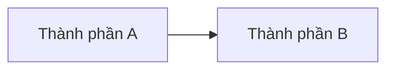
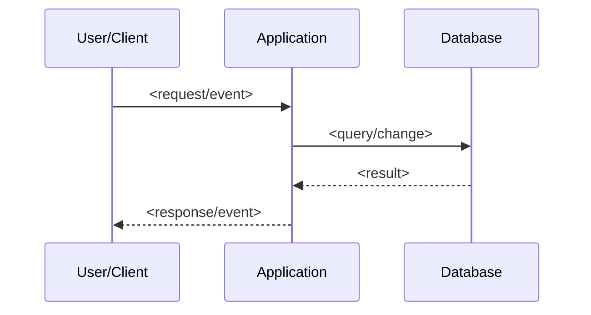

# Survey repository — <Tên feature>

## Thông tin tài liệu

| Thuộc tính | Giá trị |
|---|---|
| Feature ID | `<feature-id>` |
| Requirement liên quan | `<REQ-*>` |
| Trạng thái | `DRAFT` |
| Người khảo sát | `<tên>` |
| Commit/worktree được khảo sát | `<commit hash hoặc mô tả dirty worktree>` |
| Ngày khảo sát | `<YYYY-MM-DD>` |

## Tổng quan repository

Mô tả loại project, các application/module chính và cách chúng phối hợp. Mọi tên folder phải lấy từ repository thật.

## Tech stack

| Thành phần | Công nghệ/Version | Bằng chứng |
|---|---|---|
| Frontend | `<...>` | `<path manifest/config>` |
| Backend | `<...>` | `<path manifest/config>` |
| Database | `<...>` | `<path config/compose>` |
| Realtime/Queue | `<...>` | `<path>` |
| Test | `<...>` | `<path/script>` |

## Claim và Evidence từ repository

Mọi nhận định quan trọng phải có `EVD-*` trong `evidence.md`. Không suy đoán architecture, framework, authentication hoặc behavior chỉ từ tên project, folder hay file.

| Claim | Evidence ID | Nguồn trong repository | Cách kiểm chứng | Trạng thái |
|---|---|---|---|---|
| `<Project dùng framework/version cụ thể>` | `<EVD-*>` | `<manifest/config và vị trí>` | `<command hoặc bước đọc symbol>` | `PASS/FAIL/INCONCLUSIVE` |
| `<Luồng xử lý có behavior cụ thể>` | `<EVD-*>` | `<path#symbol/test>` | `<cách trace luồng>` | `PASS/FAIL/INCONCLUSIVE` |

Nếu chỉ có dấu hiệu nhưng chưa đủ để kết luận, dùng `INCONCLUSIVE` và ghi điều cần kiểm tra thêm.

## Cấu trúc thư mục liên quan

```text
<cây thư mục rút gọn chỉ gồm phần liên quan feature>
```

## Kiến trúc hiện tại

Mô tả layer, boundary, dependency direction, nơi lưu business logic và cách frontend/backend giao tiếp.

Nếu cần, sử dụng Mermaid:



## Thành phần liên quan đến feature

| Loại | Path/Symbol | Trách nhiệm hiện tại | Requirement liên quan |
|---|---|---|---|
| Controller/API | `<path#symbol>` | `<...>` | `<REQ-*>` |
| Service | `<path#symbol>` | `<...>` | `<REQ-*>` |
| Repository | `<path#symbol>` | `<...>` | `<REQ-*>` |
| Entity/Table | `<path/table>` | `<...>` | `<REQ-*>` |
| DTO/Type | `<path#symbol>` | `<...>` | `<REQ-*>` |
| Frontend component | `<path#symbol>` | `<...>` | `<REQ-*>` |
| Event/WebSocket | `<path/topic>` | `<...>` | `<REQ-*>` |

Xóa các dòng không áp dụng và bổ sung loại thành phần cần thiết.

## Luồng xử lý hiện tại

Mô tả từ input đến output, bao gồm API, service, database, event và UI liên quan.



## API và Event hiện tại

| Loại | Method/Topic | Request/Payload | Response/Consumer | Bằng chứng |
|---|---|---|---|---|
| REST | `<METHOD /endpoint>` | `<DTO>` | `<response>` | `<path>` |
| WebSocket/Event | `<topic/name>` | `<payload>` | `<consumer>` | `<path>` |

## Data model hiện tại

| Entity/Table | Field/Constraint liên quan | Relationship | Ghi chú |
|---|---|---|---|
| `<tên>` | `<field/index/unique>` | `<relationship>` | `<rủi ro hoặc khả năng tái sử dụng>` |

## Convention đang được sử dụng

### Naming và cấu trúc

- `<convention có bằng chứng path>`

### Error handling và validation

- `<cách hiện tại xử lý lỗi/validation; nêu thiếu sót nếu có>`

### Logging và configuration

- `<cách cấu hình, env, profile và logging>`

### Testing

- `<framework, vị trí test, naming và fixture>`

### API/Realtime

- `<response, status, topic, reconnect hoặc serialization convention>`

## Thành phần có thể tái sử dụng

| Thành phần | Lý do phù hợp | Giới hạn |
|---|---|---|
| `<path#symbol>` | `<...>` | `<...>` |

## Khoảng cách giữa hiện trạng và Requirement

| Requirement | Hiện trạng | Gap | Mức ảnh hưởng | Bằng chứng |
|---|---|---|---|---|
| `<REQ-*>` | `Có/Một phần/Chưa có` | `<gap>` | `Cao/Vừa/Thấp` | `<path/output>` |

## Điểm cần chú ý

- `<race condition, backward compatibility, data integrity hoặc coupling liên quan>`

## Technical debt liên quan

Chỉ ghi technical debt tác động trực tiếp tới feature. Không biến feature thành đợt refactor tổng thể.

| Technical debt | Ảnh hưởng tới feature | Xử lý trong feature? | Lý do |
|---|---|---|---|
| `<mô tả>` | `<ảnh hưởng>` | `Có/Không` | `<lý do>` |

## File dự kiến bị ảnh hưởng

### File có thể tạo mới

- `<path>` — `<trách nhiệm dự kiến>`

### File có thể chỉnh sửa

- `<path>` — `<lý do dự kiến>`

Danh sách này là đầu vào cho Spec/Plan, chưa phải quyết định implementation cuối cùng.

## Command khảo sát đã chạy

| Command | Exit code | Kết quả/tóm tắt | Evidence | Artifact nếu có |
|---|---|---|---|---|
| `<command thực tế>` | `<code>` | `<kết quả>` | `<EVD-*>` | `<path>` |

Không ghi command chưa tồn tại trong project như thể đã chạy thành công.

## Rủi ro và câu hỏi cần Spec giải quyết

- `<rủi ro/câu hỏi>`

## Checklist hoàn thành

- [ ] Không sửa source code ứng dụng trong phase Survey.
- [ ] Tên path, symbol, command và stack lấy từ repository thật.
- [ ] Luồng hiện tại và gap có bằng chứng.
- [ ] Mỗi Claim quan trọng về repository có `EVD-*` và nguồn cụ thể.
- [ ] Không có kết luận chỉ dựa trên tên project/folder/file.
- [ ] Convention tái sử dụng đã được ghi nhận.
- [ ] Technical debt chỉ giới hạn phần ảnh hưởng feature.
- [ ] File dự kiến bị ảnh hưởng đã đủ để bắt đầu Spec.
